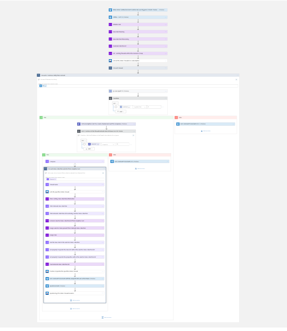

# Block IP Address in Azure Firewall by adding new rules to Network Rules Collection

 ## Summary
When a new Azure Sentinel incident is created, this playbook gets triggered and performs below actions:
1.  An adaptive card is sent to the SOC channel, providing IP address, Virus Total report , showing list of existing firewalls in the Resource group and providing an option to block IP Address to Deny network rules collection or Ignore.
2. If SOC user confirms yes, the IP Address gets added to deny network rules collection and incident will get updates with endpoint information, summary of the action taken and virus total scan report.
3. Else, incident will get updates with endpoint information and summary of the action taken. 
4. Update the firewall tags "configuration" as key and "sentinel" as value.

  
**This is the adaptive card SOC will recieve when playbook is triggered:**  

**Comment example:**  

### Prerequisites 
1. **This playbook template is based on Azure Sentinel Incident Trigger which is currently in Private Preview (Automation Rules).** You can change the trigger to the Sentinel Alert trigger in cases you are not part of the Private Preview.
1. Azure Firewall connector needs to be deployed prior to the deployment of this playbook under the same subscription. Relevant instructions can be found in the connector doc page.
1. Azure Firewall connector need to be authenticated with a Service Principal that has permissions over Azure Firewall. Relevant instructions can be found in the connector doc page.
1. This playbook will add new rules to existing Network Collections in Azure Firewalls in your subscription. Make sure you have such prior to running the playbook. 
1. **Permissions required for this playbook** 
This playbook **Gets** and **Updates** Azure Firewalls. The registered application/Service Principal that is authenticated to the connector needs to have the following RBAC Roles:

	* **Contributor** on the Azure Firewalls it should be able to get and update in the subscription.

1. To use VirusTotal connector, get your Virus Totan API key. [ how to generate the API Key](https://developers.virustotal.com/v3.0/reference#getting-started)

### Deployment instructions 
1. Deploy the playbook by clicking on "Depoly to Azure" button. This will take you to deplyoing an ARM Template wizard.

2. Fill in the required paramteres:
    * Playbook Name: Enter the playbook name here (ex:AzureFirewall-BlockIP-addNewRule)
    * Teams GroupId : Enter the Teams channel id to send the adaptive card
    * Teams ChannelId : Enter the Teams Group id to send the adaptive card
    [Refer the below link to get the channel id and group id](https://docs.microsoft.com/powershell/module/teams/get-teamchannel?view=teams-ps)
    * ClientId : Enter the ClientId of the application
    * ClientSecret : Enter the Client secret of the application

### Post-Deployment instructions 
#### a. Authorize connections
Once deployment is complete, you will need to authorize each connection.
1.	Click the Azure Sentinel connection resource
2.	Click edit API connection
3.	Click Authorize
4.	Sign in
5.	Click Save
6.	Repeat steps for other connection such as Teams connection and Virus Total (For authorizing the Virus Total API connection, the API Key needs to be provided)

     b. Click Edit

     c. Find the action with the name "Lists all Azure Firewalls in a resource group", "Gets the specified Azure Firewall","Creates or updates the specified Azure Firewall", "Updates tags for Azure Firewall resource" in the workflow.
        
     d. Click Change connection
        a. Enter Connection name, ClientId, SecretKey and TenantId captured from AAD. 

#### b. Configurations in Sentinel
1. In Azure sentinel analytical rules should be configured to trigger an incident with IP Entity.
2. Configure the automation rules to trigger this playbook

## Playbook steps explained
### When Azure Sentinel incident creation rule is triggered

### Varialbes 

   a. Initialize Rule to store the new rule information

   b. RulecollectionArray to store the existing network rules collection in the SOC user selected firewall.

   c. RulecollectionFilteredArray to store the Rules collection array which is selected by SOC.

   d. FinalRuleCollectionList to store the entire Network Rules collection

   e. List - existing firewalls with in the Resource Group to store the Firewall - Rule collection choice list to show in the Adaptive Card

### Lists all Firewall Policies in a resource group
Lists - Existing azure firewalls with in a Resource Group

### Select Firewall Policies Choice List to show in the Adaptive Card
Prepare Firewall Policies Choice list to show in the Adaptive Card

### For each-malicious IP received from the incident
Iterates on the IPs found in this incident (probably one) and performs the following:
For the malicious IP Address, playbook uses "Ip scan report" action to get the information from Virus Total.
#### Posts an Adaptive card to  user 
In this step we post a message in Microsoft Teams to the SOC user with Incident details , IP Scan report and ask for his confirmation on the malicious activity described in the incident.

#### If malicious
 Preparing an Array with SOC selected Firewall Options

### For each rules collection selected from Adaptive Card

 1. Reading the firewall name from the SOC selected Firewall Rule collection

 1. Reading the resource group name from the SOC selected Firewall Rule collection

 1. Gets the specified Azure Firewall information from the Azure Firewall Connector

 1. Array to Store the existing rule collection information for the selected firewall

 1. Filter the network rule collection information based on the network rule collection selected in the Adaptive Card

 1. Filter the network collection list by excluding the selected rules collection

 1. Variable to store the above filtered collection

 1. Variable to store the rules present in the selected network rules collection

 1. Variable to store the new rule with malicious IP Address reported

 1. Append the new rule to the filtered rule collection list which is selected in the Adaptive Card

 1. Update the existing rules list with the composed new rules list

 1. Update the existing  network rules collection with the composed new rule collection list

 1. Append the selected rules collection list 

 1. Create a rule with in the specified Azure firewall

 1. Add comment to incident with the endpoint info , action taken and virus total scan report

 1. Close the incident with the Severity and Classification reason selected from Adaptive Card

 1. Updates tags for Azure Firewall resource

#### Else
 Add comment to incident with the endpoint information , action taken and virus total scan report

