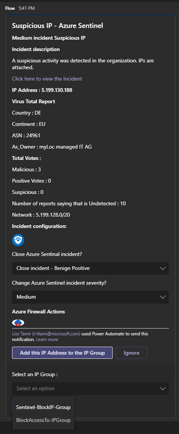

# Block IP by adding IP Address to IP Groups

 ## Summary

This playbook allows blocking/allowing IPs in Azure Firewall, using **IP Groups**. This allows to make changes on IP groups, which are attached to rules, instead of make direct changes on Azure Firewall. It also allows using the same IP group for multiple firewalls.
[Learn more about IP Groups in Azure Firewall](https://docs.microsoft.com/azure/firewall/ip-groups)

When a new Sentinel incident is created,this playbook gets triggered and performs below actions
1.  An adaptive card is sent to the SOC channel providing IP address, Virus Total report , showing list of existing firewalls in the Resource group and providing an option to add IP Address to IPGroups or Ignore.
2. If SOC user confirms yes, the IP Address gets added to IPGroups under IPAddress section and incident will get updates with endpoint information, summary of the action taken and virus total scan report.
3. Else, incident will get updates with endpoint information and summary of the action taken. 
4. Update the firewall tags "configuration" as key and "sentinel" as value.

 

**This is the adaptive card SOC will recieve when playbook is triggered:**  

**Comment example:**  

### Prerequisites 

1. Azure Firewall connector needs to be deployed prior to the deployment of this playbook under the same subscription. Relevant instructions can be found in the connector doc page.
1. Azure Firewall connector need to be authenticated with a Service Principal that has permissions over Azure Firewall. Relevant instructions can be found in the connector doc page.
1. This playbook will query IP Groups that exist in the resource group of Azure Sentinel workspace. Make sure to create IP Groups and attach them to Azure Firewall rules prior to running the playbook. You can change the source of the IP groups in the playbook itself after deployment.
1. **Permissions required for this playbook** 
This playbook **Gets** and **Updates** IP groups. The registered application/Service Principal that is authenticated to the connector needs to have the following RBAC Roles:

	* **Contributor** on the IP Groups in the Azure Sentinel resource group.

1. To use VirusTotal connector, get your Virus Totan API key. [ how to generate the API Key](https://developers.virustotal.com/v3.0/reference#getting-started)

### Deployment instructions 
1. Deploy the playbook by clicking on "Depoly to Azure" button. This will take you to deplyoing an ARM Template wizard.

2. Fill in the required paramteres:
    * Playbook Name: Enter the playbook name here (ex:AzureFirewall-BlockIP-addToIPGroup)
    * Teams GroupId : Enter the Teams channel id to send the adaptive card
    * Teams ChannelId : Enter the Teams Group id to send the adaptive card
    [Refer the below link to get the channel id and group id](https://docs.microsoft.com/powershell/module/teams/get-teamchannel?view=teams-ps)
    * ClientId : Enter the ClientId of the application
    * ClientSecret : Enter the Client secret of the application

### Post-Deployment instructions 
#### a. Authorize connections
Once deployment is complete, you will need to authorize each connection.
1.	Click the Azure Sentinel connection resource
2.	Click edit API connection
3.	Click Authorize
4.	Sign in
5.	Click Save
6.	Repeat steps for other connection such as Teams connection and Virus Total (For authorizing the Virus Total API connection, the API Key needs to be provided)
7.  Authorize the Azure Firewall custom connector by following the below mentioned steps.

	 a. Navigate to playbook

     b. Click Edit

     c. Find the action with the name "Gets all IpGroups in a resource group", "Gets the specified ipGroups","Creates or updates an ipGroups in a specified resource group" in the workflow.
        
     d. Click Change connection [ Enter Connection name, ClientId, SecretKey and TenantId captured from AAD. ]

#### b. Configurations in Sentinel
1. In Azure sentinel analytical rules should be configured to trigger an incident with IP Entity.
2. Configure the automation rules to trigger this playbook

## Playbook steps explained
### When Azure Sentinel incident creation rule is triggered

### Varialbes 

   a. List - IP Groups present with in the Resource Group to store IP Groups present with in the Resource Group.

   b. List - existing firewalls with in the Resource Group to store the Firewall - Rule collection choice list to show in the Adaptive Card

### Gets all IpGroups in a resource group
Lists all the IP Groups present in the Resource Group

### Select IPGroups Choice List to show in the Adaptive Card
Prepare IP Groups Choice list to show in the Adaptive Card

### For each-malicious IP received from the incident
Iterates on the IPs found in this incident (probably one) and performs the following:
For the malicious IP Address, playbook uses "Ip scan report" action to get the information from Virus Total.
#### Posts an Adaptive card to  user 
In this step we post a message in Microsoft Teams to the SOC user with Incident details , IP Scan report and ask for his confirmation on the malicious activity described in the incident.

#### If malicious

 a. Gets the specified ipGroups

 b. Assign Existing IP Addresses

 c. Append malicious IP Address to the existing IP Address List

 d. Creates or updates an ipGroups in a specified resource group

 e. Add comment to incident with the Virus Total report , the action taken and virus total scan report

 f. Close the incident with the Severity and Classification reason selected from Adaptive Card

#### Else
 Add comment to incident with the endpoint information , action taken and virus total scan report

