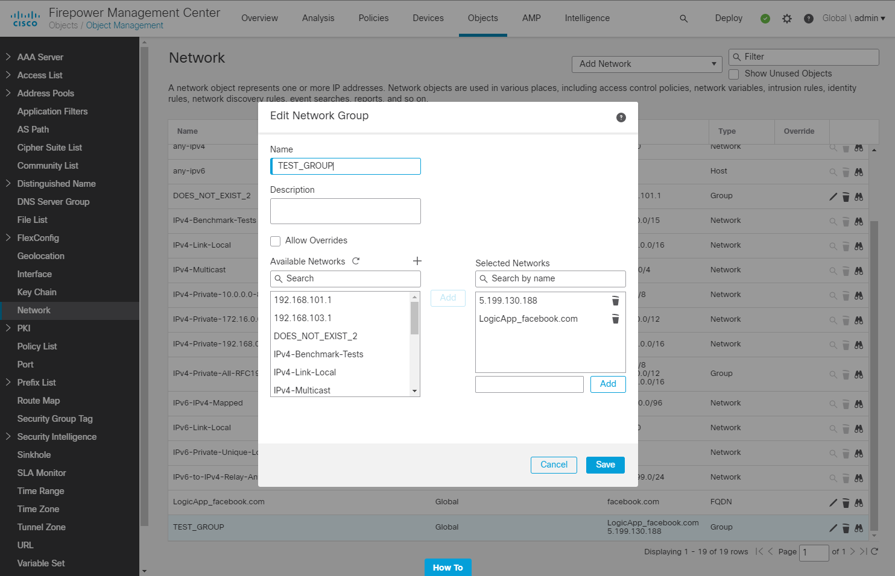

# Cisco Firepower - Add FQDN to a Network Group object

## Summary

This playbook allows blocking of FQDNs in Cisco Firepower, using a **Network Group object**. This allows making changes to a Network Group selected members, instead of making Access List Entries. The Network Group object itself should be part of an Access List Entry.

When a new Sentinel incident is created, this playbook gets triggered and performs the following actions.
1. For the URLs of the incident we extract the FQDN
2. For the FQDNs we check if they are already selected for the Network Group object
3. For the FQDNs not already selected for the Network Group object we check if there is an existing FQDN object in Cisco Firepower, if it does not exist we create it
4. We add the FQDN object to the Network Group object, so it gets blocked
5. Comment is added to Azure Sentinel incident
    

** FQDN is added to Cisco Firepower Network Group object:**

**Plabook overview:**

### Prerequisites
1. Cisco Firepower custom connector needs to be deployed prior to the deployment of this playbook, in the same resource group and region. Relevant instructions can be found in the connector doc pages.
2. In Cisco Firepower there needs to be a Network Group object. [Creating Network Objects](https://www.cisco.com/c/en/us/td/docs/security/firepower/630/configuration/guide/fpmc-config-guide-v63/reusable_objects.html#ariaid-title15)

### Deployment instructions 
1. Deploy the playbook by clicking on "Depoly to Azure" button. This will take you to deplyoing an ARM Template wizard.

2. Fill in the required paramteres:
    * Playbook Name: Enter the playbook name here (ex:CiscoFirepower-BlockFQDN-NetworkGroup)
    * Cisco Firepower Connector name: Enter the name of the Cisco Firepower custom connector (default value:CiscoFirepowerConnector)
    * Network Group object name: The name of the Network Group object.

### Post-Deployment instructions 
#### a. Authorize connections
Once deployment is complete, you will need to authorize each connection.
1.	Click the Azure Sentinel connection resource
2.	Click edit API connection
3.	Click Authorize
4.	Sign in
5.	Click Save
6.	Repeat steps for other connections such as Cisco Firepower (For authorizing the Cisco Firepower API connection, the username and password needs to be provided)

#### b. Configurations in Sentinel
1. In Azure sentinel analytical rules should be configured to trigger an incident with URL Entity.
2. Configure the automation rules to trigger this playbook
