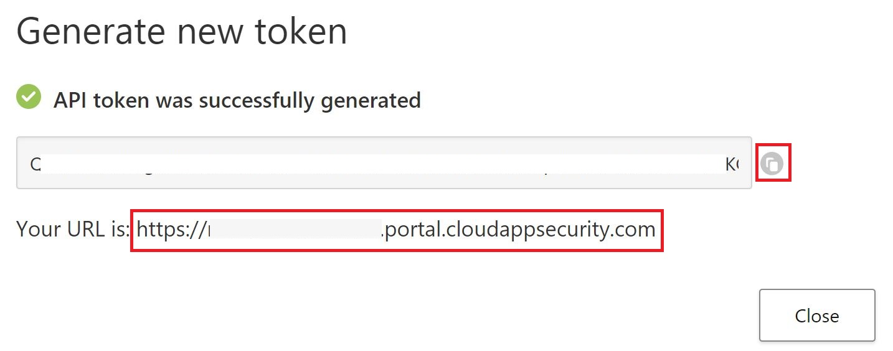

# Close Incident MCAS Playbook
Author: Benjamin Kovacevic

This playbook will close the Sentinel incident and will also dismiss the corresponding Microsoft Cloud App Security alert.

Before you start deploying this playbook, we first need to generate MCAS API Token and to get MCAS URL.

Go to MCAS portal (https://portal.cloudappsecurity.com/), click on Settings (Gear icon) and choose Security Extensions.

Click on +Add token, enter token name (like SentinelMCAS) and click on Generate.
In next screen COPY API token - after you close, you are not able to see this token again! Copy as well you URL.

Now we can deploy playbook template!

