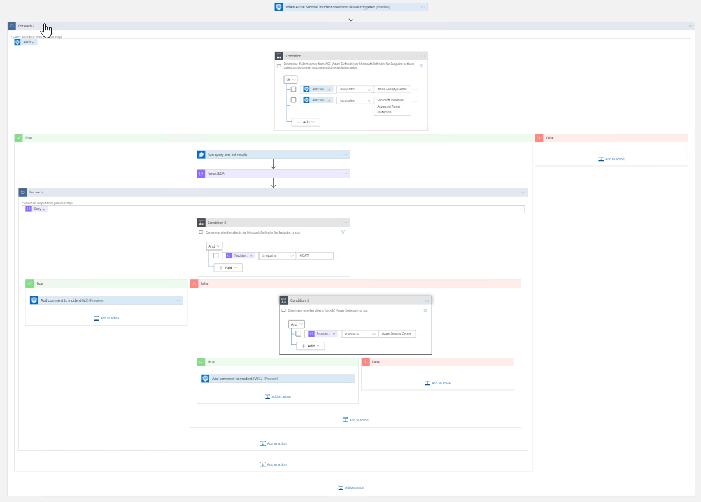
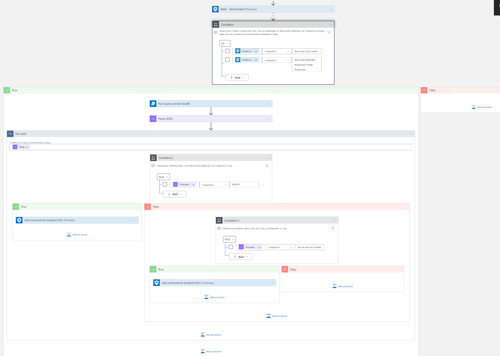

# Comment-RemediationSteps
authors: Jordan Ross and Nicholas DiCola

This playbook will provide analysts with guidance to properly respond to an incident. This will add a comment to a Sentinel Incident with the remediation steps for alerts related to Microsoft Defender for Endpoint and Azure Security Center / Azure Defender. With these steps users will be able to respond to threats and prevent similar suspicious activity from occurring in the future. 

## Quick Deployment
**Deploy with incident trigger** (recommended)

After deployment, attach this playbook to an **automation rule** so it runs when the incident is created.

[Learn more about automation rules](https://docs.microsoft.com/azure/sentinel/automate-incident-handling-with-automation-rules#creating-and-managing-automation-rules)

**Deploy with alert trigger**

After deployment, you can run this playbook manually on an alert or attach it to an **analytics rule** so it will rune when an alert is created.

## Prerequisites
- This playbook requires the enablement of at least one of the following data connections: Microsoft Defender for Endpoint or Azure Defender. This playbook uses a managed identity to access the API.
- You will need to add the playbook to the subscriptions or management group with Security Reader Role

## Screenshots
**Incident Trigger**

**Alert Trigger**
