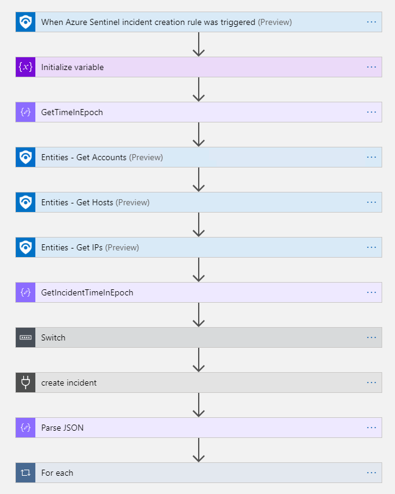

# Create-IBMResilientIncident
author: Nicholas DiCola

This playbook will create an IBM Resilient incident from an Azure Sentinel incident.  It will also
add the Azure Sentinel Incident Entities as IBM Resilient Incident Artifacts.

## Custom Connector
This playbook uses a custom connector in Logic Apps. The template is set to not need a gateway, but if IBM Resilient is on-prem you can deploy a Logic Apps gateway and set the connector to use that gateway. You will need to update the connector and delete/re-add the API connection.

**If you want to deploy just the customer connector:**

## Quick Deployment
**Deploy with incident trigger (and custom connector)** (recommended)

After deployment, attach this playbook to an **automation rule** so it runs when the incident is created.

[Learn more about automation rules](https://docs.microsoft.com/azure/sentinel/automate-incident-handling-with-automation-rules#creating-and-managing-automation-rules)

**Deploy with alert trigger (and custom connector)**

After deployment, you can run this playbook manually on an alert or attach it to an **analytics rule** so it will rune when an alert is created.

## Prerequisites

None

## Screenshots

**Incident Trigger** 

**Alert Trigger** 
