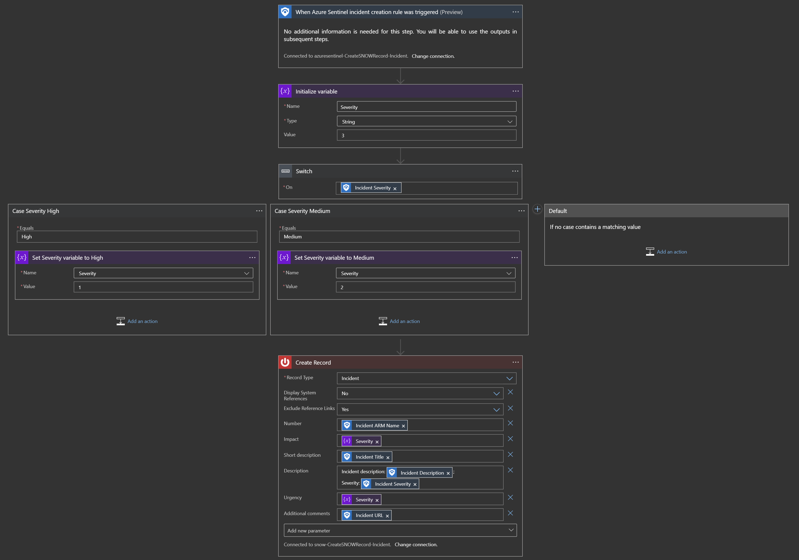

# Create-SNOW-record
author: Yaniv Shasha, Benjamin Kovacevic

This playbook will open a Service Now incident when a new incident is opened in Azure Sentinel. 
 
High severity incident in Azure Sentinel will be synced with Critical priority to SNOW 
Medium severity incident in Azure Sentinel will be synced with Moderate priority to SNOW 
Low and Informational severity incident in Azure Sentinel will be synced with Planning priority to SNOW  
## Prerequisites

We will need following data to make SNOW connector: 
1. SNOW instance (ex. xyz.service-now.com) 
2. Username 
3. Password 
  

## Quick Deployment
**Deploy with incident trigger** (recommended)

After deployment, attach this playbook to an **automation rule** so it runs when the incident is created.

[Learn more about automation rules](https://docs.microsoft.com/azure/sentinel/automate-incident-handling-with-automation-rules#creating-and-managing-automation-rules)

**Deploy with alert trigger**

After deployment, you can run this playbook manually on an alert or attach it to an **analytics rule** so it will rune when an alert is created.

 
 
## Post-deployment
Go to Playbook edit mode and fix SNOW connection with data from Prerequisite.  
 

<strong>Note: This step is necessary only if you are deploying the Playbook using Alert trigger method from above</strong> 
We will need to assign Azure Sentinel Reader role to the Playbooks Managed Identity: 
1. Open Playbook and go to Settings > Identity
2. Click on Azure Role Assignments and then on Add Role Assignment
3. For Scope choose Resource group and make sure that subscription and resource group are where Azure Sentinel and Playbook are deployed. For Role choose Azure Sentinel Reader and click on Save. 
 
## Screenshots

**Incident Trigger** 
 
 
 
**Alert Trigger** 
 
 
 
**Example in ServiceNow** 
 
