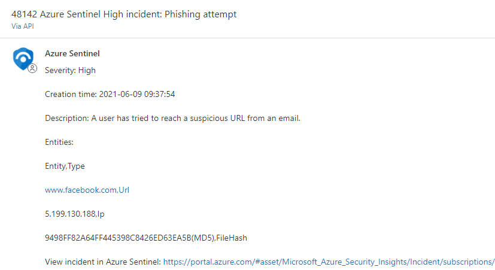
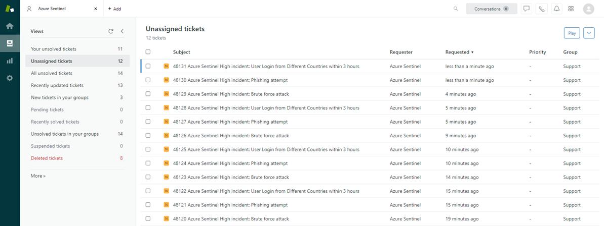
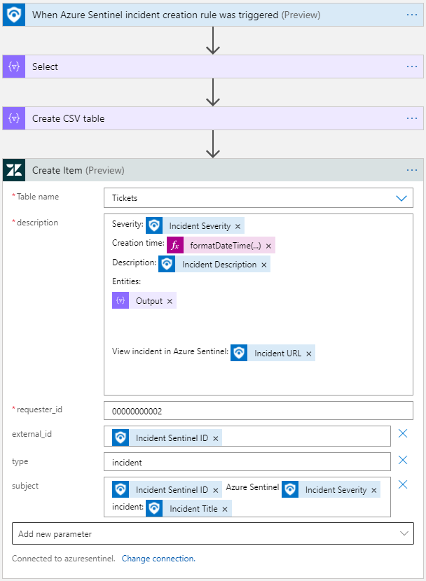

# Create-Zendesk-Ticket
author: Lior Tamir

This playbook will create a Zendesk ticket when a new incident is created in Azure Sentinel.

## Prerequisites 
Create a Zendesk user (for example, call it Azure Sentinel) which on behalf of its requester id new tickets will be created.

## Screenshots

 

 

