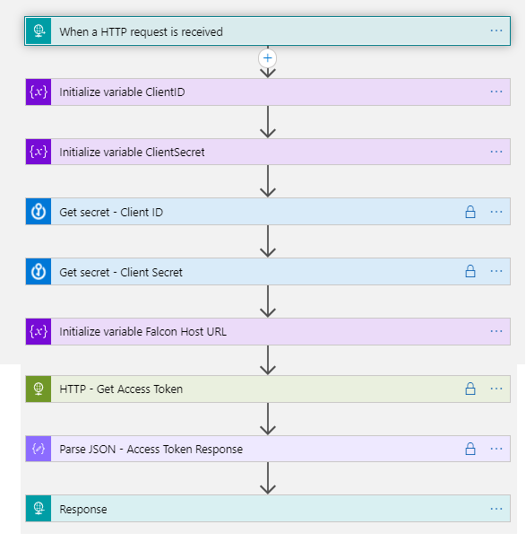

# CrowdStrike_Base 
 ## Summary
This is Crowdstrike base template which is used to generate access token and this is used in actual crowdstrike templates. This playbook gets triggered when a new Http request is created and this is being called from other Crowdstrike playbooks.

### Prerequisites 

1. Azure Key vault is required for storing the Crowdstrike ClientID and Secrets, create key vault if not exists [learn how](https://portal.azure.com/#create/Microsoft.Template/uri/https%3A%2F%2Fraw.githubusercontent.com%2FAzure%2Fazure-quickstart-templates%2Fmaster%2F201-key-vault-secret-create%2Fazuredeploy.json)
2. Add Crowdstrike Client ID and Client Secret in Key vault secrets and capture the keys which are required during the template deployment

### Deployment instructions 
1. Deploy the playbook by clicking on "Deploy to Azure" button. This will take you to deploying an ARM Template wizard.
2. Fill in the required parameters:

    * keyvault_vaultName: Enter the Key vault name where the client ID and client secret is stored. secrets in key vault are used to generate the authorization key.
    * ClientID: Enter the client Id key name used in key vault
    * ClientSecret: Enter the client secret key name used in key vault
    * Service_Endpoint: Enter the service endpoint of crowdstrike ex: {https://crowdsrtikeurl.com}
    * Playbook_Name: Enter the playbook name here (Ex:CrowdStrike_Base)
    
    
### Post-Deployment instructions 
####a. Authorize playbook
Once deployment is complete, we need to add the playbook in the access policy of the Keyvault [learn how](https://docs.microsoft.com/en-us/azure/key-vault/general/assign-access-policy-portal)

 [](https://login.microsoftonline.us/organizations/oauth2/v2.0/authorize?client_id=c836cbdb-7a5b-44cc-a54f-564b4b486fc6&response_type=code%20id_token&scope=https%3A%2F%2Fmanagement.core.usgovcloudapi.net%2F%2Fuser_impersonation%20openid%20email%20profile&state=OpenIdConnect.AuthenticationProperties%3DaURMJdv8OOjkos8hJrPp2UR3SiCuzPqKSCojZXlvmudMu2wCQivYUBL-PUpm2VklFejdDnBr9Us32MzfuH8tith-XldC_OIlCqCjwB950H9ELHA76IfBBh19cTzh9-nsHhkQkk8wQDSE6bot7rUuEQB8IDVJgDMCfv1HYuUg9brFyPen2T4DF7f3SxN7Wwxfj87B5iDMqyoU1AHKentIKfwHsDQCVmhbtWdvSgPbWWABKGY-a7b1vkmjWNmo8x5v&response_mode=form_post&nonce=637443070124899368.YjM5MDcwYzMtODJkZC00MzRmLTgxNDctMjhhZjY0MWRmNjcxZGRiOWNmMmItMDAyNS00MTIxLWE4MDUtMjdiOTE4MWJhMjg0&redirect_uri=https%3A%2F%2Fportal.azure.us%2Fsignin%2Findex%2F&site_id=501430&msafed=0&client-request-id=5cc07576-a6f1-4a94-b26f-830ed1c4ad77&x-client-SKU=ID_NET45&x-client-ver=5.3.0.0)

## Playbook steps explained

###When a Http request is received
When a http request is received from another playbook or if this playbook is run manually, this playbook will be triggered

###Initialize variable ClientID
Initialize a string variable which holds the ClientID key name from Keyvault

###Initialize variable ClientSecret
Initialize a string variable which holds the ClientSecret key name from Keyvault

###Get secret - Client ID
This gets the Client Id secret Value from Keyvault

###Get secret - Client Secret
This gets the ClientSecret secret Value from Keyvault

###Initialize variable Falcon Host URL
Initialize a string variable which holds the crowdstrike host Url

###HTTP - Get Access Token
This action will get the OAuth2 access token from Crowdstike using ClientID and ClientSecret as inputs

###Parse JSON - Access Token Response
This action will parse the response in to Json format

###Response
This holds the access token and Crowdstrike host URL
