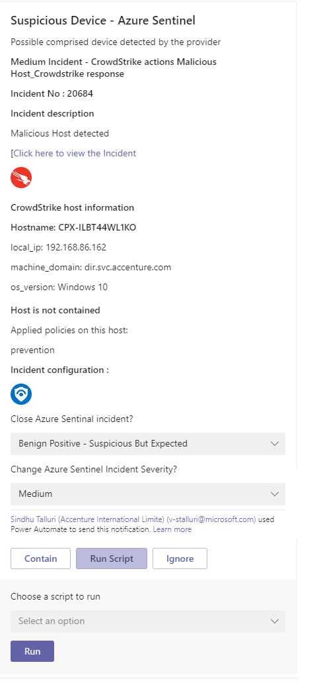

  # Crowdstrike playbook templates

   

## Table of Contents

1. [Overview](#overview)
1. [Deploy 4 Playbook templates](#deployall)
1. [Authentication](#authentication)
1. [Prerequisites](#prerequisites)
1. [Deployment](#deployment)
1. [Post Deployment Steps](#postdeployment)
1. [Limitations](#limitations)

<a name="overview">

# Overview

CrowdStrike is a SaaS solution that leverages advanced EDR applications and techniques to provide a next generation anti-virus offering powered by machine learning to ensure breaches are stopped before they occur.

<a name="deployall">

## Deploy 4 Playbook templates

This package includes 4 playbook templates leverage Crowdstrike API's.
You can choose to deploy the whole package (Four playbook templates) from the Deploy To Azure buttons below, or each one separately from it's specific folder.
* [Base playbook](./Playbooks/CrowdStrike_Base) is a nested playbook that handles authentication for any of the othe playbooks. 
* [Contain Host playbook](./Playbooks/CrowdStrike_ContainHost) will automatically contain hosts found in the incident.
* [Enrichment playbook](./Playbooks/CrowdStrike_Enrichment_GetDeviceInformation) will post a comment to the incident with device information and related detections found in CrowdStrike.
* [Response from Teams playbook](./Playbooks/CrowdStrike_ResponsefromTeams) will send the SOC Channel interactive cards with host information, allowing taking action on the host: Running a script or contain the host in CrowdStrike.

  

# Crowdstrike playbooks documentation 

<a name="authentication">

## Authentication
Authentication methods this end point supports- [oauth2 authentication](https://falcon.crowdstrike.com/support/documentation/46/crowdstrike-oauth2-based-apis#authenticating)

<a name="prerequisites">

### Prerequisites for using and deploying playbooks
1. Crowdstrike cloud end point should be known. (e.g.  https://{CrowdsrtikebaseURL})
1. User should know the Client ID and Client Secret values, and store them in a Key Vault.
1. Key vault needs to be created, and include the Client ID and Secret, under the same subscription of the Playbooks. [learn how](https://portal.azure.com/#create/Microsoft.Template/uri/https%3A%2F%2Fraw.githubusercontent.com%2FAzure%2Fazure-quickstart-templates%2Fmaster%2F201-key-vault-secret-create%2Fazuredeploy.json)
1. For playbook **Response From Teams**:
  * There should be a list of prewritten scripts created in Crowdstrike, so SOC analyst can choose from that list. [learn how to create scripts](https://falcon.crowdstrike.com/support/documentation/71/real-time-response-and-network-containment#rtr_custom_scripts) our playbook does not provide an option to create a script.
  * To run a script user needs to be an RTR Active Responder and RTR Administrator in the falcon console. [Understand and assign Real Time Responder roles](https://falcon.crowdstrike.com/support/documentation/71/real-time-response-and-network-containment#rtr_roles)
  * The following settings needs to be done on the host to run a script:
    *  Configure [Response Policies](https://falcon.crowdstrike.com/support/documentation/71/real-time-response-and-network-containment#rtr-policy-config) - create policies and assign host groups to them
    *  Enable the toggle real time functionality and enable custom scripts toggle to run them in [Real time response policy settings](https://falcon.crowdstrike.com/support/documentation/71/real-time-response-and-network-containment#rtr-policy-config)

<a name="deployment">

### Deployment instructions 
1. Deploy the playbooks by clicking on "Deploy to Azure" button. This will take you to deploying an ARM Template wizard.
2. Fill in the required parameters for deploying  playbooks

| Parameters | Description |
|----------------|--------------|
|**Service_EndPoint** | Enter the crowdstrike end point (e.g. https://{CrowdstrikeBaseURL})|
|**keyvault_Name** | Enter the keyvault name where we are storing the clientID and ClientSecret for authorization )|
|**ClientID** | Enter the ClientID key name |
|**ClientSecret** | Enter the ClientSecret key name |
|**CrowdStrike_Base_Playbook_Name**|  Enter the playbook name here (e.g. CrowdStrike_Base)|
|**Crowdstrike_ContainHost_Playbook_Name** |Enter the playbook name here (e.g. Crowdstrike_ContainHost)|
|**Crowdstrike_Enrichment_GetDeviceInformation_Playbook_Name** | Enter the playbook name here (e.g. Crowdstrike_Enrichment)| 
|**Crowdstrike-ResponsefromTeams_Playbook_Name** | Enter the playbook name here (e.g. Crowdstrike-ResponsefromTeams)| 
|**Teams GroupId** | Enter the Teams channel id to send the adaptive card|
|**Teams ChannelId** | Enter the Teams Group id to send the adaptive card [Refer the below link to get the channel id and group id](https://docs.microsoft.com/powershell/module/teams/get-teamchannel?view=teams-ps)|

<a name="postdeployment">

### Post-Deployment instructions 
The base playbook should be added in the access policies of Key vault [learn how](https://docs.microsoft.com/azure/key-vault/general/assign-access-policy-portal)
#### a. Authorize connections
Once deployment is complete, you will need to authorize each connection.
1.	Click the Azure Sentinel connection resource
2.	Click edit API connection
3.	Click Authorize
4.	Sign in
5.	Click Save
6.	Repeat steps for Teams connection as well

#### b. Configurations in Sentinel
1. In Azure sentinel analytical rules should be configured to trigger an incident with risky host. 
2. Configure the automation rules to trigger the playbooks.

<a name="limitations">

## Known Issues and Limitations
1. Run a script is not supported on devices which are offline
