# Edgescan-AzureSentinel-Integration

## Functionality
This package contains three separate logic apps:
* **edgescan_vulnerabilities**
* **edgescan_assets**
* **edgescan_hosts**

The end goal of this document is to set up Azure Sentinel logic apps that run daily and ingest records created in Edgescan over the past two days. 
The logic apps will scan the entries created within the last 7 days in the **custom logs** in Azure Sentinel for IDs duplicate IDs before adding a new entry to the corresponding log.

The logic app templates you will deploy, however, are created for the initial run, which is missing this duplicate checking logic and are instead geared to pull in all data. This documentation will walk you through executing this initial run and then walk you through the changes needed to achieve the end goal.

Entries will be stored in Azure Sentinel **custom logs** with the following table names:
* **edgescan_vulnerabilities_CL**
* **edgescan_assets_CL**
* **edgescan_hosts_CL**

### Viewing Custom Logs
* From your home page, navigate to the Azure Sentinel service
* There, select the workspace your deployed logic apps reference
* There, click on Logs in the left-hand menu and expand Custom Logs

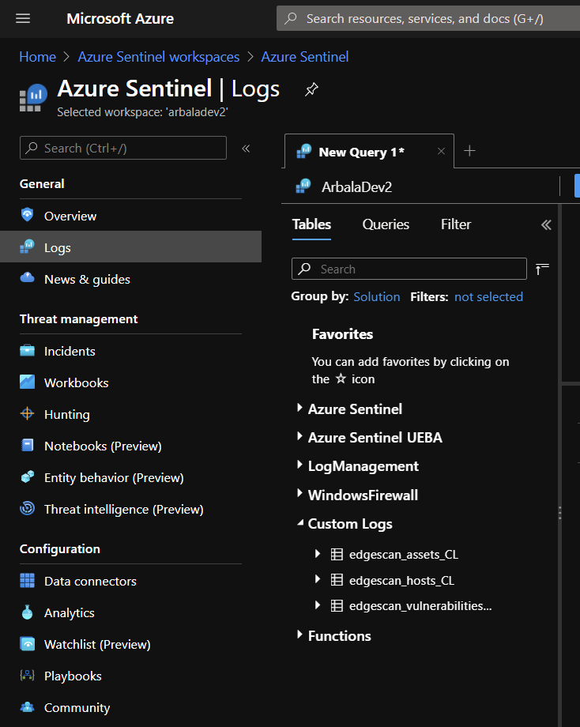

## Deploy the Logic Apps
### edgescan_vulnerabilities

### edgescan_assets

### edgescan_hosts

## Initial Setup
Each of these logic apps are disabled upon deployment, meaning they will not run until you enable them.

First, you will need to validate the connections each logic app uses to send Edgescan data to Azure Sentinel custom logs. To do this, you can either click on the Logic Apps service from the home page, and find your recently deployed logic apps there, or, after deployment, click on the logic app resource as shown below.

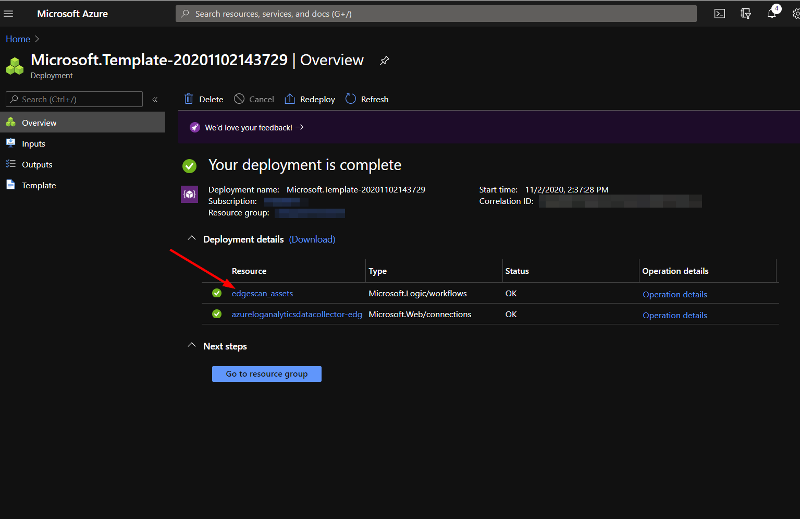

From there, click the edit button.

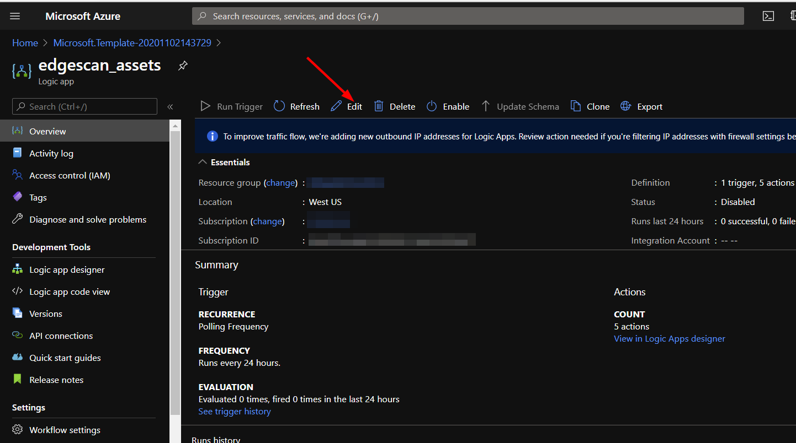

Next, expand the for each and the connection actions.

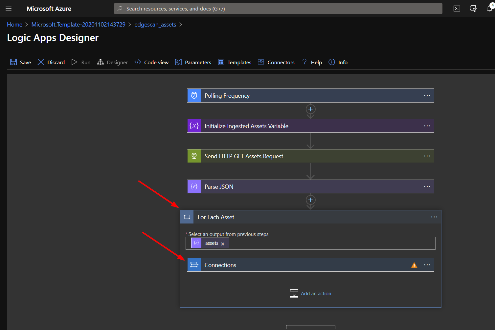

Click on the exclamation point icon for the connection matching the logic app name.

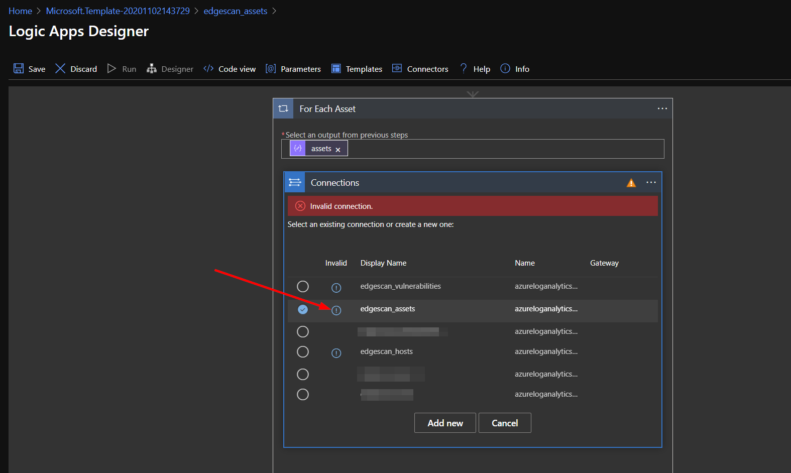

Enter the logic app name in for the Connection Name. 

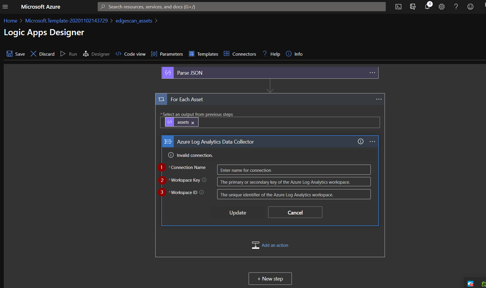

To obtain items 2 and 3, in a separate tab, open to the workspace your logic apps were deployed in. This can be found by navigating to the Log Analytics workspaces Service from the home page.

Click on the Agents management option.

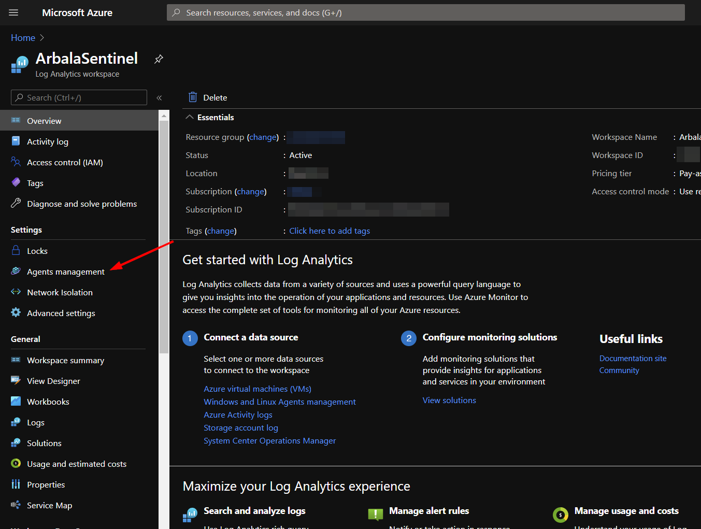

This will show you the workspace id and key, corresponding to items 3 and 2 respectively.

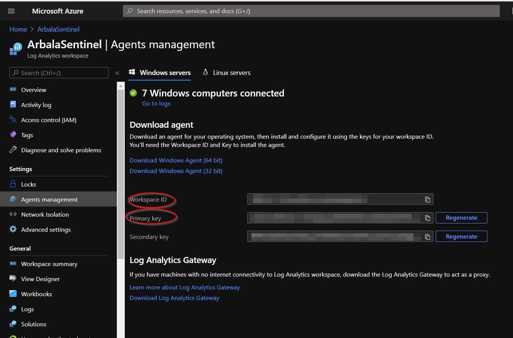

Now the logic app can be saved and enabled. 

**Note** Before you enable and run the logic apps, you may wish to limit the data initially ingested from Edgescan. If this is the case, click edit on each of the logic apps again.

Expand the HTTP Request Section.

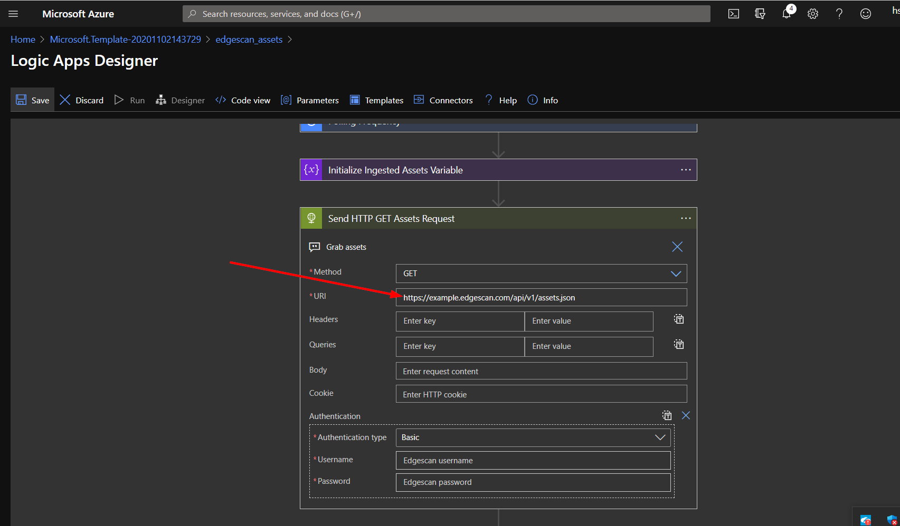

To only ingest records created in the last year, for example, you would add the following string to the end of the existing URI to the necessary logic apps:

### edgescan_vulnerabilities
    ?c[date_opened_after]=@{formatDateTime(addDays(utcNow(),-365),'yy-MM-dd')}

### edgescan_assets
    ?c[created_at]=@{formatDateTime(addDays(utcNow(),-365),'yy-MM-dd')}

### edgescan_hosts
    ?c[updated_at]=@{formatDateTime(addDays(utcNow(),-365),'yy-MM-dd')}

  
**Note** In the case of hosts, since no created date field appears to exist, the field indicating the last update is used instead.
  

Once this is done, be sure to save each logic app. 

## Initial Run
To execute our initial run, enable each logic app and run their triggers.

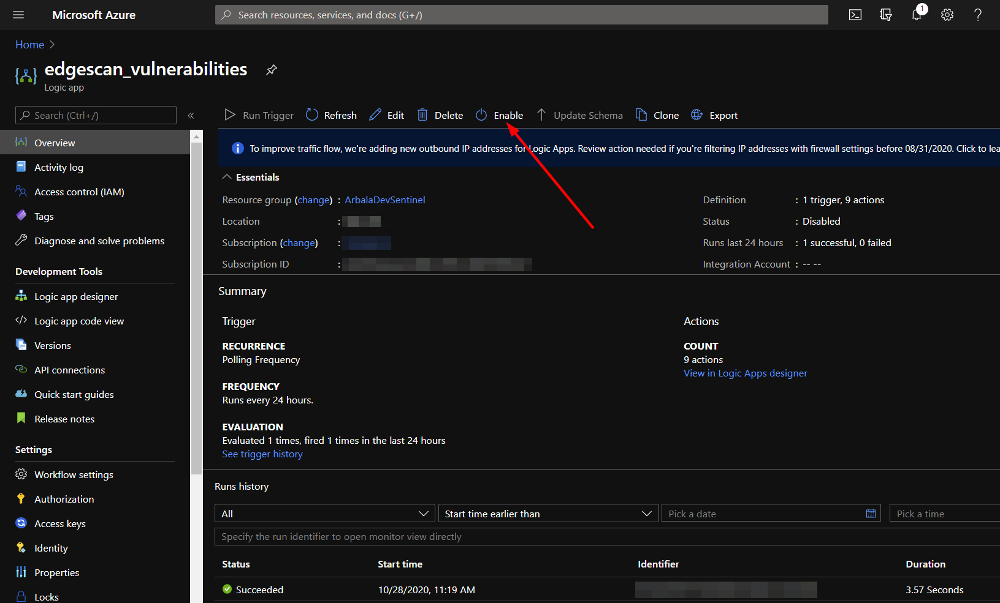

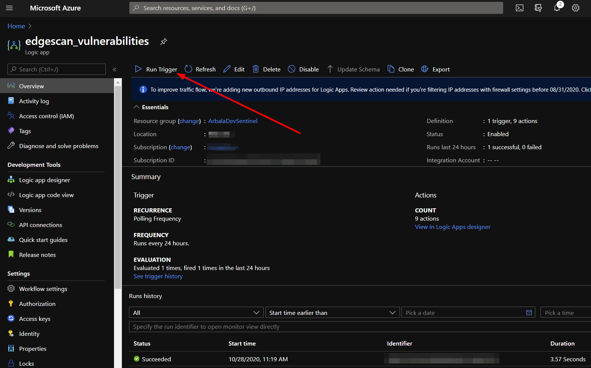

Once these complete successfully, **disable the logic apps**. We do not want them to run again until we have made additions to check for duplicates and allow a smaller lookback window.

If you do not wish to have constant polling of assets and hosts, these logic apps may be left disabled.

## Final Set Up

If you wish to have constant polling for new data, perform the following steps on each logic app:

First we’ll add the duplicate checking actions to our logic app.

Edit the logic app and add a new action below the Initialize Variable action.

Search for "Run query and list results".

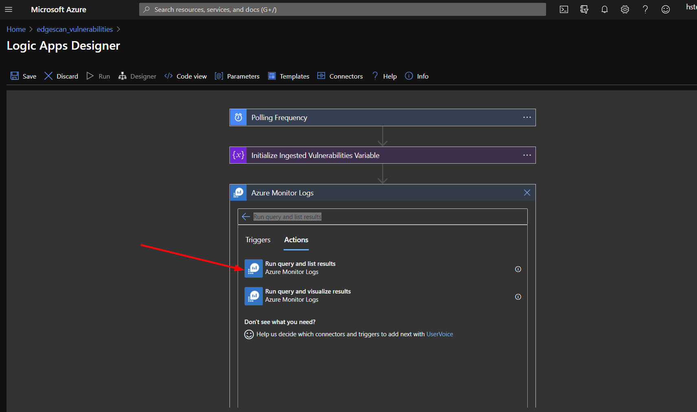

Select the information from the drop-down lists matching what was used in the logic app deployment. Be sure to select "**Log Analytics Workspace**" for the Resource Type.

Add the query matching the logic app you are editing:

### edgescan_vulnerabilities
    edgescan_vulnerabilities_CL 
    | where date_opened_t >= now(-3d)

### edgescan_assets
    edgescan_assets_CL

### edgescan_hosts
    edgescan_hosts_CL

Set the lookback range to **7 days**, although you may want to do something closer to 3 days if the data is high in volume.

You may also rename the action to something more descriptive.

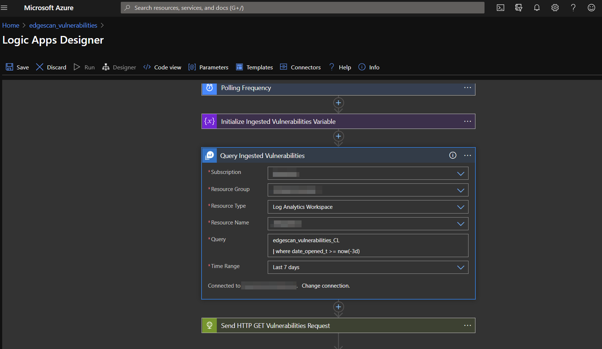

**Note** since the volume of hosts and assets is expected to be much lower, no additional filters other than a date range are used in those queries.

Below the query action, add another action, searching for "**Control**" and then selecting "**For each**".

 

Select the value from the query result to loop through.

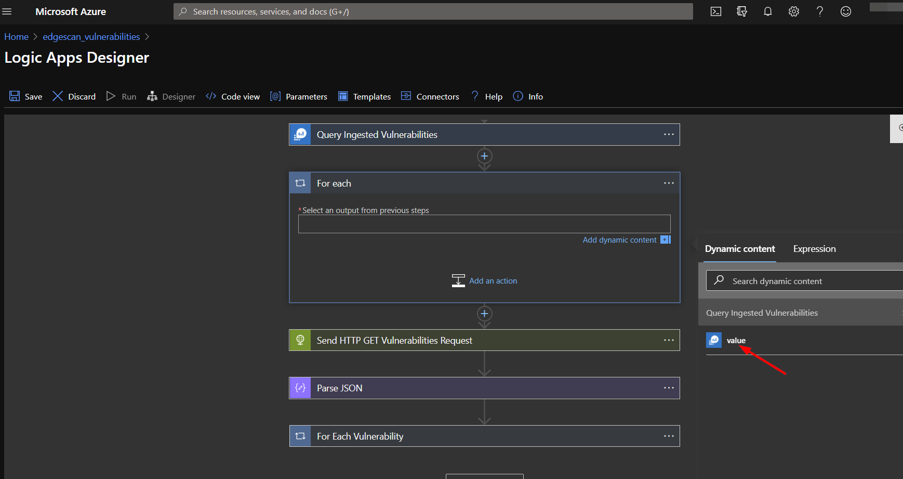
 
 Add an action inside the for loop, searching for "**Append to string variable**".
 
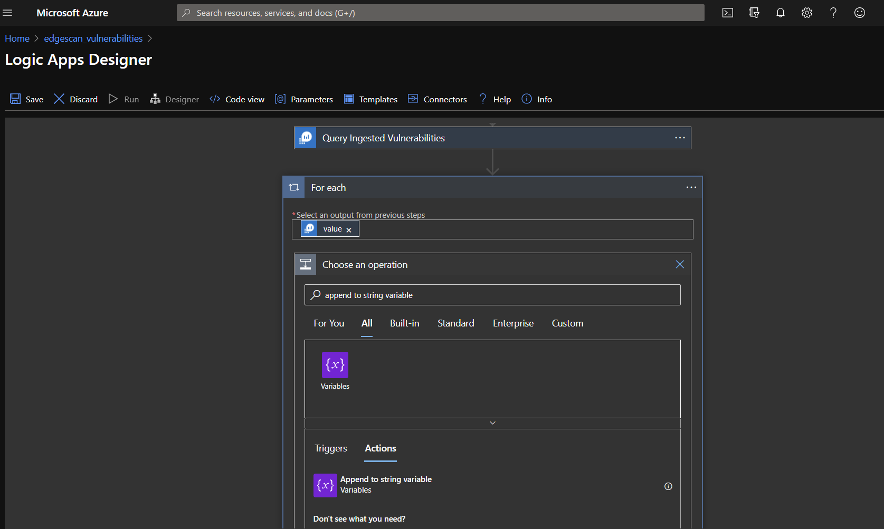

Select the string variable referenced in the logic app and add paste the following in the "**Expression**" tab of the dynamic content value box:

    concat(items('For_each')?['id_d'], ' ')

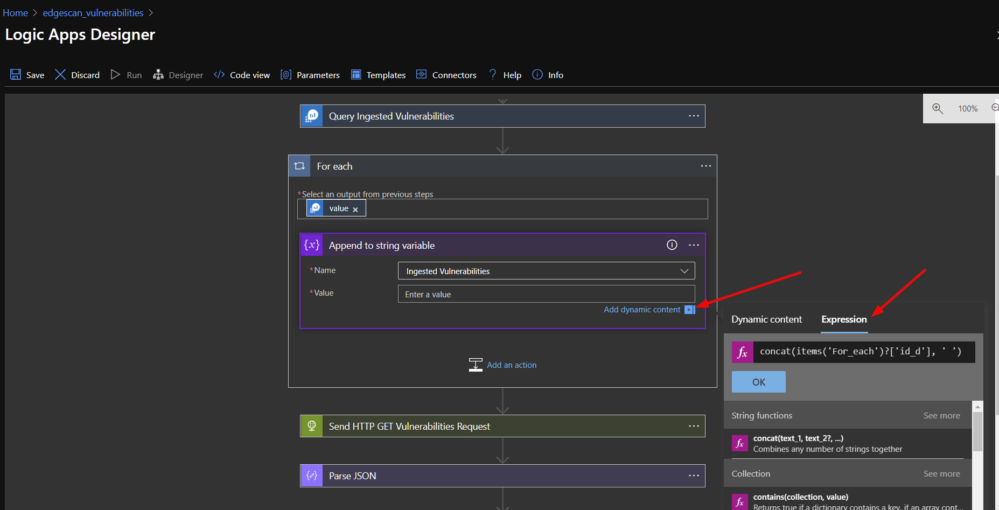

Now navigate down to the bottom for loop of your logic app.

Click "**Add an action**" inside the loop.

As you did before, select the "**Control**" action.

This time, click on "**Condition**".

In the Condition box, select the string variable in your logic app, select "**does not contain**" from the middle drop down, then paste one of the following strings in the "Expression" tab of the dynamic content value box:

### edgescan_vulnerabilities
    string(items('For_Each_Vulnerability')['id'])

### edgescan_assets
    string(items('For_Each_Asset')['id'])

### edgescan_hosts
    string(items('For_Each_Host')['id'])
    

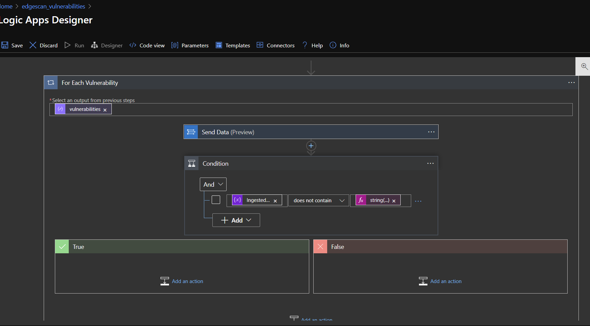

Finally, click and drag the "**Send data**" action into the "**True**" condition outcome box.

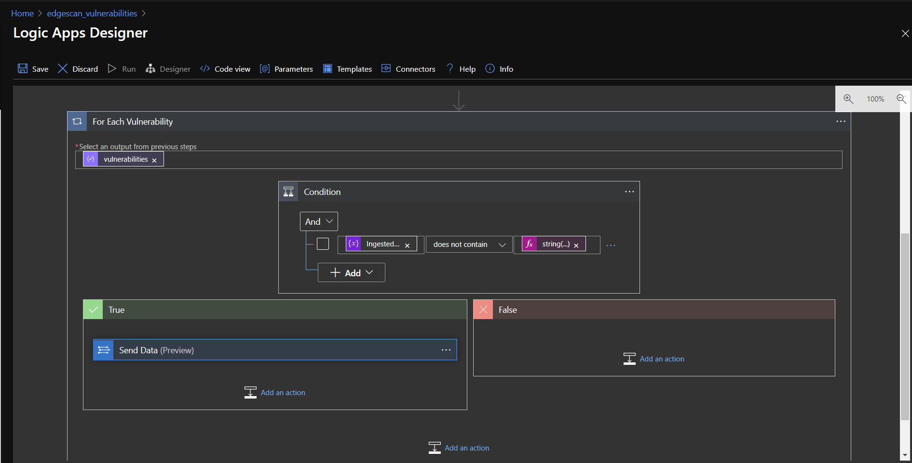

With the duplicate checking logic implemented, now we'll adjust our data ingestion window.

Expand the HTTP Request action in your logic app and add one of the following to the end of the URI, or, if you opted to add an additional filter earlier, replace that one with one of the following:

### edgescan_vulnerabilities
    ?c[date_opened_after]=@{formatDateTime(addDays(utcNow(),-2),'yy-MM-dd')}

### edgescan_assets
    ?c[created_at]=@{formatDateTime(addDays(utcNow(),-2),'yy-MM-dd')}

### edgescan_hosts
    ?c[updated_at]=@{formatDateTime(addDays(utcNow(),-2),'yy-MM-dd')}

The end result should look like this:
  
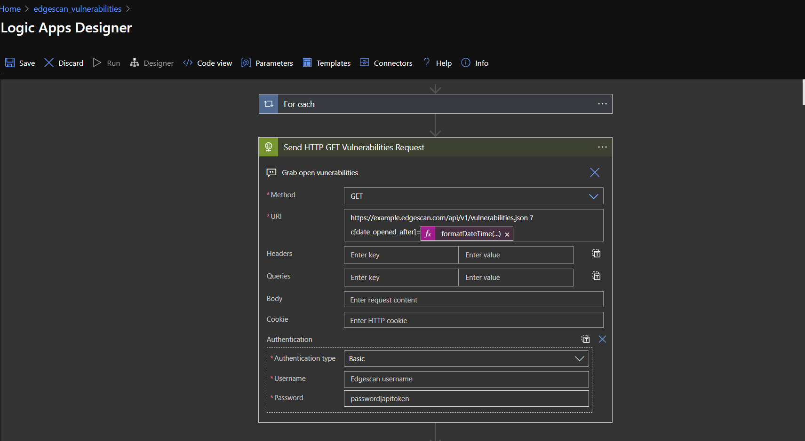

  
Save the logic app and enable it.
