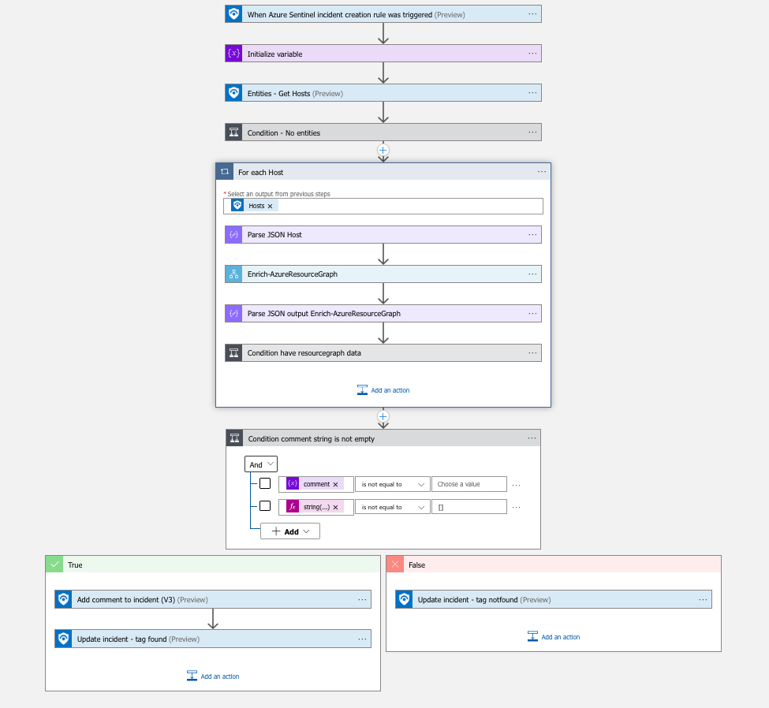

# Enrich-AzureResourceGraph-Incident

This logicapp calls Enrich-AzureResourceGraph to comment Sentinel Incident based on ResourceGraph data

## Quick Deployment

After deployment,
* Allow logicapp managed identity to update incident by adding IAM role [Sentinel Responder or above](https://learn.microsoft.com/en-us/azure/role-based-access-control/built-in-roles#microsoft-sentinel-responder)
* attach this playbook to an **automation rule** so it runs when the incident is created.

[Learn more about automation rules](https://docs.microsoft.com/azure/sentinel/automate-incident-handling-with-automation-rules#creating-and-managing-automation-rules)

## Prerequisites

* Enrich-AzureResourceGraph logicapp
* Adapt query to your context

## Screenshots

## Workflow explained

1. Azure Sentinel incident trigger
2. Get Hosts entities
3. For each host, call Enrich-AzureResourceGraph
4. Add comment and tag found/notfound depending on output
