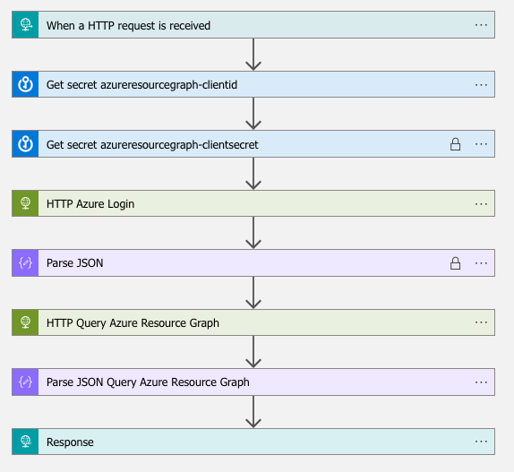

# Enrich-AzureResourceGraph

This LogicApp is querying Azure ResourceGraph and return typical azure information related to the resource like subscription, resourcegroup, tags and management groups.
It is encapsulated in other Logic app to enrich Sentinel incident (like Enrich-AzureResourceGraph-Incident).

## Quick Deployment

[Learn more about automation rules](https://docs.microsoft.com/azure/sentinel/automate-incident-handling-with-automation-rules#creating-and-managing-automation-rules)

[](https://portal.azure.com/#create/Microsoft.Template/uri/https%3A%2F%2Fraw.githubusercontent.com%2FAzure%2FAzure-Sentinel%2Fmaster%2FPlaybooks%2FEnrich-AzureResourceGraph%2Fazuredeploy.json)
[](https://portal.azure.us/#create/Microsoft.Template/uri/https%3A%2F%2Fraw.githubusercontent.com%2FAzure%2FAzure-Sentinel%2Fmaster%2FPlaybooks%2FEnrich-AzureResourceGraph%2Fazuredeploy.json)


## Prerequisites

* AzureResourceGraph data access requires Reader access for targeted scope
* Service principal client id and secret stored in Azure keyvault as 'azureresourcegraph-clientid' and 'azureresourcegraph-clientsecret' (Possible change to Managed Identity as supported by HTTP block)
* Default playbooks have a limit of 3 join. It is possible to extend this by opening an Azure support case with following inputs
  * Service Principal Client and Object id if service principal
  * LogicApp resource id and identity object id if managed identity
  * Example failed run because of it with correlation id and timestamp
  * Expect about a week delay for change to be effective after support validation
  * "There is a default limit of 3 join and 3 mv-expand operators in a single Resource Graph SDK query. You can request an increase in these limits for your tenant through Help + support." - https://learn.microsoft.com/en-us/azure/governance/resource-graph/concepts/query-language#supported-tabulartop-level-operators

## Screenshots


## Workflow explained
(step by step pseudo-code)

1. When a HTTP request is received
2. Get Azure ResourceGraph client id and secret from Keyvault
3. Do Azure Login
4. Do Azure ResourceGraph query
5. Return response through HTTP

Included queries (KQL, Azure ResourceGraph...
Current default query is
```
resources
| where name == \"@{triggerBody()?['resourceName']}\"
| join kind=inner (
    resourcecontainers
    | where type == 'microsoft.resources/subscriptions'
    | project subscriptionId, subscriptionName = name, subproperties = properties
) on subscriptionId
| project subscriptionName, resourceGroup, name, type, tags, subproperties
```

Possible custom queries
* RDP port Internet-facing
```
resources
| where type =~ 'Microsoft.Compute/virtualMachines'
| join kind=inner (resourcecontainers
    | where type == 'microsoft.resources/subscriptions'
    | project subscriptionId, subscriptionName = name, subproperties = properties
    ) on subscriptionId
| extend instance_id = properties.vmId
| extend resourceid = id
| extend vmStatus = properties.extended.instanceView.powerState.displayStatus
| join kind=leftouter (
    Resources
    | where type =~ "Microsoft.Network/networkInterfaces"
    | mv-expand properties.ipConfigurations
    | where isnotempty(properties_ipConfigurations.properties.publicIPAddress.id)
    | extend publicIpId = tostring(properties_ipConfigurations.properties.publicIPAddress.id)
    | join (
        Resources
        | where type =~ "microsoft.network/publicipaddresses"
        ) on $left.publicIpId == $right.id
    | extend ipAddress = tostring(properties1.ipAddress)
    | extend publicIPAllocationMethod = tostring(properties1.publicIPAllocationMethod)
    | extend publicIpName = tostring(name1)
    | extend vmId = tostring(properties.virtualMachine.id)
    | extend nsgId = tostring(properties.networkSecurityGroup.id)
    | project publicIpName,publicIPAllocationMethod,ipAddress,vmId,nsgId
    ) on $left.id == $right.vmId
| join (
    resources
    | where type =~ "microsoft.network/networksecuritygroups"
    |mv-expand rules=properties.securityRules
    |extend direction=tostring(rules.properties.direction)
    |extend priority=toint(rules.properties.priority)
    |extend rule_name = rules.name
    |extend nsg_name = name
    |extend description=rules.properties.description
    |extend destination_prefix=iif(rules.properties.destinationAddressPrefixes=='[]', rules.properties.destinationAddressPrefix, strcat_array(rules.properties.destinationAddressPrefixes, ","))
    |extend destination_asgs=iif(isempty(rules.properties.destinationApplicationSecurityGroups), '', strcat_array(parse_json(rules.properties.destinationApplicationSecurityGroups), ","))
    |extend destination=iif(isempty(destination_asgs), destination_prefix, destination_asgs)
    |extend destination=iif(destination=='*', "Any", destination)
    |extend destination_port=iif(isempty(rules.properties.destinationPortRange), strcat_array(rules.properties.destinationPortRanges,","), rules.properties.destinationPortRange)
    |extend source_prefix=iif(rules.properties.sourceAddressPrefixes=='[]', rules.properties.sourceAddressPrefix, strcat_array(rules.properties.sourceAddressPrefixes, ","))
    |extend source_asgs=iif(isempty(rules.properties.sourceApplicationSecurityGroups), "", strcat_array(parse_json(rules.properties.sourceApplicationSecurityGroups), ","))
    |extend source=iif(isempty(source_asgs), source_prefix, tostring(source_asgs))
    |extend source=iif(source=='*', 'Any', source)
    |extend source_port=iif(isempty(rules.properties.sourcePortRange), strcat_array(rules.properties.sourcePortRanges,","), rules.properties.sourcePortRange)
    |extend action=rules.properties.access
    |extend subnets = strcat_array(properties.subnets, ",")
    | where direction == "Inbound" and destination_port==3389 and source == "Any" and action == "Allow"
    | extend nsg_rdp_name = nsg_name
    | extend nsg_rdp_rulename = rule_name
    | extend nsg_rdp_ruledescription = description
    | project nsg_rdp_name, nsg_rdp_rulename, nsg_rdp_ruledescription, id
    ) on $left.nsgId == $right.id
| where vmStatus == "VM running"
| project resourceid,instance_id,subscriptionName, resourceGroup, name, type, vmStatus, tags.environment, tags.contact, tags.businesscontact, tags.engcontact, subproperties, publicIpName, publicIPAllocationMethod, ipAddress, nsgId, nsg_rdp_name, nsg_rdp_rulename, nsg_rdp_ruledescription
```
* SSH port Internet-facing
```
resources
| where type =~ 'Microsoft.Compute/virtualMachines'
| join kind=inner (resourcecontainers
    | where type == 'microsoft.resources/subscriptions'
    | project subscriptionId, subscriptionName = name, subproperties = properties
    ) on subscriptionId
| extend instance_id = properties.vmId
| extend resourceid = id
| extend vmStatus = properties.extended.instanceView.powerState.displayStatus
| join kind=leftouter (
    Resources
    | where type =~ "Microsoft.Network/networkInterfaces"
    | mv-expand properties.ipConfigurations
    | where isnotempty(properties_ipConfigurations.properties.publicIPAddress.id)
    | extend publicIpId = tostring(properties_ipConfigurations.properties.publicIPAddress.id)
    | join (
        Resources
        | where type =~ "microsoft.network/publicipaddresses"
        ) on $left.publicIpId == $right.id
    | extend ipAddress = tostring(properties1.ipAddress)
    | extend publicIPAllocationMethod = tostring(properties1.publicIPAllocationMethod)
    | extend publicIpName = tostring(name1)
    | extend vmId = tostring(properties.virtualMachine.id)
    | extend nsgId = tostring(properties.networkSecurityGroup.id)
    | project publicIpName,publicIPAllocationMethod,ipAddress,vmId,nsgId
    ) on $left.id == $right.vmId
| join (
    resources
    | where type =~ "microsoft.network/networksecuritygroups"
    |mv-expand rules=properties.securityRules
    |extend direction=tostring(rules.properties.direction)
    |extend priority=toint(rules.properties.priority)
    |extend rule_name = rules.name
    |extend nsg_name = name
    |extend description=rules.properties.description
    |extend destination_prefix=iif(rules.properties.destinationAddressPrefixes=='[]', rules.properties.destinationAddressPrefix, strcat_array(rules.properties.destinationAddressPrefixes, ","))
    |extend destination_asgs=iif(isempty(rules.properties.destinationApplicationSecurityGroups), '', strcat_array(parse_json(rules.properties.destinationApplicationSecurityGroups), ","))
    |extend destination=iif(isempty(destination_asgs), destination_prefix, destination_asgs)
    |extend destination=iif(destination=='*', "Any", destination)
    |extend destination_port=iif(isempty(rules.properties.destinationPortRange), strcat_array(rules.properties.destinationPortRanges,","), rules.properties.destinationPortRange)
    |extend source_prefix=iif(rules.properties.sourceAddressPrefixes=='[]', rules.properties.sourceAddressPrefix, strcat_array(rules.properties.sourceAddressPrefixes, ","))
    |extend source_asgs=iif(isempty(rules.properties.sourceApplicationSecurityGroups), "", strcat_array(parse_json(rules.properties.sourceApplicationSecurityGroups), ","))
    |extend source=iif(isempty(source_asgs), source_prefix, tostring(source_asgs))
    |extend source=iif(source=='*', 'Any', source)
    |extend source_port=iif(isempty(rules.properties.sourcePortRange), strcat_array(rules.properties.sourcePortRanges,","), rules.properties.sourcePortRange)
    |extend action=rules.properties.access
    |extend subnets = strcat_array(properties.subnets, ",")
    | where direction == "Inbound" and destination_port==22 and source == "Any" and action == "Allow"
    | extend nsg_ssh_name = nsg_name
    | extend nsg_ssh_rulename = rule_name
    | extend nsg_ssh_ruledescription = description
    | project nsg_ssh_name, nsg_ssh_rulename, nsg_ssh_ruledescription, id
    ) on $left.nsgId == $right.id
| where vmStatus == "VM running"
| project resourceid,instance_id,subscriptionName, resourceGroup, name, type, vmStatus, tags.environment, tags.contact, tags.businesscontact, tags.engcontact, subproperties, publicIpName, publicIPAllocationMethod, ipAddress, nsgId, nsg_ssh_name, nsg_ssh_rulename, nsg_ssh_ruledescription
```
* MsSQL port Internet-facing
```
resources
| where type =~ 'Microsoft.Compute/virtualMachines'
| join kind=inner (resourcecontainers
    | where type == 'microsoft.resources/subscriptions'
    | project subscriptionId, subscriptionName = name, subproperties = properties
    ) on subscriptionId
| extend instance_id = properties.vmId
| extend resourceid = id
| extend vmStatus = properties.extended.instanceView.powerState.displayStatus
| join kind=leftouter (
    Resources
    | where type =~ "Microsoft.Network/networkInterfaces"
    | mv-expand properties.ipConfigurations
    | where isnotempty(properties_ipConfigurations.properties.publicIPAddress.id)
    | extend publicIpId = tostring(properties_ipConfigurations.properties.publicIPAddress.id)
    | join (
        Resources
        | where type =~ "microsoft.network/publicipaddresses"
        ) on $left.publicIpId == $right.id
    | extend ipAddress = tostring(properties1.ipAddress)
    | extend publicIPAllocationMethod = tostring(properties1.publicIPAllocationMethod)
    | extend publicIpName = tostring(name1)
    | extend vmId = tostring(properties.virtualMachine.id)
    | extend nsgId = tostring(properties.networkSecurityGroup.id)
    | project publicIpName,publicIPAllocationMethod,ipAddress,vmId,nsgId
    ) on $left.id == $right.vmId
| join (
    resources
    | where type =~ "microsoft.network/networksecuritygroups"
    |mv-expand rules=properties.securityRules
    |extend direction=tostring(rules.properties.direction)
    |extend priority=toint(rules.properties.priority)
    |extend rule_name = rules.name
    |extend nsg_name = name
    |extend description=rules.properties.description
    |extend destination_prefix=iif(rules.properties.destinationAddressPrefixes=='[]', rules.properties.destinationAddressPrefix, strcat_array(rules.properties.destinationAddressPrefixes, ","))
    |extend destination_asgs=iif(isempty(rules.properties.destinationApplicationSecurityGroups), '', strcat_array(parse_json(rules.properties.destinationApplicationSecurityGroups), ","))
    |extend destination=iif(isempty(destination_asgs), destination_prefix, destination_asgs)
    |extend destination=iif(destination=='*', "Any", destination)
    |extend destination_port=iif(isempty(rules.properties.destinationPortRange), strcat_array(rules.properties.destinationPortRanges,","), rules.properties.destinationPortRange)
    |extend source_prefix=iif(rules.properties.sourceAddressPrefixes=='[]', rules.properties.sourceAddressPrefix, strcat_array(rules.properties.sourceAddressPrefixes, ","))
    |extend source_asgs=iif(isempty(rules.properties.sourceApplicationSecurityGroups), "", strcat_array(parse_json(rules.properties.sourceApplicationSecurityGroups), ","))
    |extend source=iif(isempty(source_asgs), source_prefix, tostring(source_asgs))
    |extend source=iif(source=='*', 'Any', source)
    |extend source_port=iif(isempty(rules.properties.sourcePortRange), strcat_array(rules.properties.sourcePortRanges,","), rules.properties.sourcePortRange)
    |extend action=rules.properties.access
    |extend subnets = strcat_array(properties.subnets, ",")
    | where direction == "Inbound" and destination_port==1433 and source == "Any" and action == "Allow"
    | extend nsg_name = nsg_name
    | extend nsg_rulename = rule_name
    | extend nsg_ruledescription = description
    | project nsg_name, nsg_rulename, nsg_ruledescription, id
    ) on $left.nsgId == $right.id
| where vmStatus == "VM running"
| project resourceid,instance_id,subscriptionName, resourceGroup, name, type, vmStatus, tags.environment, tags.contact, tags.businesscontact, tags.engcontact, subproperties, publicIpName, publicIPAllocationMethod, ipAddress, nsgId, nsg_name, nsg_rulename, nsg_ruledescription
```
* Cognitive services Internet facing
```
resources
| where type == "microsoft.cognitiveservices/accounts"
| where properties.networkAcls.defaultAction != "Deny" or
    array_length(properties.networkAcls.ipRules) == 0 or
    array_length(properties.networkAcls.virtualNetworkRules) == 0
| join kind=inner (resourcecontainers
    | where type == 'microsoft.resources/subscriptions'
    | project subscriptionId, subscriptionName = name, subproperties = properties
    ) on subscriptionId
| project subscriptionName,resourceGroup,name,type,location,kind,tostring(properties),tostring(tags), tags.contact, tags.businesscontact, tags.engcontact, subproperties
| limit @{variables('report_limit')}
```
* Defender for Cloud Attack Paths
```
securityresources
| where type == 'microsoft.security/attackpaths'
| project name, display=tostring(properties.displayName), description=tostring(properties.description), aptype=tostring(properties.attackPathType)
```
