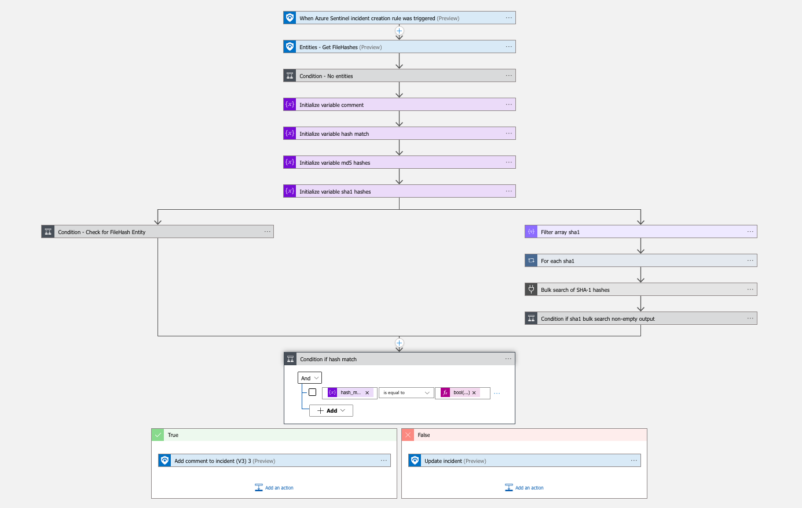

# Enrich-CIRCL-hashlookup

Add information from [CIRCL hashlookup](https://circl.lu/services/hashlookup/) public instance about hashes found in Sentinel incident entities. MD5 and SHA1 only.

## Quick Deployment
**Deploy with incident trigger** (recommended)

After deployment, attach this playbook to an **automation rule** so it runs when the incident is created.

[Learn more about automation rules](https://docs.microsoft.com/azure/sentinel/automate-incident-handling-with-automation-rules#creating-and-managing-automation-rules)

## Prerequisites

* No authentication to hashlookup server
* Logic Apps Custom Connector CIRCL-hashlookup
* Logic App managed identity should be given Sentinel Responder role to read incident trigger and write comment/tag to incident

## Screenshots

## Workflow explained
(step by step pseudo-code)

1. Sentinel incident trigger
4. Get FileHashes entities
5. Validate entities list is not empty or terminate
6. For each FileHash, bulk search for md5 and sha1, and append to comment
7. Update sentinel incident with comment and appropriate tag Found/NotFound
