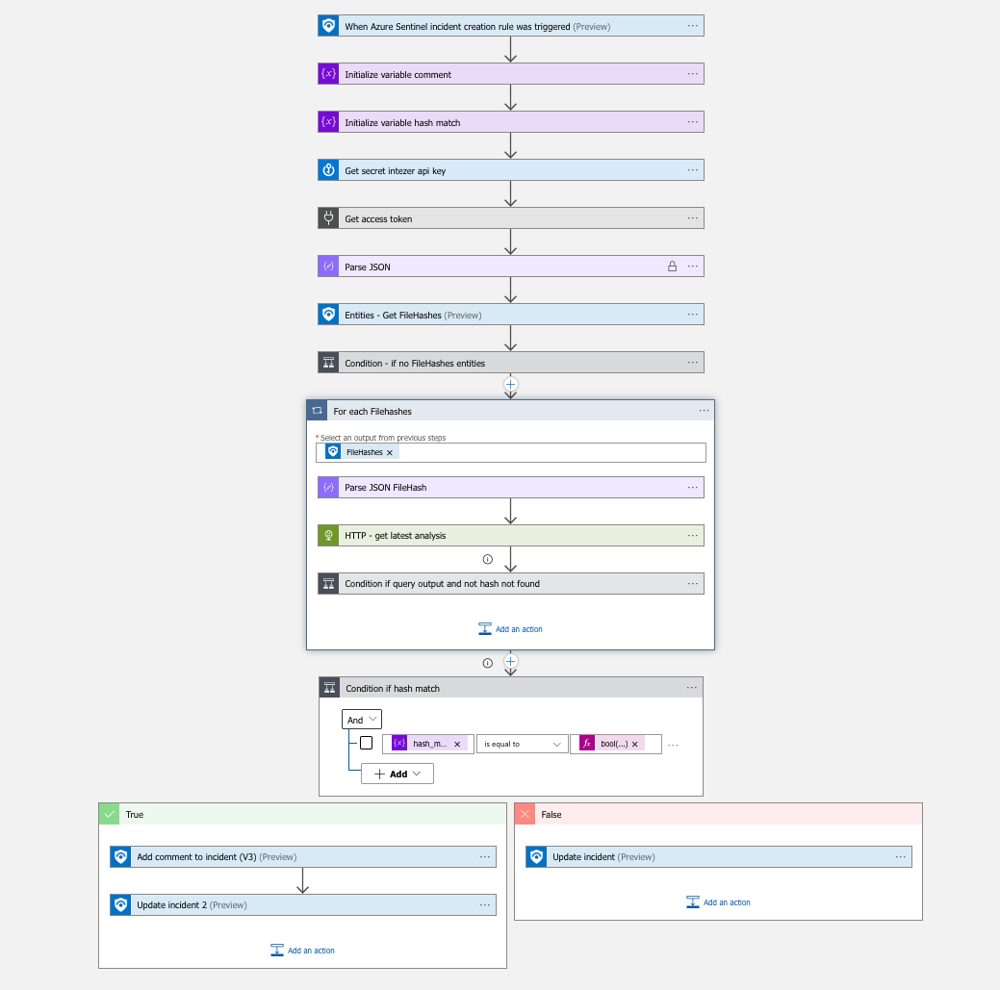

# Enrich-Intezer-Analyze-Community

Add information from [Intezer Community](https://www.intezer.com/blog/malware-analysis/intezer-analyze-free-community-edition/) to Sentinel incident hashes.

## Quick Deployment
**Deploy with incident trigger** (recommended)

After deployment, attach this playbook to an **automation rule** so it runs when the incident is created.

[Learn more about automation rules](https://docs.microsoft.com/azure/sentinel/automate-incident-handling-with-automation-rules#creating-and-managing-automation-rules)

## Prerequisites

* Intezer Community API key. If issue with community key, reach out to Intezer and/or do free trial.
* Logic Apps Custom Connector for Intezer-Analyze-Community
* Keyvault to store Intezer API key as secret malware-intezer-api-key
  * Target keyvault parameter can be provided either through portal, either through `azuredeploy.parameters*.json` file, either shared parameters file defined through [sentinel-deployment.config](https://learn.microsoft.com/en-us/azure/sentinel/ci-cd-custom-deploy?tabs=github#scale-your-deployments-with-parameter-files)
  * Keyvault networking restrictions from LogicApps: https://aka.ms/connectors-ip-addresses
  * Logic App managed identity should be given read access, typically through [access policy](https://learn.microsoft.com/en-us/azure/key-vault/general/assign-access-policy?tabs=azure-portal)
* Logic App managed identity should be given Sentinel Responder role to read incident trigger and write comment/tag to incident

## Screenshots

## Workflow explained
(step by step pseudo-code)

1. Sentinel incident trigger
2. Get Intezer API key from keyvault
3. Get Intezer API access token
4. Get FileHashes entities
5. Validate entities list is not empty or terminate
6. For each FileHash, get latest analysis from Intezer Community and append to comment
7. Update sentinel incident with comment and appropriate tag Found/NotFound
