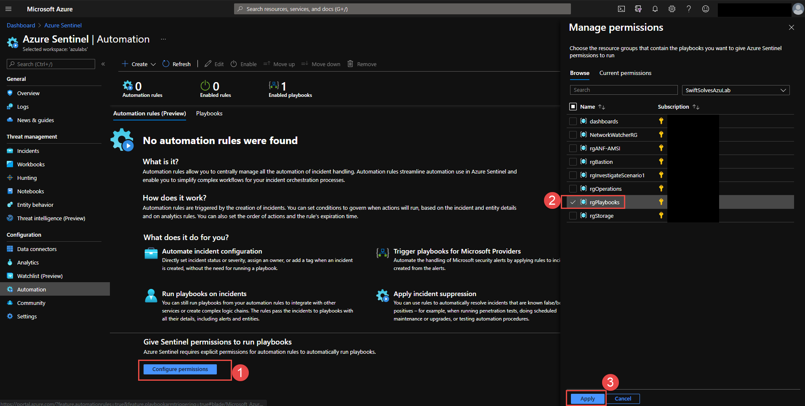
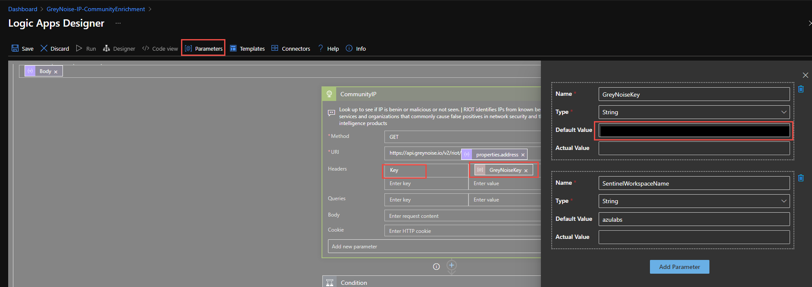

# Enrich-SentinelIncident-GreyNoiseCommunity-IP
author: Nathan Swift

This playbook uses the GreyNoise Community API to automatically enrich incidents generated by Sentinel for IP addresses. Optionally to prevent rate limits you may want to obtain a valid GreyNoise API Key. To learn more about the service and request a trial key, see the [Setting up an Account](https://developer.greynoise.io/docs/setting-up-an-account). 

For details around the API used see the [Community API documentation](https://developer.greynoise.io/reference/community-api#get_v3-community-ip).

**Additional Post Install Notes:**

Authorize the web.connection APIs deployed into the ResourceGroup.

The Logic App creates and uses a Managed System Identity (MSI) to update the Azure Sentinel Incident. 

Assign RBAC 'Azure Sentinel Responder' role to the Logic App at the Resource Group level of the Log Analytics Workspace.

## Initial Setup

Logic App is utilitzed by Automation rules. You must setup an Automation rule. Go to the Automation Rules blade in Azure Sentinel. 

If you have not set permissions yet, [review here](https://docs.microsoft.com/azure/sentinel/automate-incident-handling-with-automation-rules#permissions-for-automation-rules-to-run-playbooks)

Once permission are set, click on + Create and Add New Rule

An new automation rule blade on right will open up. fill in the fields be sure to select all the Analytic rules you want this enrichment playbook to run on and also add a second condition IP Address contains .

Be sure under Actions to choose Run playbook and choose the GreyNoise-IP-Enrichment playbook from the drop down menu.

Once completed press Apply button at bottom to add the Automation rule.

## (Optional) Manually update Logic App with GreyNoise API Key

To prevent rate limits you may want to obtain a valid GreyNoise API Key. Open the Logic App and Edit. Within the UI editor go to Parameters button towards top and add the key ass a default value as shown below. In addition open the CommunityIP action and add Key and the Parameter GreyNoiseKey.

