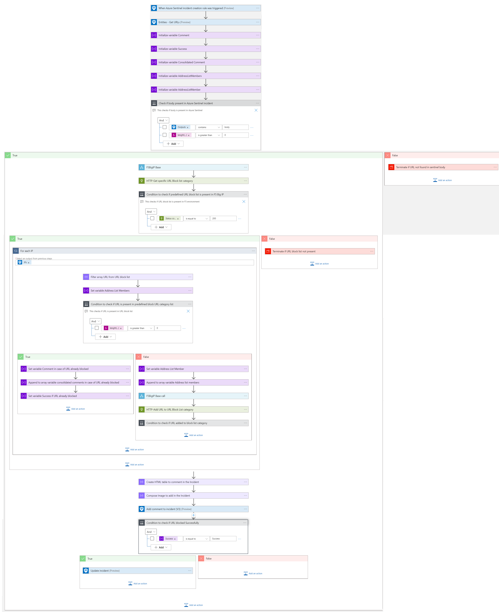
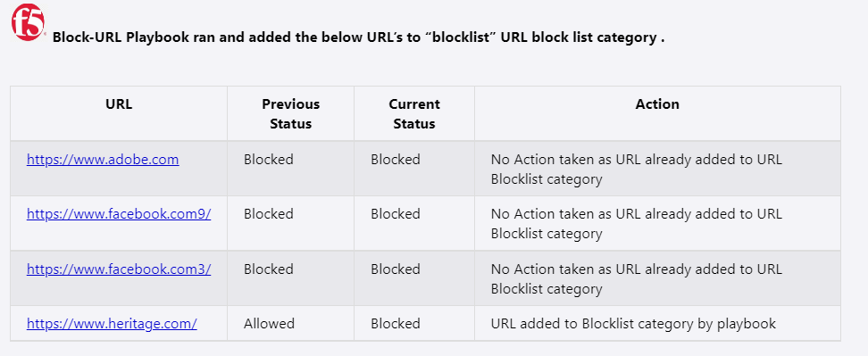
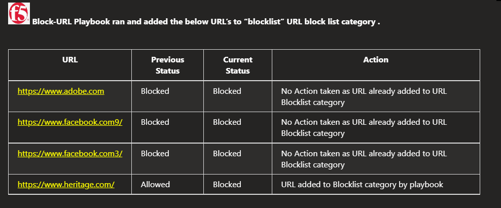

# F5 BIG-IP Block URL Playbook

## Summary
 When a new Azure Sentinel incident is created, this playbook gets triggered and performs the below actions:
 1. Fetches a list of potentially malicious URLs.
 2. For each URL in the list, checks if the URL is present in URL Blocklist Category of F5 BIG-IP firewall.
 3. If URL not present in Blocklist Category, then adds the URL to URL Blocklist Category.

 

 ## Pre-requisites for deployment
1. Deploy the F5 BIG-IP Base Playbook before the deployment of this playbook under the same subscription, same resource group and in the same location/region. Capture the name of the playbook during deployment.
2. URL Blocklist Category should be created for blocking URLs.

## Authentication

* The REST APIs used by the playbook requires API Key access token which is generated by base playbook. The access token expires every 20 minutes. To be authenticated by the F5 BIG-IP resource, the access token (X-F5-Auth-Token) must be included with header in a REST API request.

## Deploy Base Playbook

 Deploy the base playbook by clicking on "Deploy to Azure" button. This will take you to deploying an ARM Template wizard.

  

 ## Deployment Instructions
 1. Deploy the playbook by clicking on the "Deploy to Azure" button. This will take you to deploy an ARM Template wizard.

  

 2. Fill in the required parameters for deploying the playbook.

 | Parameter  | Description |
| ------------- | ------------- |
| **Playbook Name** | Enter the playbook name here without spaces |
| **Base Playbook Name**|Enter the name of base playbook without spaces |
| **URL Blocklist Category Name** | Enter URL Blocklist Category name to block URL |

# Post-Deployment Instructions 
## Configurations in Sentinel
- In Azure sentinel analytical rules should be configured to trigger an incident with URL. 
- Configure the automation rules to trigger the playbook.

# Playbook steps explained
## When Azure Sentinel incident creation rule is triggered
  Captures potentially malicious or malware URL incident information.

## Entities - Get URLs
  Get the list of URLs as entities from the Incident.

## Generate Access Token
 Call base playbook to generate access token.

 ## Check if URL Blocklist Category exists
 * If URL Blocklist Category exists, then for each malicious URL check if that URL is part of URL Blocklist Category.
 * If URL Blocklist Category does not exist, terminate with error URL Blocklist Category not found.

## For each malicious URL received from the incident
 - Checks if the URL is part of URL Blocklist Category.
  - If URL is part of URL Blocklist Category, then Incident Comment is created saying URL is blocked.
  - If URL is not part of URL Blocklist Category, then add the URL to URL Blocklist Category and update the URL Blocklist Category in firewall. Incident Comment created saying URL added to URL Blocklist Category by playbook.
  - Incident Comment from both cases are combined.

- Update the incident with status close.

## Incident comment 

