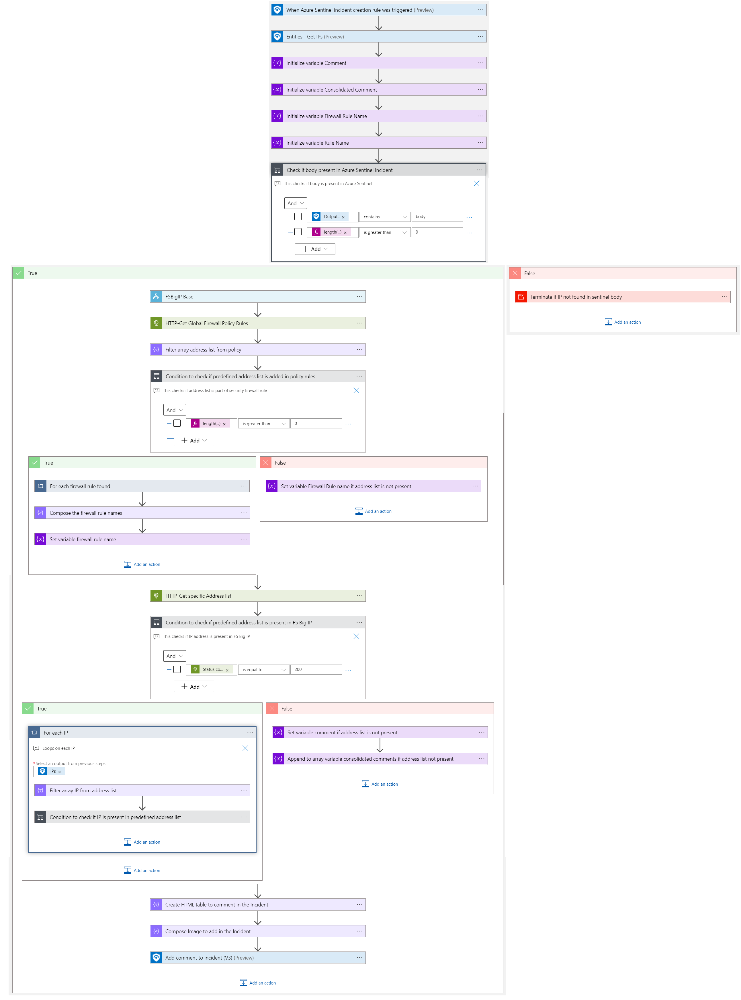
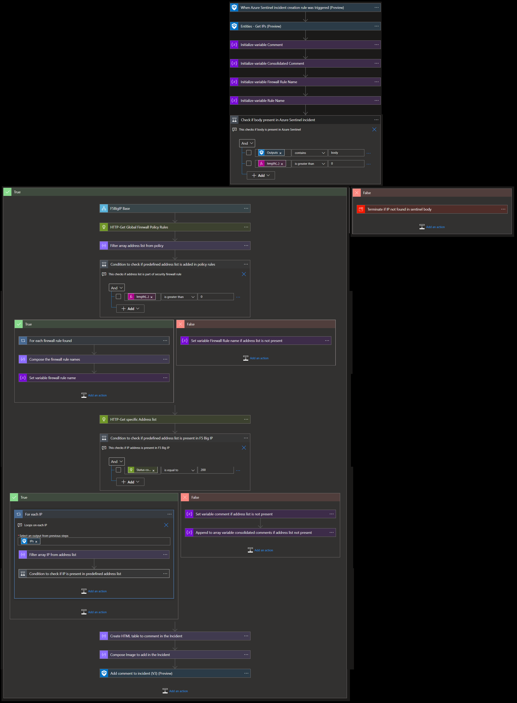

# F5 BIG-IP Enrichment IP Playbook

## Summary
 When a new Azure Sentinel incident is created, this playbook gets triggered and performs the below actions:
 1. Fetches a list of potentially malicious IP addresses.
 2. For each IP address in the list, checks if the IP address is present in IP Address list of F5 BIG-IP firewall.
 3. Checks if IP address list is present in any firewall security policy rule.

 

 ## Pre-requisites for deployment
1. Deploy the F5 BIG-IP Base Playbook before the deployment of this playbook under the same subscription and same resource group and in the same location/region. Capture the name of the playbook during deployment.
2. A Firewall policy rule should be created for blocking of IP.
3. An address list should be created for blocking IP.
4. The address list should be a part of firewall policy rule.

## Authentication

* The REST APIs used by the playbook requires API Key access token which is generated by base playbook. The access token expires every 20 minutes. To be authenticated by the F5 BIG-IP resource, the access token (X-F5-Auth-Token) must be included with header in a REST API request.

## Deploy Base Playbook

 Deploy the base playbook by clicking on "Deploy to Azure" button. This will take you to deploying an ARM Template wizard.

  

 ## Deployment Instructions
 1. Deploy the playbook by clicking on the "Deploy to Azure" button. This will take you to deploy an ARM Template wizard.

      

 2. Fill in the required parameters for deploying the playbook.

 | Parameter  | Description |
| ------------- | ------------- |
| **Playbook Name** | Enter the playbook name here without spaces |
| **Base Playbook Name**|Enter the name of base playbook without spaces |
| **IP Address List Name** | Enter IP Address list name |

# Post-Deployment Instructions 
## Configurations in Sentinel
- In Azure sentinel analytical rules should be configured to trigger an incident with IP addresses. 
- Configure the automation rules to trigger the playbook.

# Playbook steps explained
## When Azure Sentinel incident creation rule is triggered
  Captures potentially malicious or malware IP addresses incident information.

## Entities - Get IPs
  Get the list of IPs as entities from the Incident.

## Generate Access Token
 Call base playbook to generate access token.

 ## Check if IP Address List exists
 * If IP address list exists, then for each malicious IP check if that IP is part of IP address list.
 * If IP address list does not exist, compose comment that IP address list not found.

 ## Check if IP address List is part of firewall security policy rule.
  - If IP address list is part of any firewall security policy rule, then incident comment is created by dispalying list of firewall security policy rule(s) by coma seperated values.
  - If IP address list is not part of firewall security policy rule, then incident comment is created saying IP address list is not part of firewall security policy rule.

## For each malicious IP received from the incident
 - Checks if the IP address is part of IP address list.
  - If IP address is part of IP address list, then incident comment is created saying IP address is added to IP address list.
  - If IP address is not part of IP address list, then incident comment is created saying IP address is not added to IP address list.
  - Incident comment from all cases are combined.

  ## Incident comment 

