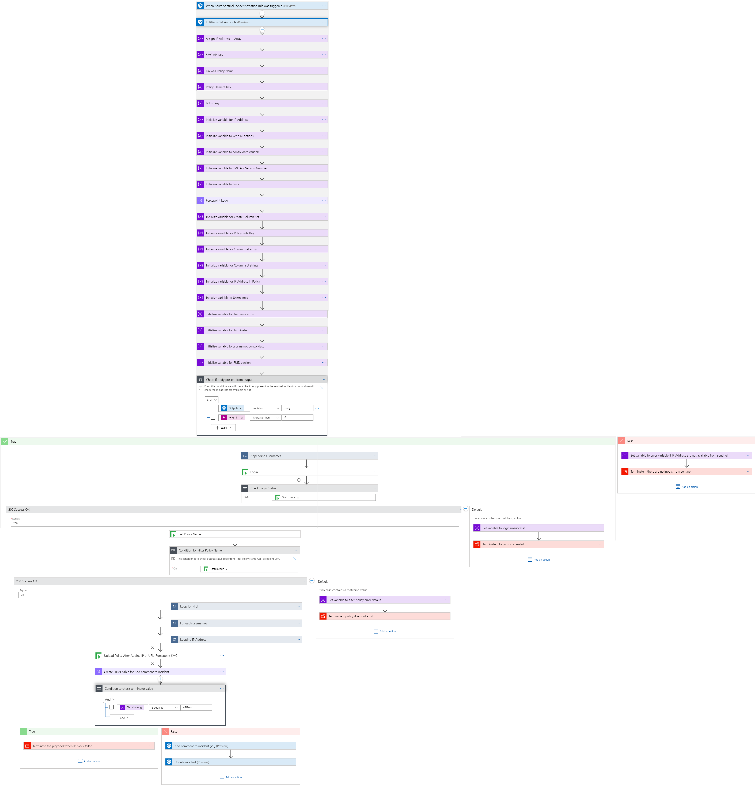
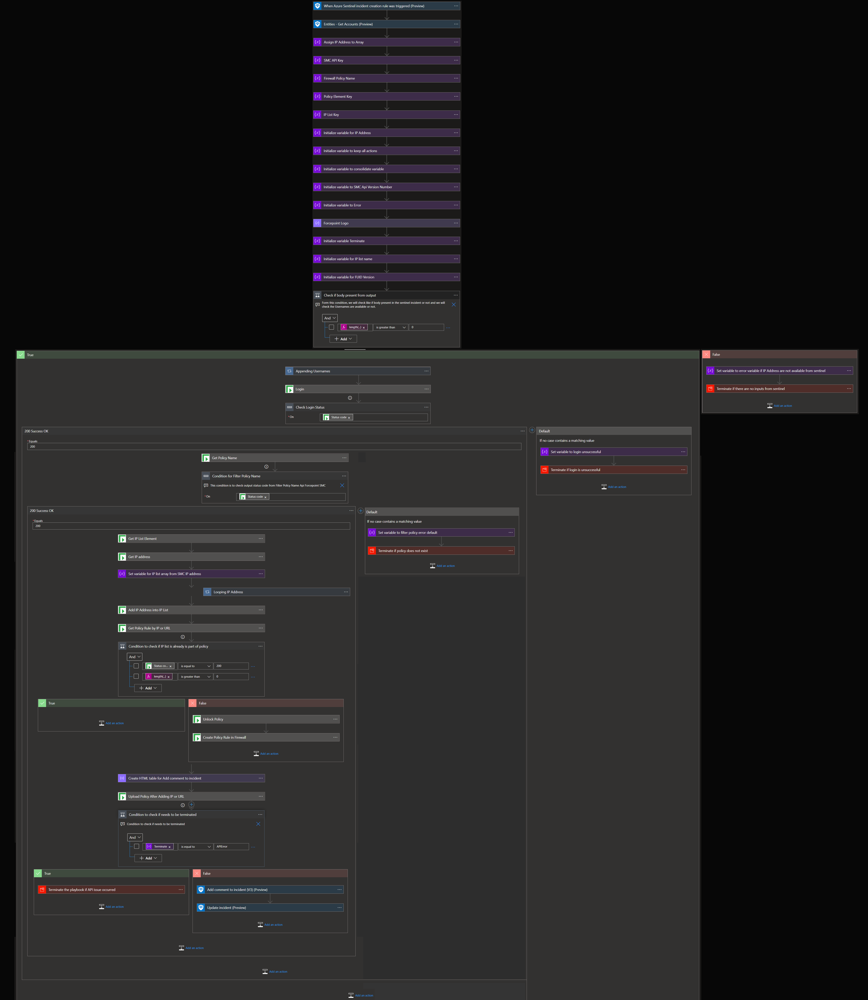
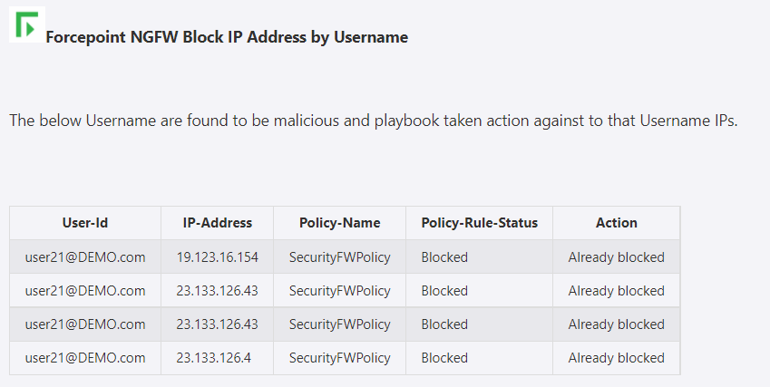
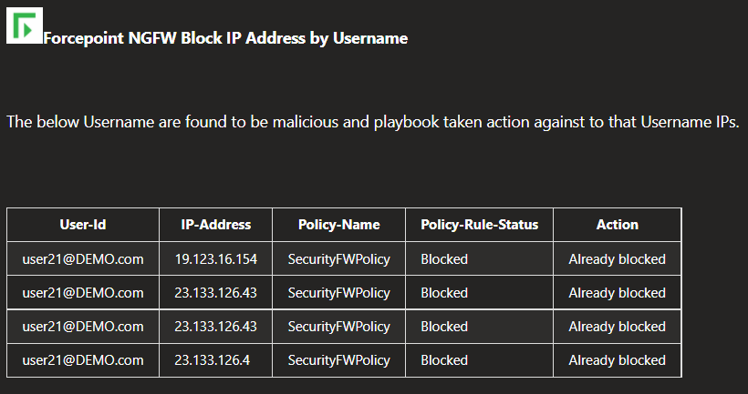

# Forcepoint NGFW Block IP Address by UserName Playbook

## Summary
 When a new Azure Sentinel incident is created, this playbook gets triggered and performs the below actions:
 1. Fetches a list of potentially suspicious User Accounts that are part of Azure Active Directory (AAD) through Azure Sentinel.
 2. Fetches a list of IP addresses associated with User Accounts from FUID (Forcepoint User ID service).
 3. For each User Account IP address in the list, checks if the IP address is already present in SMC (Security Management Center) security policy rule or not.
 4. If the IP address is not present in the security policy rule then adds to the security policy and closes the incident.

  
 

 ## Pre-requisites for deployment
 1. Deploy the Forcepoint SMC Custom Connector and Forcepoint FUID Custom Connector before the deployment of this playbook under the same subscription and same resource group as will be used for this playbook. Capture the name for both connectors during deployment.
 2. Forcepoint SMC API Key should be known to establish a connection with Forcepoint SMC. For API Key [Refer here](http://www.websense.com/content/support/library/ngfw/v610/rfrnce/ngfw_6100_ug_smc-api_a_en-us.pdf )
 3. Forcepoint SMC Version number should be known. [Refer here](https://help.stonesoft.com/onlinehelp/StoneGate/SMC/) to download and install Forcepoint SMC and capture the version number for the same.
 4. Forcepoint FUID version number should be known.[Refer here](https://www.websense.com/content/support/library/uid/v20/install/fuid_200_ht_integrate-fuid_a_en-us.pdf)
 5. Security policy rule name created in SMC should be known.

 ## Deployment Instructions
 1. Deploy the playbook by clicking on the "Deploy to Azure" button. This will take you to deploy an ARM Template wizard.

  
  

 2. Fill in the required parameters for deploying the playbook.

 | Parameter  | Description |
| ------------- | ------------- |
| **Playbook Name** | Enter the Playbook Name here without spaces. (e.g. BlockIP-forcepointFUID ) |
| **SMC Connector name**|Enter the name of your Forcepoint SMC Connector without spaces.|
| **FUID Connector name**|Enter the name of your Forcepoint FUID Connector without spaces.|
| **SMC API Key**  | Enter the SMC API Key. | 
| **SMC Version Number** | Enter the version number of SMC. (e.g. 6.9) |
| **FUID Version Number** | Enter the version number of FUID (e.g. v1.0)
| **Security Policy Rule** | Enter the Security Policy Rule name. |

# Post-Deployment Instructions 
## Configurations in Sentinel
- In Azure sentinel analytical rules should be configured to trigger an incident with suspicious User Accounts. 
- Configure the automation rules to trigger the playbook.

# Playbook steps explained
## When Azure Sentinel incident creation rule is triggered
  Captures potentially suspicious User Account details incident information.

##Entities - Get Accounts
Get the list of Accounts as entities from the Incident.

##Compose image to add in the incident
This action will compose the Forcepoint image to add to the incident comments.

##Fetch the IP addresses for each user account
This action will fetch IP addresses for each user account in FUID.

##Check if security policy exists in SMC
*  If a security policy exists in the SMC firewall then check for the presence of IP addresses. 
*  If the security policy does not exist then terminate with an error that policy name not found.

##For each suspicious User Account IP Addresses
 - If a security policy rule exists and User Account IP addresses are not found in the rule that infers the suspicious IP addresses are not blocked: 
  **a.**  The list of all IP Addresses associated with AAD User Account found with suspicious activity in Sentinel is put in a list. 
  **b.** All those IP Addresses in the list are then blocked in the Forcepoint SMC firewall.

##Incident comment 

