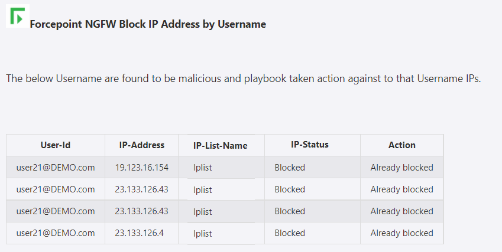
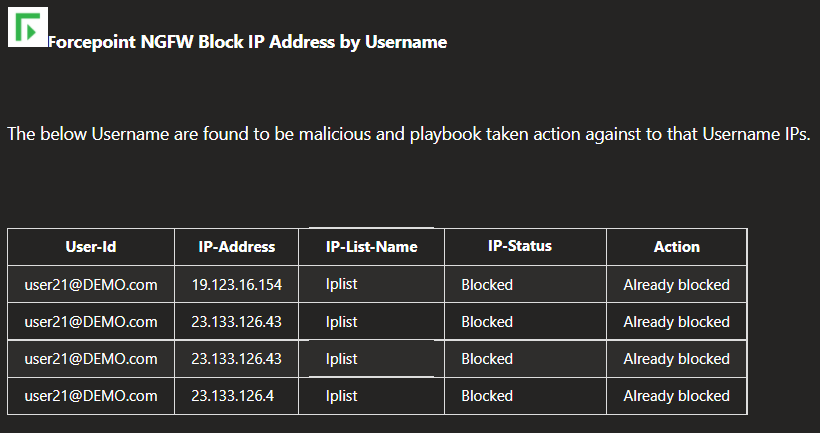

# Forcepoint NGFW Block IP by Username Playbook

## Summary
 When a new Azure Sentinel incident is created, this playbook gets triggered and performs the below actions:
 1. Fetches a list of potentially suspicious Azure Active Directory (AAD) User Accounts through Azure Sentinel.
 2. Fetches a list of IP addresses associated with User Accounts from FUID (Forcepoint User ID service).
 3. For each User Account IP address in the list, checks if the IP address is already present in IP List Name or not.
 4. List of all IP addresses not present in IP List Name is blocked in the firewall by the playbook.

  
 

 ## Pre-requisites for deployment
 1. Deploy the Forcepoint SMC Custom Connector before the deployment of this playbook under the same subscription and same resource group as will be used for this playbook. Capture the name for connector during deployment.
 2. Forcepoint SMC API Key should be known to establish a connection with Forcepoint SMC. For API Key [Refer here](http://www.websense.com/content/support/library/ngfw/v610/rfrnce/ngfw_6100_ug_smc-api_a_en-us.pdf )
 3. Forcepoint SMC Version number should be known. [Refer here](https://help.stonesoft.com/onlinehelp/StoneGate/SMC/) to download and install Forcepoint SMC and capture the version number for the same.
 4. Forcepoint FUID service endpoint should be known. (e.g.  https://{forcepointdomain:PortNumber/})
 5. IP address list name for blocking IP address present in SMC should be known.

 ## Deployment Instructions
 1. Deploy the playbook by clicking on the "Deploy to Azure" button. This will take you to deploy an ARM Template wizard.

  
  

 2. Fill in the required parameters for deploying the playbook.

 | Parameter  | Description |
| ------------- | ------------- |
| **Playbook Name** | Enter the Playbook Name here without spaces. (e.g. BlockIP-forcepointFUID ) |
| **FUID Connector name**|Enter the name of your Forcepoint FUID Connector without spaces.|
| **SMC API Key**  | Enter the SMC API Key. | 
| **SMC Version Number** | Enter the version number of SMC. (e.g. 6.9) |
| **IP List Name**|Enter IP address list name.|

# Post-Deployment Instructions 
## Configurations in Sentinel
- In Azure sentinel analytical rules should be configured to trigger an incident with suspicious User Accounts. 
- Configure the automation rules to trigger the playbook.

# Playbook steps explained
## When Azure Sentinel incident creation rule is triggered
  Captures potentially suspicious User Account details incident information.

##Entities - Get Accounts
Get the list of Accounts as entities from the Incident.

##Compose image to add in the incident
This action will compose the Forcepoint image to add to the incident comments.

##Fetch the IP addresses for each user account
This action will fetch IP addresses for each user account in FUID.

##For each suspicious User Account IP Addresses

###Check if IP address is present in IP List Name
* If IP address is present in IP List Name then check if IP List is part of security policy rule.
* If IP address is not present in IP List Name then add the IP address to IP List Name. Incident comment created with IP address blocked by Playbook.

###Check if IP List is part of security policy in SMC
*  If a security policy exists in the SMC firewall for IP List Name then IP address is already blocked. Incident comment created with IP address already blocked.
*  If the security policy does not exist for IP List name then security policy is created for IP List Name.

- Incident comment from both the cases are combined.
- The incident comments are shown below for reference.

##Incident comment 

