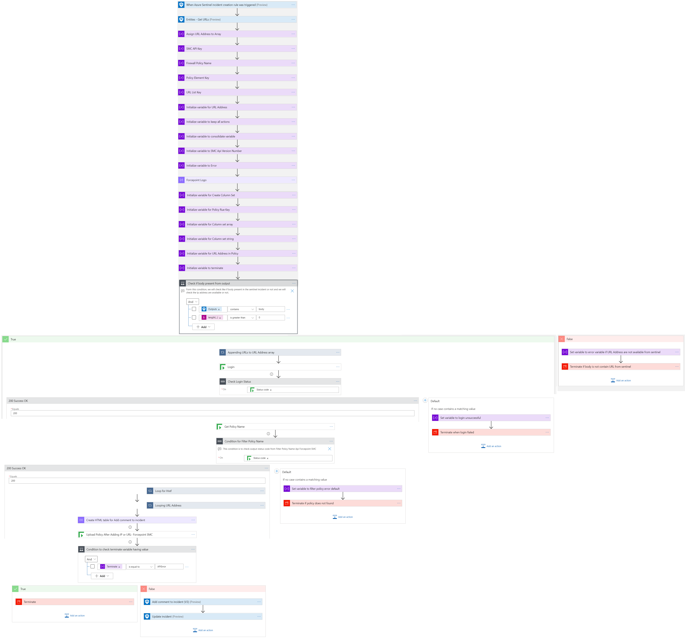
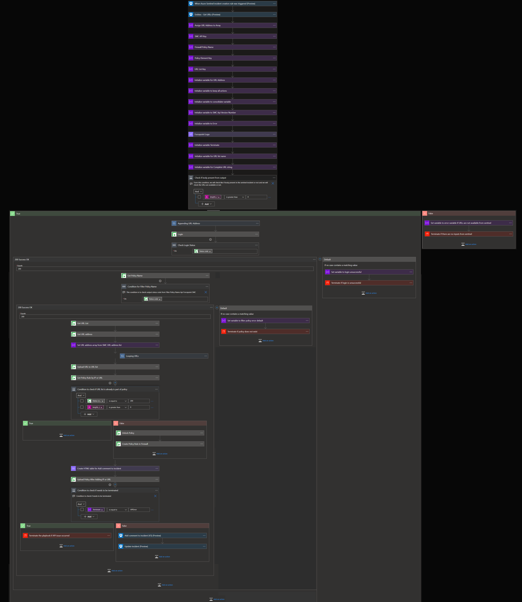
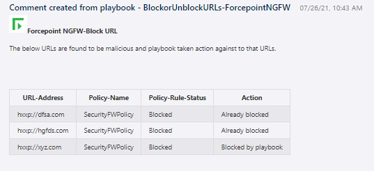
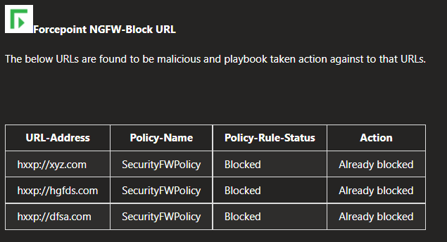

# Forcepoint NGFW Block URLs Playbook

## Summary
 When a new Azure Sentinel incident is created, this playbook gets triggered and performs the below actions:
 1. Fetches a list of potentially malicious URLs.
 2. For each URL in the list, checks if the URL is already present in SMC (Security Management Center) security policy or not. 
 a. List of all URLs present in security policy. 
 b. List of all URLs not present in security policy is blocked by the firewall.

  
 

 ## Pre-requisites for deployment
 1. Deploy the Forcepoint SMC Custom Connector before the deployment of this playbook under the same subscription and same resource group as will be used for this playbook. Capture the name of the connector during deployment.
 2. Forcepoint SMC API Key should be known to establish a connection with Forcepoint SMC. For API Key [Refer here](http://www.websense.com/content/support/library/ngfw/v610/rfrnce/ngfw_6100_ug_smc-api_a_en-us.pdf )
 3. Forcepoint SMC Version number should be known. [Refer here](https://help.stonesoft.com/onlinehelp/StoneGate/SMC/) to download and install Forcepoint SMC and capture the version number for the same.
 4. Security policy rule name created in SMC should be known.

 ## Deployment Instructions
 1. Deploy the playbook by clicking on the "Deploy to Azure" button. This will take you to deploy an ARM Template wizard.

   
 

 2. Fill in the required parameters for deploying the playbook.

 | Parameter  | Description |
| ------------- | ------------- |
| **Playbook Name** | Enter the Playbook Name here without spaces. (e.g. Unblock-URL) |
| **SMC Connector name**|Enter the name of your Forcepoint SMC Connector without spaces.|
| **SMC API Key**  | Enter the SMC API Key.  | 
| **SMC Version Number** | Enter the version number of SMC. (e.g. 6.9) |
| **Security Policy Rule** | Enter the Security Policy Rule name used for blocking or unblocking URLs.  |

# Post-Deployment Instructions 

## Configurations in Sentinel
- In Azure sentinel analytical rules should be configured to trigger an incident with URLs. 
- Configure the automation rules to trigger the playbook.

# Playbook steps explained
## When Azure Sentinel incident creation rule is triggered
  Captures potentially malicious or malware URL incident information.

##Entities - Get URLs
Get the list of URLs as entities from the Incident.

##Compose image to add in the incident
This action will compose the Forcepoint image to add to the incident comments.

##Check if security policy exists in SMC
*  If a security policy exists in the SMC firewall then check for the presence of URLs. 
*  If the security policy does not exist then terminate with the error that policy rule not found.

##For each malicious URL received from the incident
-	If a security policy rule with respect to URLs are found: 
 ***i)*** List of all URLs that are already blocked in firewall.  

-	If a security policy rule with respect to URLs are not found: 
  ***i)*** Then list of all such URLs are made and collectively blocked by firewall. 
- A combined incident comment is created for both the cases as shown below and incident is closed. 
- The incident comments are shown below for reference.

##Incident comment 

