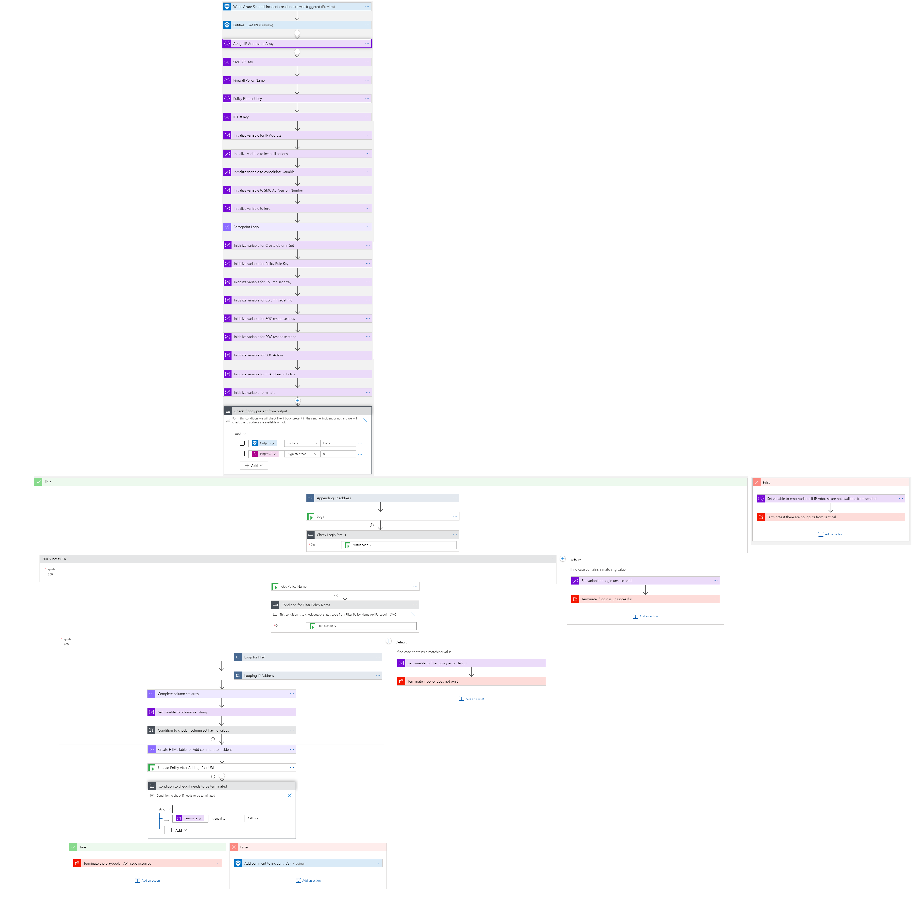
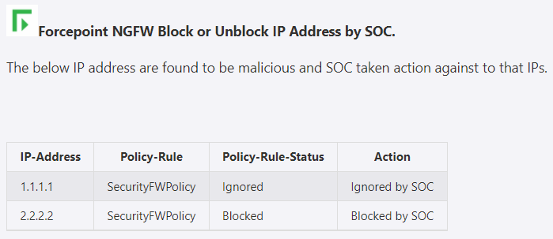
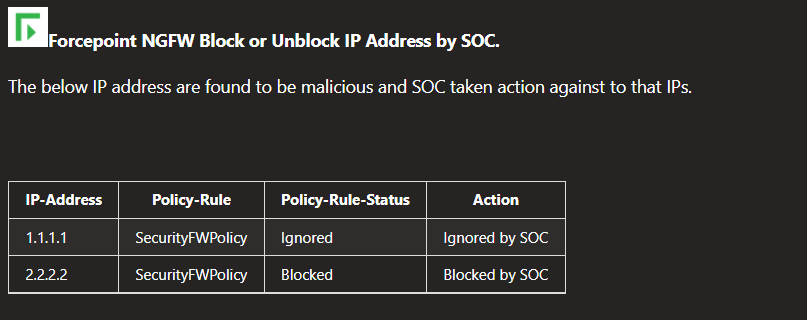
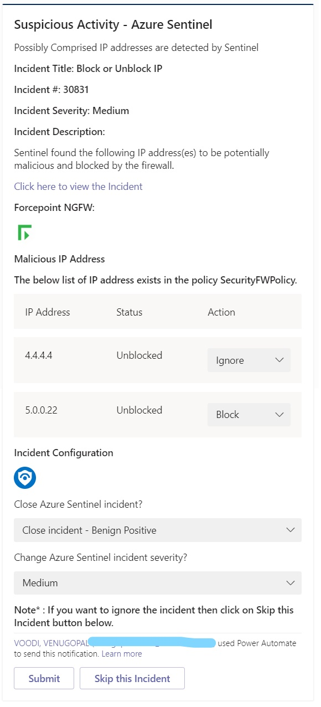

# Forcepoint NGFW Block or Unblock IP Address by Teams Channel Playbook

## Summary
 When a new Azure Sentinel incident is created, this playbook gets triggered and performs the below actions:
 1. Fetches a list of potentially malicious IP addresses.
 2. For each IP address in the list, checks if the IP is already present in SMC (Security Management Center) security policy or not. 
 3. List of all IP addresses whether blocked or unblocked by security policy is sent for SOC action via adaptive card. 

  
 

 
 ## Pre-requisites for deployment
 1. Deploy the Forcepoint SMC Custom Connector before the deployment of this playbook under the same subscription and same resource group as will be used for this playbook. Capture the name of the connector during deployment.
 2. Forcepoint SMC API Key should be known to establish a connection with Forcepoint SMC. For API Key [Refer here](http://www.websense.com/content/support/library/ngfw/v610/rfrnce/ngfw_6100_ug_smc-api_a_en-us.pdf )
 3. Forcepoint SMC Version number should be known. [Refer here](https://help.stonesoft.com/onlinehelp/StoneGate/SMC/) to download and install Forcepoint SMC and capture the version number for the same.
 4. Security policy rule name created in SMC should be known.
 5. Users must have access to Microsoft Teams and they should be a part of a Teams channel and also "Power Automate" app should be installed in the Microsoft Teams channel.

 ## Deployment Instructions
 1. Deploy the playbook by clicking on the "Deploy to Azure" button. This will take you to deploy an ARM Template wizard.

  
 

 2. Fill in the required parameters for deploying the playbook.

 | Parameter  | Description |
| ------------- | ------------- |
| **Playbook Name** | Enter the Playbook Name here without spaces. (e.g. BlockIP-Forcepoint ) |
| **SMC Connector name**|Enter the name of your Forcepoint SMC Connector without spaces.|
| **SMC API Key**  | Enter the SMC API Key. | 
| **SMC Version Number** | Enter the version number of SMC. (e.g. 6.9) |
| **Security Policy Rule** | Enter the Security Policy Rule name used for blocking or unblocking IP addresses. |

# Post-Deployment Instructions 
## a. Authorize API connections
* Once deployment is complete, go under deployment details and authorize teams connection. 
1.  Click the Teams connection resource
2.  Click **Edit API connection**
3.  Click Authorize
4.  Sign in
5.  Click Save

* In Logic App designer, go to "Post an adaptive card to teams channel" action and select your Teams name and Channel name from the dropdown.
*  In In Logic App designer again, go to "Post adaptive card in a chat or channel" action and select your Teams name, Channel name, and "Flow bot" for "Post as" parameter from the dropdown. 

## b. Configurations in Sentinel
- In Azure sentinel analytical rules should be configured to trigger an incident with IP addresses. 
- Configure the automation rules to trigger the playbook.

# Playbook steps explained
## When Azure Sentinel incident creation rule is triggered
Captures potentially malicious or malware IP addresses incident information.

##Entities - Get IPs
Get the list of IPs as entities from the Incident.

##Compose image to add in the incident
This action will compose the Forcepoint image to add to the incident comments.

##Check if security policy exists in SMC
*  If a security policy exists in the SMC firewall then check for the presence of IP addresses. 
*  If the security policy does not exist then terminate with the error that policy rule not found.

##For each malicious IP received from the incident
***i)*** If a security policy rule with respect to IP addresses are found, then list for all IP addresses that are already blocked in firewall is created. 
 ***ii)*** If a security policy rule with respect to IP addresses are not found, then list for all IP addresses that are not blocked in firewall is created. 
***iii)*** Combined List of both IP addresses is sent to SOC via adaptive card on teams channel. 
***iv)*** If a particular IP is blocked, SOC has option to either unblock it or ignore it. 
***v)*** If a particular IP is unblocked, SOC has option to either block it or ignore it. 
***vi)*** SOC can also skip their action on whole incident.

- A combined incident comment based on SOC action is created for both the cases as shown below and incident is closed.The incident comments are shown below for reference.

##Incident comment 

##Adaptive Card received by SOC

##Summary Adaptive card when the action was taken by SOC

##Summary Adaptive card when action skipped by SOC 

