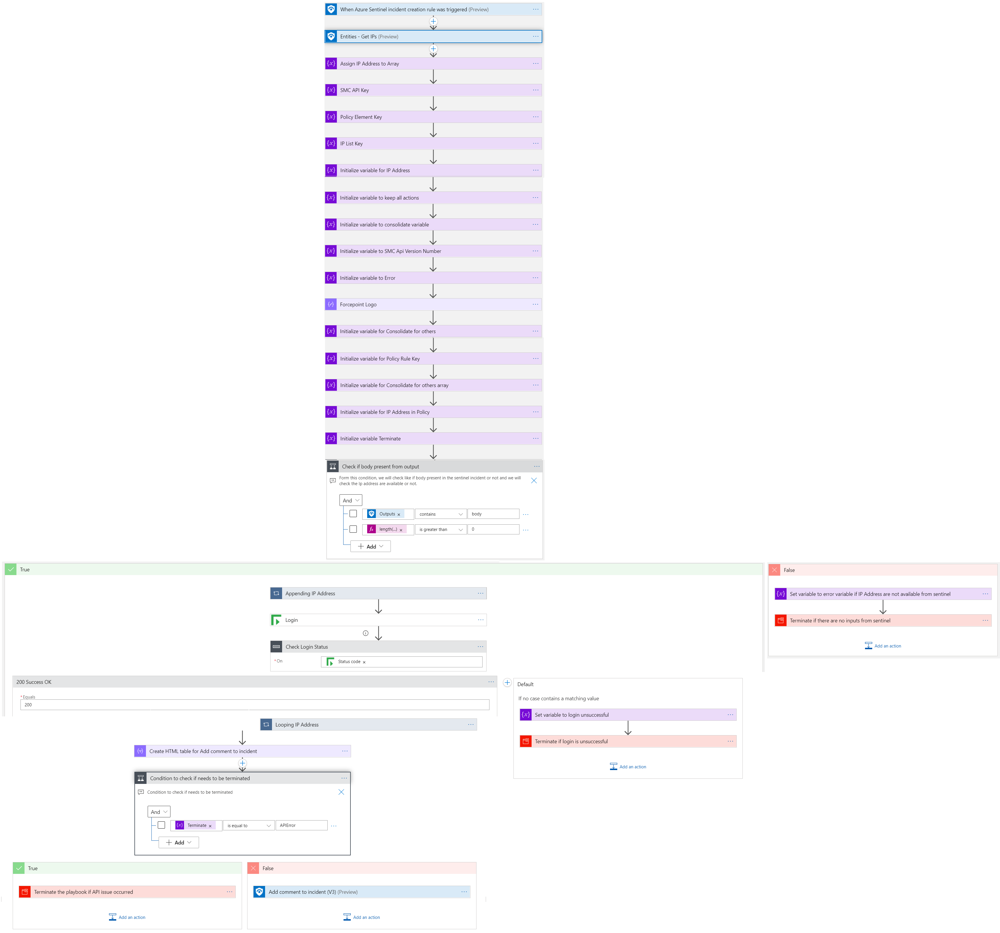
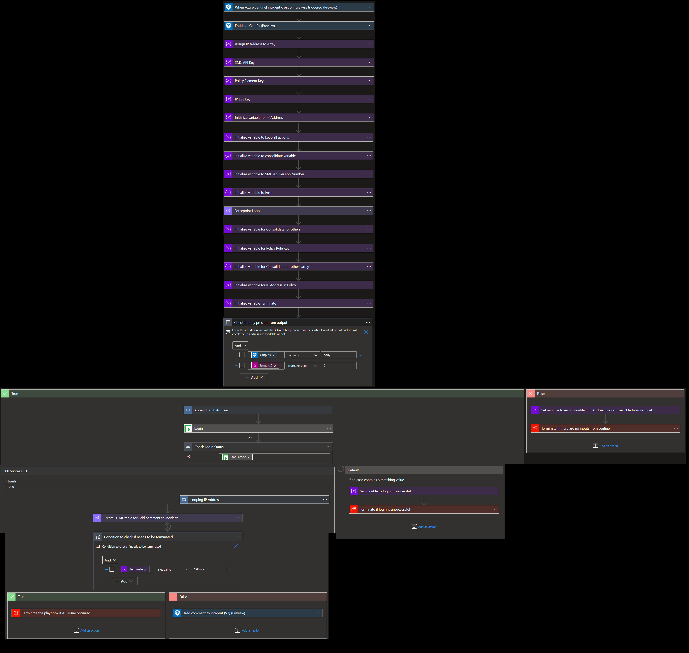
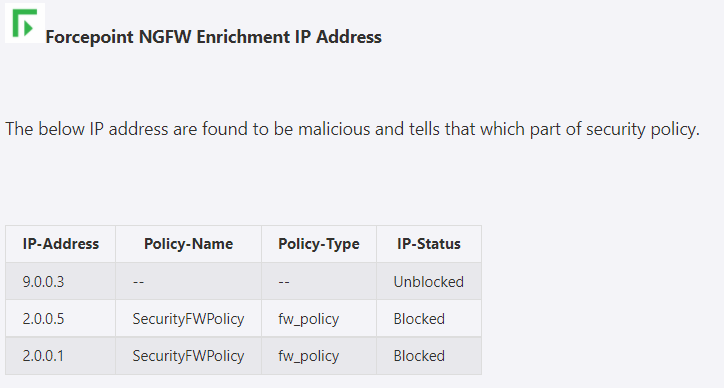
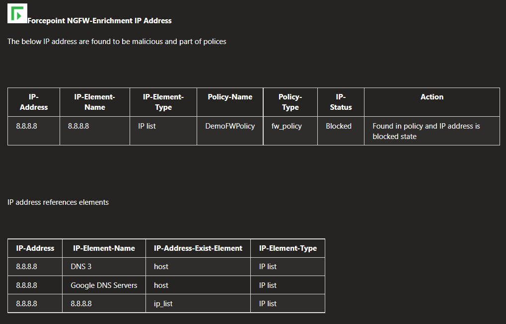

# Forcepoint NGFW Enrichment IP Address Playbook

## Summary
 When a new Azure Sentinel incident is created, this playbook gets triggered and performs the below actions:
 1. Fetches a list of potentially malicious IP addresses.
 2. For each IP in the list, checks if the IP is already present in SMC (Security Management Center) security policy or not. 
 3. If IP address is present in the security policy then the incident comment is created stating that the IP address is found in the policy.

  
 

 ## Pre-requisites for deployment
 1. Deploy the Forcepoint SMC Custom Connector before the deployment of this playbook under the same subscription and same resource group as will be used for this playbook. Capture the name of the connector during deployment.
 2. Forcepoint SMC API Key should be known to establish a connection with Forcepoint SMC. For API Key [Refer here](http://www.websense.com/content/support/library/ngfw/v610/rfrnce/ngfw_6100_ug_smc-api_a_en-us.pdf )
 3. Forcepoint SMC Version number should be known. [Refer here](https://help.stonesoft.com/onlinehelp/StoneGate/SMC/) to download and install Forcepoint SMC and capture the version number for the same.
 

 ## Deployment Instructions
 1. Deploy the playbook by clicking on the "Deploy to Azure" button. This will take you to deploy an ARM Template wizard.

 
   

 2. Fill in the required parameters for deploying the playbook.

 | Parameter  | Description |
| ------------- | ------------- |
| **Playbook Name** | Enter the Playbook Name here without spaces. (e.g. EnrichmentIP-forcepoint) |
| **SMC Connector name**|Enter the name of your Forcepoint SMC Connector without spaces.|
| **SMC API Key**  | Enter the SMC API Key.  | 
| **SMC Version Number** | Enter the version number of SMC. (e.g. 6.9) |

# Post-Deployment Instructions 
## Configurations in Sentinel
- In Azure sentinel analytical rules should be configured to trigger an incident with IP addresses. 
- Configure the automation rules to trigger the playbook.

# Playbook steps explained
## When Azure Sentinel incident creation rule is triggered
  Captures potentially malicious or malware IP addresses incident information.

##Entities - Get IPs
Get the list of IPs as entities from the Incident.

##Compose image to add in the incident
This action will compose the Forcepoint image to add to the incident comments.

##For each malicious IP received from the incident
 - Check IP address is part of how many IP Lists in SMC.  
- Check how many hosts are associated with each IP address. 
- Check IP address List and host associated with IP address are part of how many security policy rules.
- The incident comment is shown below for reference.

##Incident comment 

