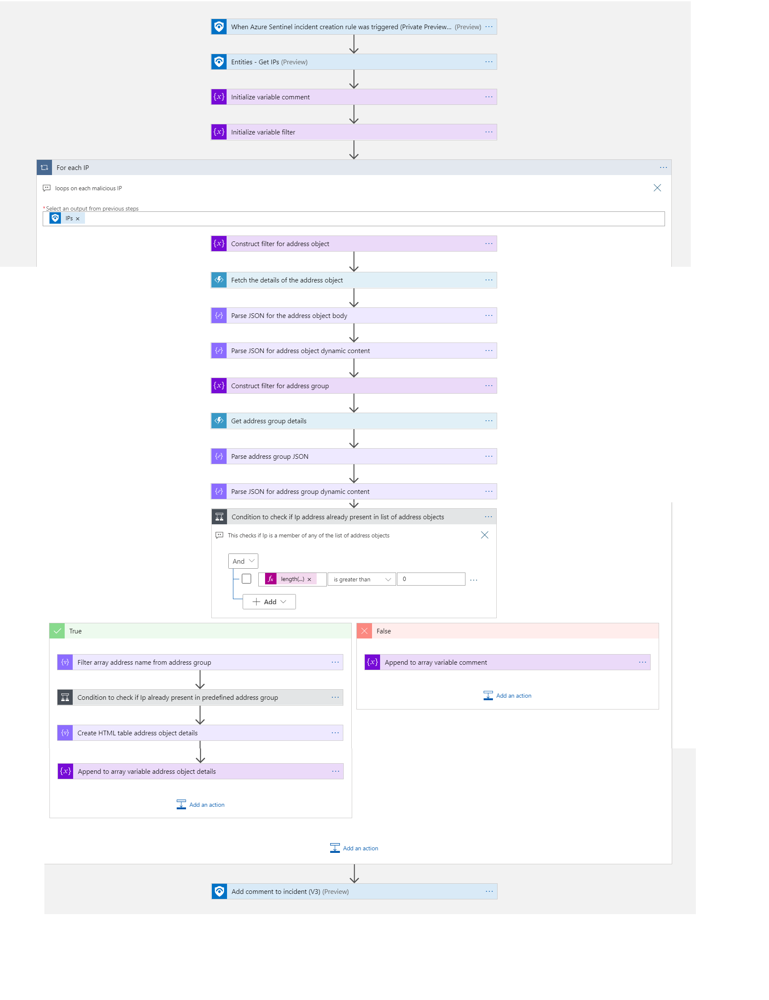

# Fortinet-Incident enrichment

## Summary
This playbook enriches the incident with address object and address group.

 
  

When a new Azure Sentinel is created, this playbook gets triggered and performs below actions:
- It fetches details of the address object.
- It retrieve the details of address groups which address object is belongs to.
- Add the Summary of address object and its groups details to an incident.

### Prerequisites 
- Sentinel IP block group should create in the VM
- Function App needs to be deployed prior to the deployment of this playbook under the same subscription. Relevant instructions can be found in the Function doc page

### Deployment instructions 
- Deploy the playbook by clicking on "Deploy to Azure" button. This will take you to deploying an ARM Template wizard.

 

- Fill the required parameters:
    * Playbook Name: Enter the playbook name here (ex:Fortinet_EnrichmentwithIP)
    * Function app Name: Enter Function app name which is created as Prerequisite
    * Address Group: Pre-defined address group name which is created in VM
    * Managed Identities Name: Enter the managed identity name (ex: managed identities name)[Create user assigned manage identity](https://docs.microsoft.com/azure/active-directory/managed-identities-azure-resources/how-to-manage-ua-identity-portal).

### Post-Deployment instructions 
#### a. Authorize connections
Once deployment is complete, you will need to authorize each connection.
1.  Click the Azure Sentinel connection resource
2.  Click edit API connection
3.  Click Authorize
4.  Sign in
5.  Click Save

#### b. Configurations in Sentinel
- In Azure sentinel analytical rules should be configured to trigger an incident with IP Entity.
- Configure the automation rules to trigger this playbook

## Playbook steps explained

### When Azure Sentinel incident creation rule is triggered

- Capture IP and check for existence and if IP does not exist, create an address object for IP's

### For each-malicious IP received from the incident
Iterates on the IPs found in this incident (probably one) and performs the following:
- Fetches the address object details
- Retrieve the address groups details
- construct HTML Table with details of address object and address groups
- Add comment for an incident with summary of the address object and address groups.

## Enrich Incident with address object and address groups details look as follows

  
    
## Known Issues and Limitations
- When pre-defined group reaches the max limit user must create the new pre-defined group and change in the play book

