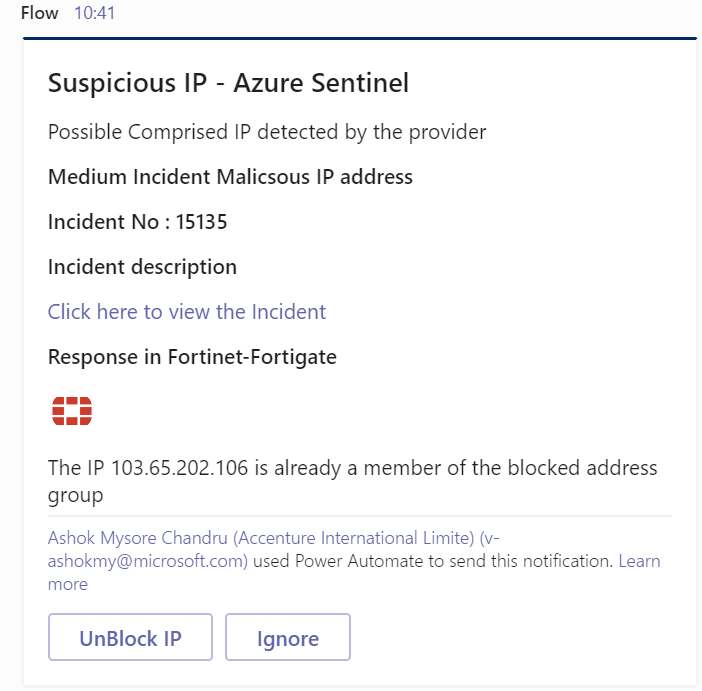
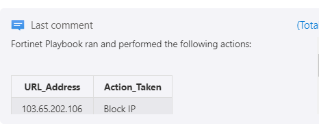

# Fortinet - ResponseOnIP

 ## Summary

This playbook allows the SOC users to automatically response to Azure Sentinel incidents which includes IPs, by adding/removing the IPs to the Sentinel IP blocked group.
 [Learn more about Threat Intelligence in Fortinet policy](https://www.fortinet.com/fortiguard/threat-intelligence/threat-research)

 

**This is the adaptive card SOC will receive when playbook is triggered for each risky IP for taking actions like block/unblock/ignore:**  
 

**This is the consolidate adaptive card about the summary of actions taken on IP and the incident configuration:**  
 

 

### Prerequisites 
- Sentinel IP block group should create in the VM
- FortinetConnector needs to be deployed prior to the deployment of this playbook under the same subscription. Relevant instructions can be found in the connector doc page.
- Function App needs to be deployed prior to the deployment of this playbook under the same subscription. Relevant instructions can be found in the Function doc page.
- FortinetConnector need to be authenticated with an API key. Relevant instructions can be found in the connector doc page.

### Deployment instructions 
1. Deploy the playbook by clicking on "Deploy to Azure" button. This will take you to deploying an ARM Template wizard.

 

2. Fill the required parameters:
    * Playbook Name: Enter the playbook name here (ex:Fortinet_ResponseOnIP)
    * Team Channel ID: Enter the teams channel id
    * Teams group ID: Enter the teams channel id
    * Pre-defined Group Name: Group name which is created in firewall
    * Function app Name: Enter Function app name which is created as Prerequisites
    * Managed Identities Name: Enter the managed identity name (ex: managed identities name) [Create user assigned manage identity](https://docs.microsoft.com/azure/active-directory/managed-identities-azure-resources/how-to-manage-ua-identity-portal)

### Post-Deployment instructions
* Go to logic app designer.
* Look for the function call actions. You can find them by the titles:
  - Fetch the details of the address object.
  - Get address group details.
* For each one of the above function call actions and perform the below mentioned steps:
  - Go to "Managed identity" dropdown and select user identity.
  - Save playbook.
* Go to Azure Sentinel, hook playbook to azure sentinel rules.

#### a. Authorize connections
Once deployment is complete, you will need to authorize each connection.
1.  Click the Azure Sentinel connection resource.
2.  Click edit API connection.
3.  Click Authorize
4.  Sign in.
5.  Click Save
6.  Repeat steps for other connection such as Team's connection
#### b. Configurations in Sentinel
1. In Azure sentinel analytical rules should be configured to trigger an incident with IP Entity.
2. Configure the automation rules to trigger this playbook

## Playbook steps explained

#### b. Configurations in Sentinel
1. In Azure sentinel analytical rules should be configured to trigger an incident with IP Entity.
2. Configure the automation rules to trigger this playbook.

### When Azure Sentinel incident creation rule is triggered

- Azure Sentinel incident is created. The playbook receives the incident as the input.

### Get Entities as IP's

- Get the list of risky/malicious IPs as entities from the Incident.

### Initialize variables 

-  Action Name (type-String) - To determine the action name to be displayed in the adaptive card such as Block or Unblock IP from predefined address group.

-  Adaptive card body(type-Array) - To determine the dynamic adaptive card body 
   
-  Address group Members(type-Array) - To determine the body of predefined address group
   
-  IP Address Action(type-Array) - Consolidated actions summary on each IP to display in adaptive card

-  Predefined group name(type-String)- You can change the pre-defined address group name here

## Post an adaptive card to the SOC channel
- Trigger an adaptive card for the SOC with all incident information

## Create an address object      
- Create an address object of type FQDN  if IP received from sentinel (if it not exist).

## Compose a member collection

- Capture all the existing member of address group

## Update an address group 

- Block IP or Unblock IP by adding or removing from address group

## Post a summary adaptive card to the SOC channel

- Trigger an adaptive card for the SOC with incident configuration details and provided option to change the configuration

## Incident will comment as follows

 

## Known Issues and Limitations

- When pre-defined group reaches the max limit user must create the new pre-defined group and change in the play book

