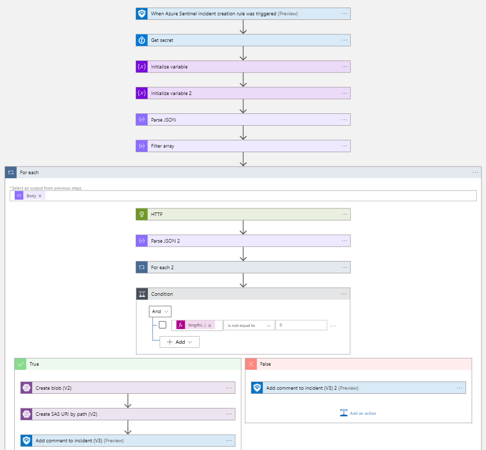
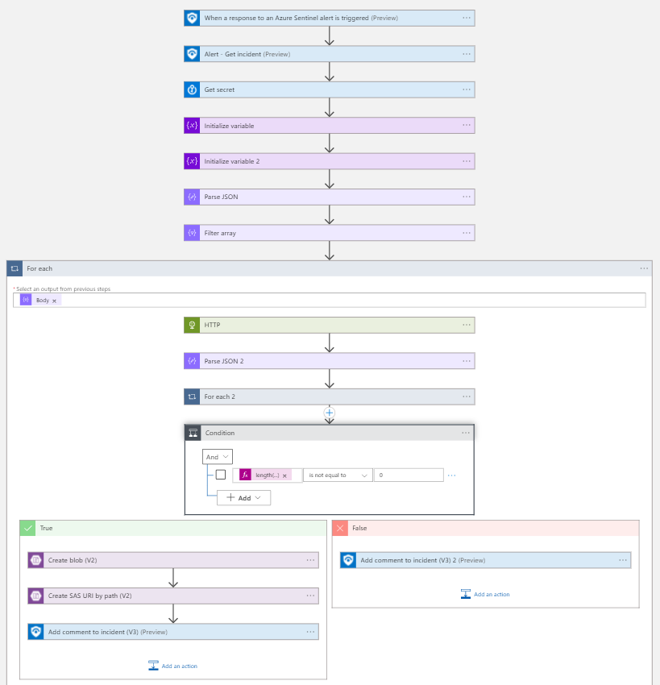

# Get-AD4IoTDeviceCVEs
author: Nicholas DiCola

This playbook will get device CVEs from the Azure Defender for IoT sensor.  The CVEs will be written to a JSON blob in Azure Storage and a link will be added to the Azure Sentinel Incident comments.

## Quick Deployment
**Deploy with incident trigger** (recommended)

After deployment, attach this playbook to an **automation rule** so it runs when the incident is created.

[Learn more about automation rules](https://docs.microsoft.com/azure/sentinel/automate-incident-handling-with-automation-rules#creating-and-managing-automation-rules)

**Deploy with alert trigger**

After deployment, you can run this playbook manually on an alert or attach it to an **analytics rule** so it will rune when an alert is created.

## Prerequisites
- The Azure Defender for IoT Sensor must be accessible from the Azure Logic App.
- You will need to generate an API key.  The Key will be stored in Azure Key Vault with only the Logic App system identity able to access it.  For instructions to generate an API Key [see](https://docs.microsoft.com/azure/defender-for-iot/organizations/references-work-with-defender-for-iot-apis#getting-started).

## Screenshots
**Incident Trigger** 

**Alert Trigger** 
