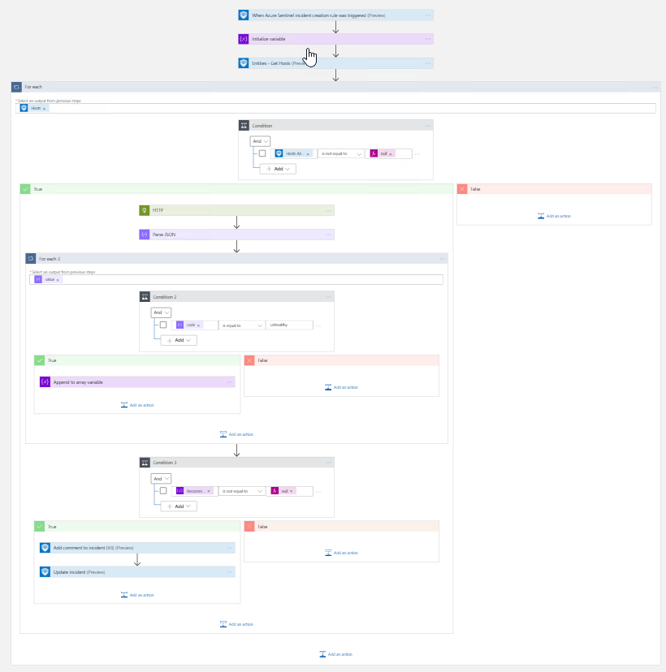

# Get-ASCRecommendations

author: Nicholas DiCola

This playbook will take each Host entity and If its an Azure Resource, query ASC API to get any ASC recommendations.  It will add a tag and comment if any unhealthy recommendations are found for the resource.

## Quick Deployment
**Deploy with incident trigger** (recommended)

After deployment, attach this playbook to an **automation rule** so it runs when the incident is created.

[Learn more about automation rules](https://docs.microsoft.com/azure/sentinel/automate-incident-handling-with-automation-rules#creating-and-managing-automation-rules)

**Deploy with alert trigger**

After deployment, you can run this playbook manually on an alert or attach it to an **analytics rule** so it will rune when an alert is created.

 of management group with Security Reader permissions.

## Screenshots
**Incident Trigger** 
 
**Alert Trigger** 
 