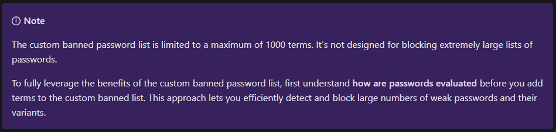
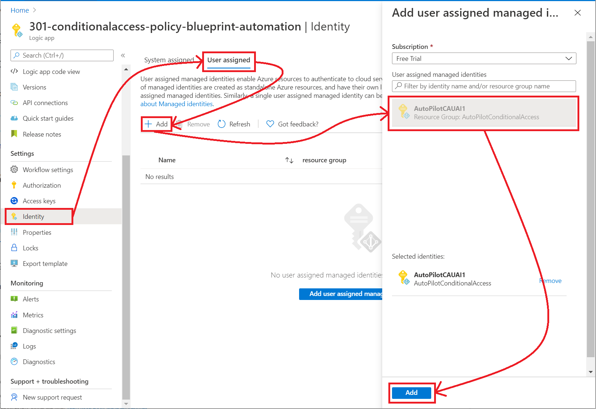
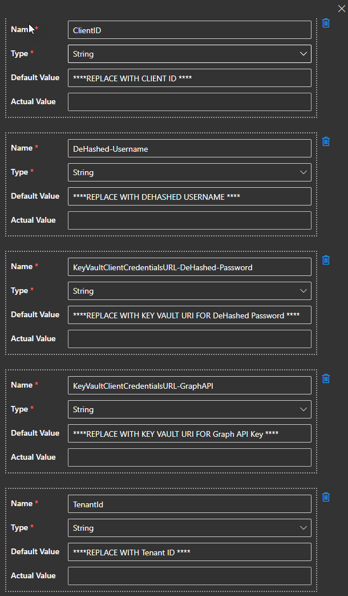
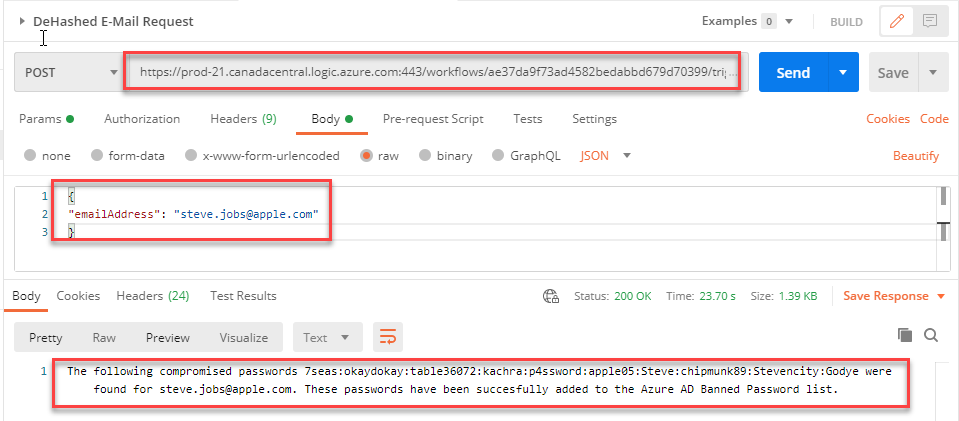

# Tutorial: Synchronize Compromised Passwords to the Azure AD Banned Password List using the paid DeHashed API

Intent: As an IT admin, I want to be know which users have publicly posted compromised passwords and I want to ensure these passwords and variations of those passwords are not used in my environment.

The [Azure AD Banned Password List](https://docs.microsoft.com/azure/active-directory/authentication/concept-password-ban-bad) is designed to support your own business and security needs, you can define entries in a custom banned password list. When users change or reset their passwords, these banned password lists are checked to enforce the use of strong passwords.

Utilizing the publicly available [DeHashed API](https://www.dehashed.com/pricing) we can query for a specific e-mail address, and if breached passwords are found have them automatically added to the Azure AD Banned Password list to prevent those passwords (and all variations) from being used in the environment.

## Example:
`The following compromised passwords 7seas:okaydokay:table36072:kachra:p4ssword:apple05:Steve:chipmunk89:Stevencity:Godye were found for steve.jobs@apple.com. These passwords have been succesfully added to the Azure AD Banned Password list.`

   
   

## Prerequisites

If you don't have an Azure subscription, create a [free Azure account](https://azure.microsoft.com/free/?WT.mc_id=A261C142F) before you start.

This Logic App retrieves API keys from Key Vault and as such you should review and complete the steps in the article [Secure authentication for Conditional Access automation](https://github.com/Azure-Samples/azure-ad-conditional-access-apis/blob/main/00-prereq/readme.md) to create a Key Vault and connect to Managed Identity.

This Logic App will require Graph API Permissions to [Update a directory setting](https://docs.microsoft.com/graph/api/directorysetting-update?view=graph-rest-beta&tabs=http) - `Directory.ReadWrite.All`in order to update the Azure AD Banned Password list.

This Logic App will require a paid subscription to the [DeHashed API](https://www.dehashed.com/pricing) which will use your username and password within the Logic App. Store your DeHashed password in an Azure Key Vault that your Managed Identity has access to and note the URI for secret retrieval.

## Step 1: Deploy this logic app to your organization

If your Azure environment meets the prerequisites, and you're familiar with using Azure Resource Manager templates, these steps help you sign in directly to Azure and open the Azure Resource Manager template in the Azure portal. For more information, see the article, [Deploy resources with Azure Resource Manager templates and Azure portal](https://docs.microsoft.com/azure/azure-resource-manager/templates/overview).

Select the following image to sign in with your Azure account and open the logic app in the Azure portal:

    

1. In the portal, on the **Custom deployment** page, enter or select these values:

   | Property | Value | Description |
   |----------|-------|-------------|
   | **Subscription** | <*Azure-subscription-name*> | The name for the Azure subscription to use |
   | **Resource group** | <*Azure-resource-group-name*> | The name for a new or existing Azure resource group |
   | **Region** |  <*Azure-region-for-all-resources*> | The Azure region to use for all resources, if different from the default value. This example uses the default value which is the resource group location. |
   | **Playbook Name**|  <*PlaybookName*> | This is the name for the deployed Logic App. |
   | **Client ID** | <*ClientID*> | The Client ID of your App Registration with Graph API Permissions.|
   | **Tenant ID** | <*TenantID*> | The Azure AD Tenant ID where your App Registration Resides.|
   | **Dehashed Username** | <*DeHashed-Username*> | The Username for your Dehashed Subscription.|
   | **Key Vault Client Credentials URL-DeHashed-Password** | <*KeyVaultClientCredentialsURL-DeHashed-Password*> | The URL for your DeHashed Password secret from Azure Key Vault|
   | **Key Vault Client Credentials URL-GraphAPI** | <*KeyVaultClientCredentialsURL-GraphAPI*> | The URL for your Graph API Key Secret from Azure Key Vault|

1. When you're done, select **Review + Create** and finally **Create**.

## Step 2: Authenticate your logic app to Azure AD with the right permissions

This logic app uses Managed Identity to access secrets from Key Vault to call the Graph API. As a prerequisite you must have completed the steps in the article [Secure authentication for Conditional Access automation](https://github.com/Azure-Samples/azure-ad-conditional-access-apis/blob/main/00-prereq/readme.md) to create a Key Vault and connect to Managed Identity. To learn more about how to use managed identities within Logic Apps, see the article [**Logic Apps and Managed Identities**](https://docs.microsoft.com/azure/logic-apps/create-managed-service-identity).

1. In the left-hand navigation pane, select Identity > User Assigned > Select Add.

1. Select the User-assigned managed identity from the context pane that appears on the right, select Add.

   

## Step 3: Update parameters

1. In the left-hand navigation pane, select Logic App designer > Parameters > Ensure all the default values are updated with Key Vault URL's (storing Client Secrets), Client ID and Tenant ID.

   

## Step 4: Select appropriate managed identity

1. On the Logic App Designer, in the HTTP connection box, click `GET client secret from key vault - Graph API`. This example uses HTTP connector.

2. Specify the Managed Identity to use.

   

Repeat the above for the step `GET client secret from key vault - DeHashed`

This will give the Managed Identity the ability to retrieve both the Graph API secret and DeHashed password from Azure Key Vault.

> [!WARNING]
> Ensure you follow best practices regarding managing secrets within Logic apps by using secure inputs and outputs as documented in the article, [Secure access and data in Azure Logic Apps]](https://docs.microsoft.com/azure/logic-apps/logic-apps-securing-a-logic-app).

## Next steps

This Logic App can be triggered in response to an Azure Sentinel alert. It will grab all the Account Entities associated with the Alert, retrieve their mail attribute from Azure AD using Graph API, it will check each account against the DeHashed API, if passwords have been found, it will update the Azure AD Banned Password list and will also add a comment to the Azure Sentinel Incident.

1. Launch Playbook in response to an Azure Sentinel Alert with an associated Azure AD Entity.
2. Wait for the Playbook to complete and check the Incident comments.

7. Review the updates to the Azure AD Banned Password List
   
