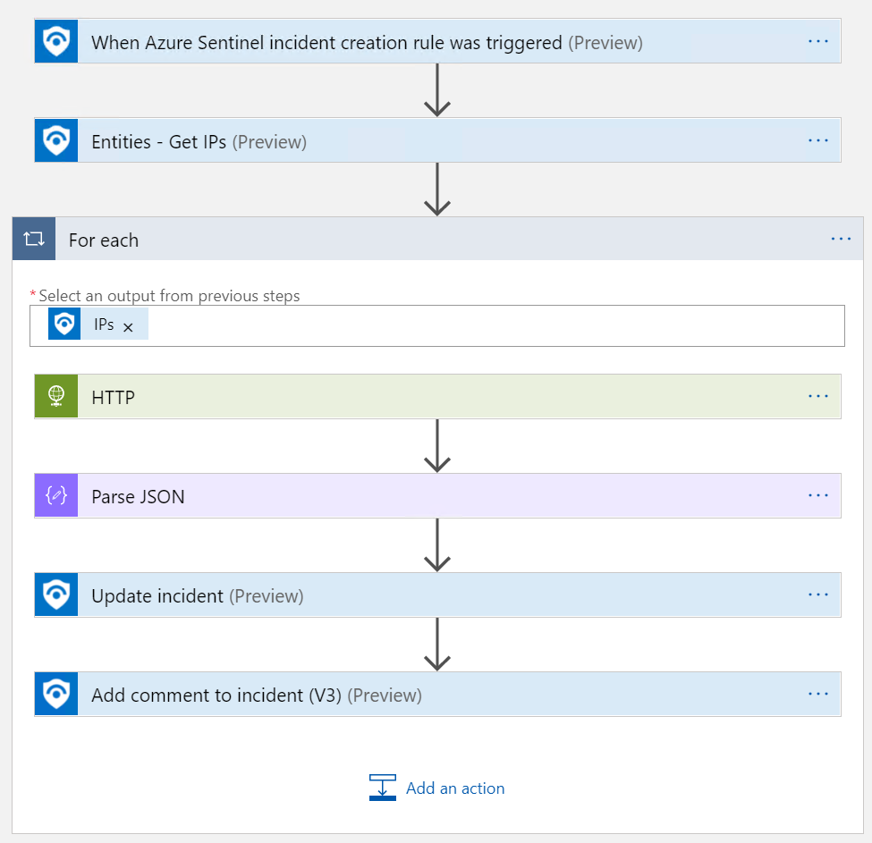
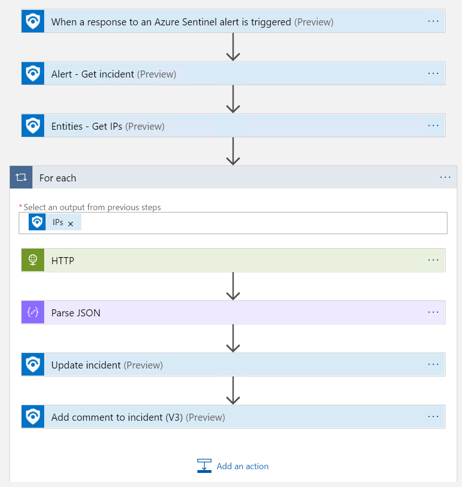

# Get-GeoFromIpAndTagIncident
author: Nicholas DiCola

This playbook will take the IP address entities from the Incident and query a Geo-IP API to geo-locate the IP Address.  It will write the City and Country to a tag on the Incident and more details to the comments.

## Quick Deployment
**Deploy with incident trigger** (recommended)

After deployment, attach this playbook to an **automation rule** so it runs when the incident is created.

[Learn more about automation rules](https://docs.microsoft.com/azure/sentinel/automate-incident-handling-with-automation-rules#creating-and-managing-automation-rules)

**Deploy with alert trigger**

After deployment, you can run this playbook manually on an alert or attach it to an **analytics rule** so it will rune when an alert is created.

## Prerequisites
None

## Screenshots
**Incident Trigger**

**Alert Trigger**
