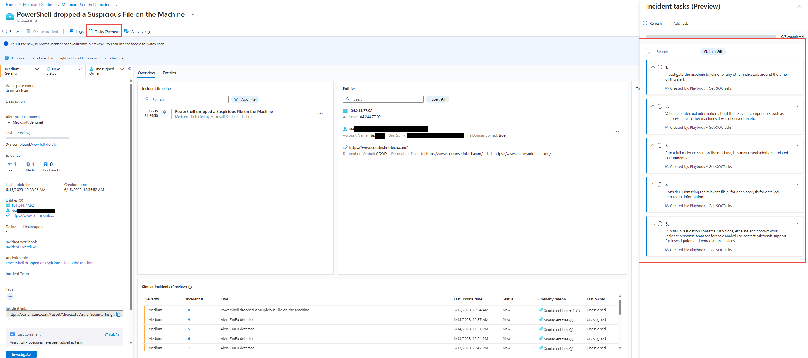

# Get-SOCTasks

## Overview
This playbook is an updated version of Get-SOCActions found in the Sentinel Solution: [SOC Process Framework][https://techcommunity.microsoft.com/t5/microsoft-sentinel-blog/what-s-new-soc-process-framework-is-now-live-in-content-hub/ba-p/3590349]. The playbook uses the SOCRA Watchlist to automatically enrich incidents generated by Microsoft Sentinel with Tasks to review and take. Tasks will be evaluated per Customer Organization and edited/modified per their standards of conduct.

## Prerequisites
This playbook does a watchlist lookup using an API connection created with in the LogicApp of this playbook to the SOCRA Watchlist and writes the recommended actions as tasks to the working incident. Ensure you have deployed the SOCRA Watchlist prior to deploying this playbook.

## Deployment

### Post-Deployment Instructions
After deploying the playbook, you must authorize the connections leveraged.

1. Visit the playbook resource.
2. Under "Development Tools" (located on the left), click "API Connections".
3. Ensure each connection has been authorized.

**Note: Each A# column contains a action, this logic app will use '-' dash as a delimter between the title and description of the task to be added**

