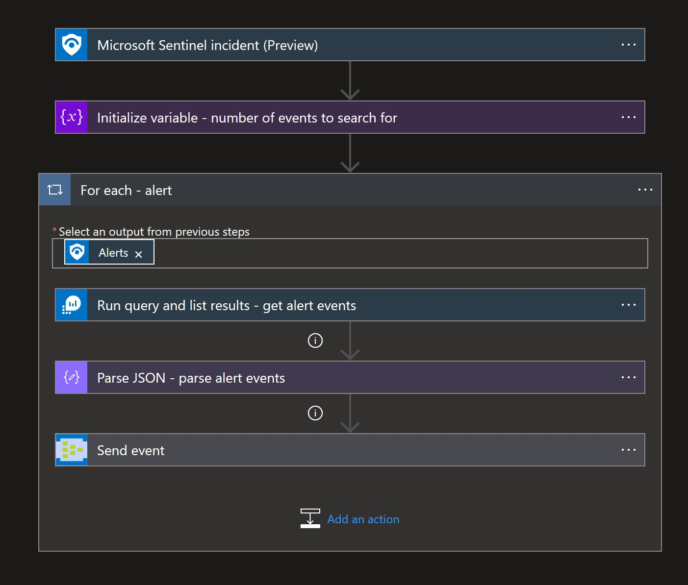

# Get-SentinelAlertsEvidence
Author: Yaniv Shasha

This playbook will Logic will automatically attach alert evidence from Azure Sentinel alerts and send them to an Event Hub that can be consumed by a 3rd party SIEM solution.
  

# Prerequisites
1.	Create an Event Hub using the article "Create an event hub using Azure portal"  
https://docs.microsoft.com/azure/event-hubs/event-hubs-create or use an existing Event Hub.
  

# Quick Deployment
**Deploy with incident trigger**

After deployment, you can run this playbook manually on an incident or attach this playbook to an **automation rule** so it runs when the incident is created.

**Deploy with alert trigger**

After deployment, you can run this playbook manually on an alert or attach it to an **automation rule** so it will rune when an alert is created.

  

# Post-deployment
1.	Once the playbook is deployed, Modify the “Run query and list results” actions and point it to your Azure sentinel workspace. 
2.	Next, configure the "send event" actions to use your Event Hub that created earlier.  

# Screenshots
**Incident Trigger**
