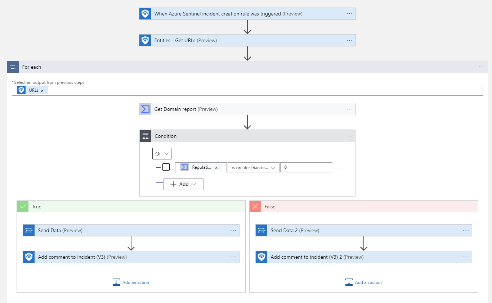

# Get-VirusTotalDomainReport
author: Nicholas DiCola

TThis playbook will take each URL entity and query VirusTotal for Domain info (https://developers.virustotal.com/v3.0/reference#domain-info).

## Quick Deployment
**Deploy with incident trigger** (recommended)

After deployment, attach this playbook to an **automation rule** so it runs when the incident is created.

[Learn more about automation rules](https://docs.microsoft.com/azure/sentinel/automate-incident-handling-with-automation-rules#creating-and-managing-automation-rules)

**Deploy with alert trigger**

After deployment, you can run this playbook manually on an alert or attach it to an **analytics rule** so it will rune when an alert is created.

## Prerequisites

- You will need to register to Virus Total community for an API key

## Screenshots
**Incident Trigger** 
 
**Alert Trigger** 
 