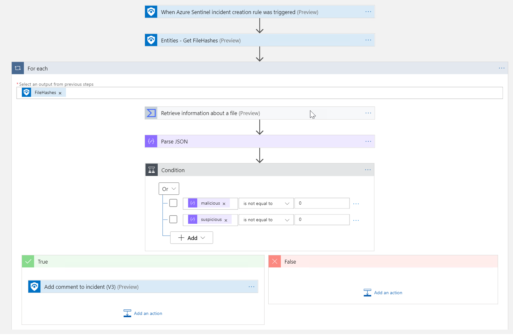
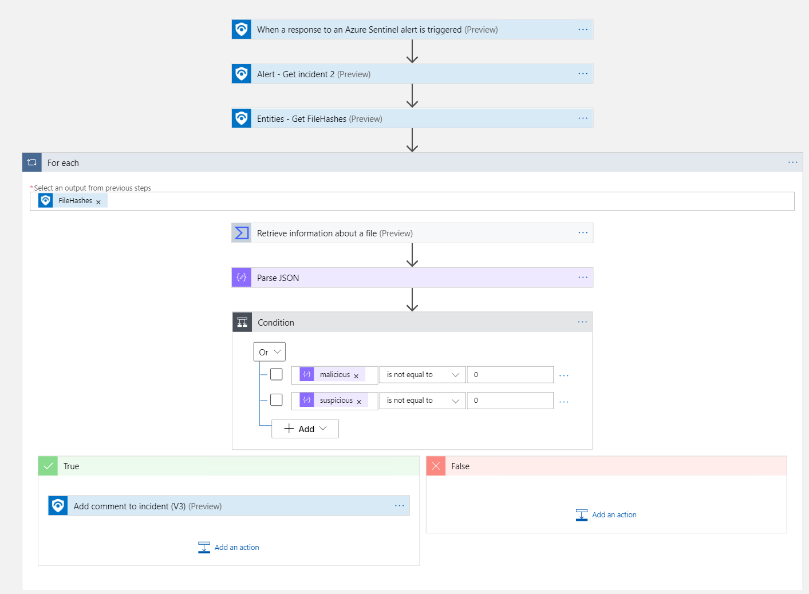

# Get-VirusTotalFileInfo
author: Nicholas DiCola

This playbook will take each File Hash entity and query VirusTotal for file report (https://developers.virustotal.com/v3.0/reference#file-info).  If the file last analysis has any suspicious or malicious hits a comment will be added to the incident.

## Quick Deployment
**Deploy with incident trigger** (recommended)

After deployment, attach this playbook to an **automation rule** so it runs when the incident is created.

[Learn more about automation rules](https://docs.microsoft.com/azure/sentinel/automate-incident-handling-with-automation-rules#creating-and-managing-automation-rules)

**Deploy with alert trigger**

After deployment, you can run this playbook manually on an alert or attach it to an **analytics rule** so it will rune when an alert is created.

## Prerequisites

- You will need to register to Virus Total community for an API key

## Screenshots
**Incident Trigger**

**Alert Trigger**
