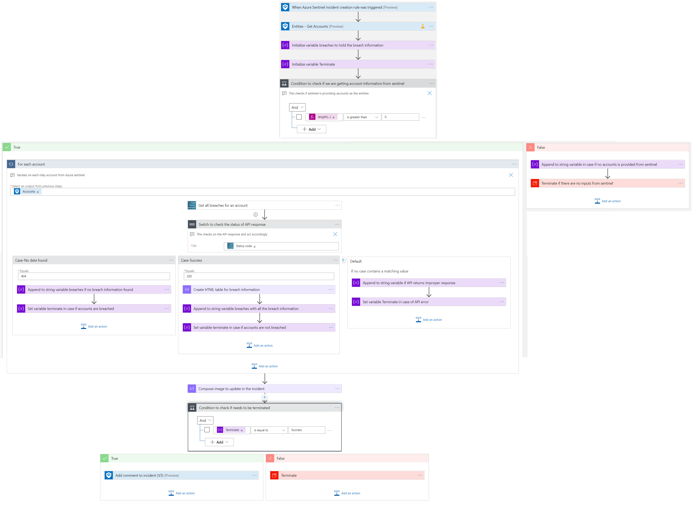
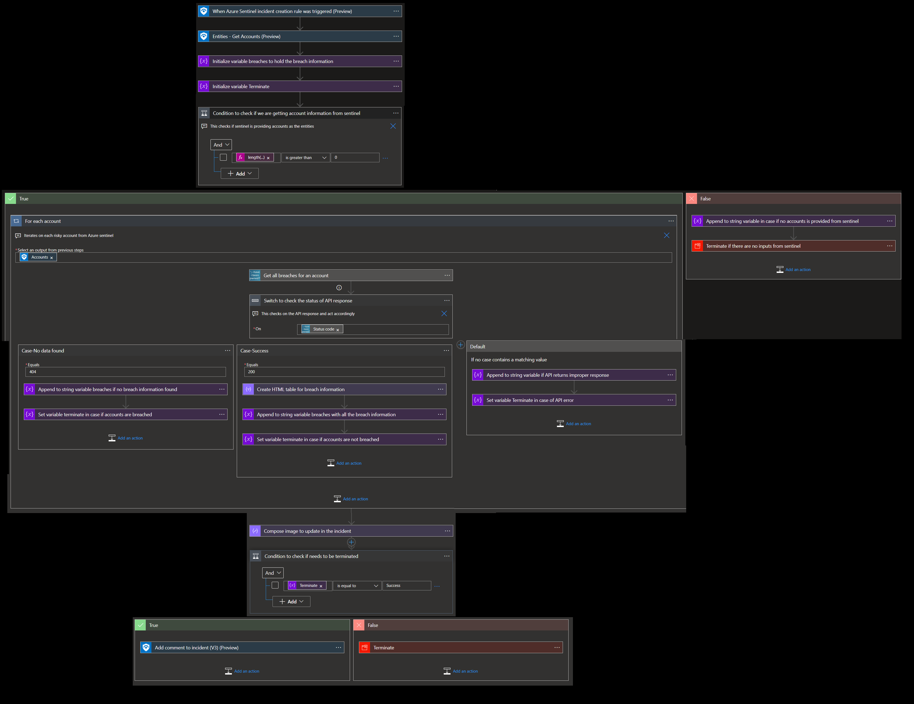
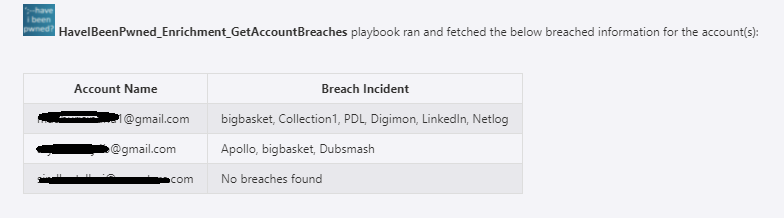
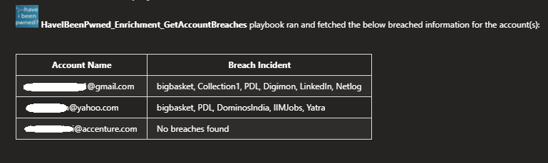

# HaveIBeenPwned GetAccountBreaches Enrichment Playbook
 ## Summary
 When a new azure sentinel incident is created, this playbook gets triggered and performs below actions:
 1. Fetches all the breach details for a list of email accounts.
 2. Updates all the collected information in incident.

 
 
## Prerequisites 
1. HaveIBeenPwned Custom Connector needs to be deployed prior to the deployment of this playbook under the same subscription and under the same resource group. Capture the name for the connector.
2. Generate an API key. [Refer this link on how to generate the API Key](https://haveibeenpwned.com/API/Key).

## Deployment instructions 
1. Deploy the playbook by clicking on "Deploy to Azure" button. This will lead you to the wizard for deploying an ARM Template.
2. Fill in the required parameters:
    * Playbook Name: Enter the playbook name here (e.g. HaveIBeenPwned_Enrichment_GetAccountBreaches)
    * Custom connector Name: Enter the name of your HaveIBeenPwned Custom Connector (e.g. HaveIBeenPwned_CustomConnector) 

* Deploy the playbook by clicking on "Deploy to Azure" button. This will take you to deplyoing an ARM Template wizard.

    
## Post-Deployment instructions 
###a. Authorize connections
Once deployment is complete, you will need to authorize each connection.
1.	Click the HaveIBeenPwned API Connection  resource
2.	Click edit API connection
3.	Provide the API Key
4.	Click Save

###b. Configurations in Sentinel
1. In Azure Sentinel analytical rules should be configured to trigger an incident with risky user account.
2. Configure the automation rules to trigger this playbook.

## Playbook steps explained

### When Azure Sentinel incident creation rule is triggered

Azure Sentinel incident is created. The playbook receives the incident as the input.

### Entities - Get Accounts

Get the list of Accounts as entities from the Incident.

### For each-Account received from the incident

Iterates on the Accounts found in this incident and performs the following:

 1. Get all breaches for an Account.

 2. If breach found, capture breaches for each individual accounts in a table, else update no breaches found.

 3. Add a comment to the incident with the breach information collected which looks like below.

