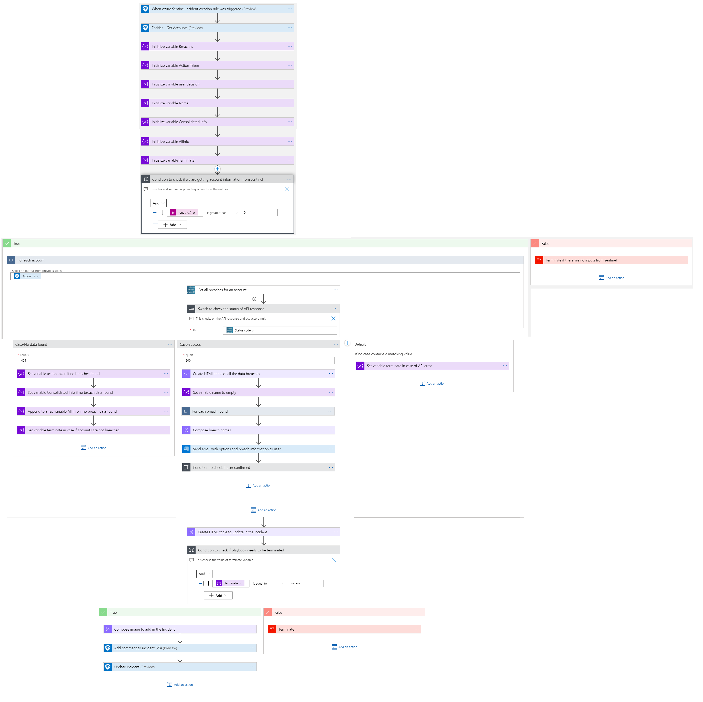
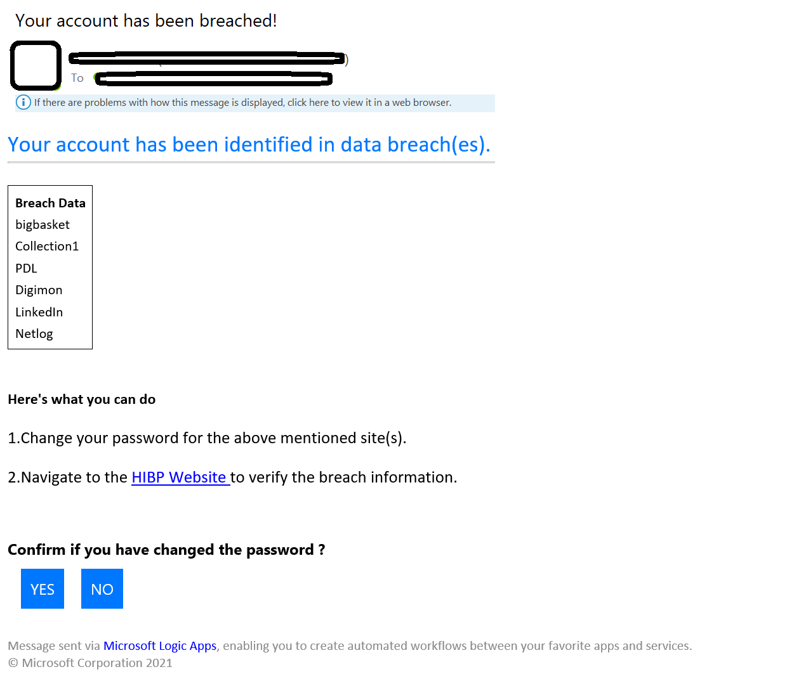
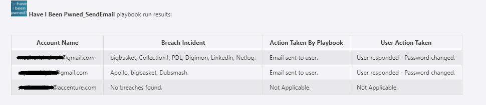
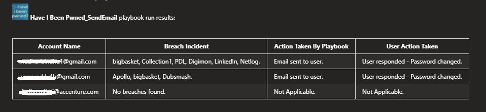

# HaveIBeenPwned Send Email playbook
 ## Summary
 When a new Azure Sentinel incident is created, this playbook gets triggered and performs below actions:
 1. Fetches the breach information from HaveIBeenPwned.
 1. Sends an email to breached user account and awaits for user response.
 1. Adds a comment to the incident with the information collected from the HaveIBeenPwned, action taken by user and closes the incident.

**Playbook overview:**

  
  

 
**Email sent to pwned user:**

 

 ## Prerequisites 

1. HaveIBeenPwned Custom Connector needs to be deployed prior to the deployment of this playbook under the same subscription and under the same resource group. Capture the name for the connector.
2. Generate an API key. [Refer this link on how to generate the API Key](https://haveibeenpwned.com/API/Key).

## Deployment instructions 
1. Deploy the playbook by clicking on "Deploy to Azure" button. This will lead you to the wizard for deploying an ARM Template.
2. Fill in the required parameters:
    * Playbook Name: Enter the playbook name here (Eg: HaveIBeenPwned_SendEmail)
    * Custom connector Name: Enter the name of your HaveIBeenPwned Custom Connector (e.g. HaveIBeenPwned_CustomConnector)

* Deploy the playbook by clicking on "Deploy to Azure" button. This will take you to deplyoing an ARM Template wizard.

   
## Post-Deployment instructions 
###a. Authorize connections
Once deployment is complete, you will need to authorize each connection.
1.	Click the Office 365 connection resource
2.	Click edit API connection
3.	Click Authorize
4.	Sign in
5.	Click Save
6.	Repeat steps for HaveIBeenPwned API Connection (For authorizing the HaveIBeenPwned API connection, API Key needs to be provided)
###b. Configurations in Sentinel
1. In Azure sentinel analytical rules should be configured to trigger an incident with risky account.
2. Configure the automation rules to trigger this playbook.

## Playbook steps explained

###When Azure Sentinel incident creation rule is triggered
Azure Sentinel incident is created. The playbook receives the incident as the input.

###Entities - Get Accounts
Get the list of risky Accounts as entities from the Incident.

###Initialize the below variables

  a. Breaches - This holds the Breaches for an individual account.

  b. Action Taken - This holds the action taken on SOC to comment in the Incident.

  c. User decision - This hold the value of User decision.

  d. Name -  This holds the value of breach names.

  e. Consolidated Info - This holds consolidated info of account names, breaches , soc decision and action taken for a particular account.

  f. All Info - This holds consolidated info of account names, breaches, soc decision and action taken for all accounts.

 ###Compose image to add in the incident
This action will compose the HaveIBeenPwned image to add to the incident comments.

###For each Account
* Get all the breaches for the account from HaveIBeenPwned API action.
* Based on the response from API, the following actions will be taken:
  * If breach information found: Send email to user with breach details associated with their account and recommend them to change the password and take confirmation from user.
  * If no breach information found: Update incident with no breach information found.

**Incident comment:**
  
  