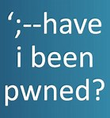

  # HaveIBeenPwned Logic Apps Custom Connector and playbook templates

   

## Table of Contents

1. [Overview](#overview)
1. [Deploy Custom Connector + 4 Playbook templates](#deployall)
1. [Authentication](#importantnotes)
1. [Prerequisites](#prerequisites)
1. [Deployment](#deployment)
1. [Post Deployment Steps](#postdeployment)
1. [References](#references)
1. [Limitations](#limitations)

<a name="overview">

# Overview

Have I Been Pwned is a website that allows Internet users to check whether their personal data has been compromised by data breaches.

<a name="deploy">

# Deploy Custom Connector + 4 Playbook templates
This package includes:
* Custom connector for HaveIBeenPwned.
* Four playbook templates leverage HaveIBeenPwned custom connector.

You can choose to deploy the whole package : connector + all four playbook templates, or each one seperately from it's specific folder.

# HaveIBeenPwned connector documentation 

<a name="authentication">

# Authentication
Authentication methods this connector supports- [API Key authentication](https://{haveibeenpwned.com/api/v3)

<a name="prerequisites">

# Prerequisites for using and deploying Custom Connector + 4 playbooks
1. HaveIBeenPwned service end point should be known. (e.g. https://{haveibeenpwned.com})
2. Generate an API key. [Refer this link on how to generate the API Key](https://haveibeenpwned.com/API/Key)

<a name="deployment">

# Deployment instructions 
1. Deploy the Custom Connector and playbooks by clicking on "Deploy to Azure" button. This will take you to deploying an ARM Template wizard.
2. Fill in the required parameters for deploying custom connector and playbooks

| Parameters | Description |
|----------------|--------------|
|**For Custom Connector**|
|**Custom Connector name:**| Enter the Custom connector name (e.g. contoso HaveIBeenPwned connector)|
|**Service Endpoint:** | Enter the HaveIBeenPwned service end point (e.g. https://{haveibeenpwned.com})|
|**For Playbooks**|
|**HaveIBeenPwned Enrichment GetAccountBreaches:**|  Enter the playbook name for account breaches (e.g. HaveIBeenPwned Playbook)|
|**HaveIBeenPwned Enrichment GetSiteBreaches:** | Enter the playbook name for site breaches (e.g. HaveIBeenPwned Playbook)| 
|**HaveIBeenPwned Response On Teams:** |Enter the playbook name for response on teams (e.g. HaveIBeenPwned Playbook)|
|**HaveIBeenPwned Send Email :** |Enter the playbook name for sending email (e.g. HaveIBeenPwned Playbook)|

<a name="postdeployment">

# Post-Deployment instructions 
After deploying response from Teams playbook, we need to select the Teams group and Teams channel from the dropdown in logic app designer.
## a. Authorize connections
Once deployment is complete, you will need to authorize each connection.
1.	Click the Teams connection resource
2.	Click edit API connection
3.	Click Authorize
4.	Sign in
5.	Click Save
6.	Repeat steps for other connections such as Office 365 connection and HaveIBeenPwned API Connection (For authorizing the HaveIBeenPwned API connection, API Key needs to be provided)

## b. Configurations in Sentinel
1. In Azure sentinel analytical rules should be configured to trigger an incident with risky user account or site. 
2. Configure the automation rules to trigger the playbooks.

<a name="references">

#  Reference to the playbook templates and the connector

 Connector
*[HaveIBeenPwnedCustomConnector](https://github.com/Azure/Azure-Sentinel/tree/master/Playbooks/HaveIBeenPwned/HaveIBeenPwnedCustomConnector)

Playbooks
* [HaveIBeenPwned_Enrichment_GetAccountBreaches : Playbook to Get Account Breaches and update to incident](https://github.com/Azure/Azure-Sentinel/tree/master/Playbooks/HaveIBeenPwned/Playbooks/HaveIBeenPwned_Enrichment_GetAccountBreaches)
* [HaveIBeenPwned_Enrichment_GetSiteBreaches : Playbook to Get Site Breaches and update to incident](https://github.com/Azure/Azure-Sentinel/tree/master/Playbooks/HaveIBeenPwned/Playbooks/HaveIBeenPwned_Enrichment_GetSiteBreaches)
* [HaveIBeenPwned_ResponseOnTeams : Playbook to act based on Response from Teams](https://github.com/Azure/Azure-Sentinel/tree/master/Playbooks/HaveIBeenPwned/Playbooks/HaveIBeenPwned_ResponseOnTeams)
* [HaveIBeenPwned_SendEmail : Playbook to send email automatically](https://github.com/Azure/Azure-Sentinel/tree/master/Playbooks/HaveIBeenPwned/Playbooks/HaveIBeenPwned_SendEmail)

<a name="limitations">

# Known Issues and Limitations
* We need to authorize the connections after deploying the playbooks.

