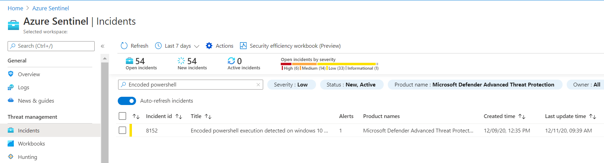
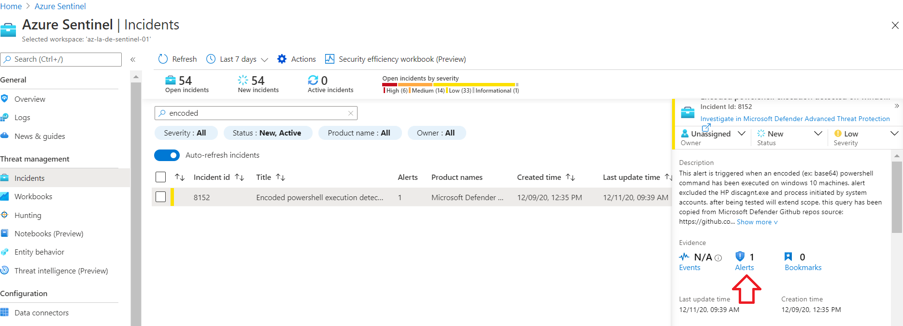
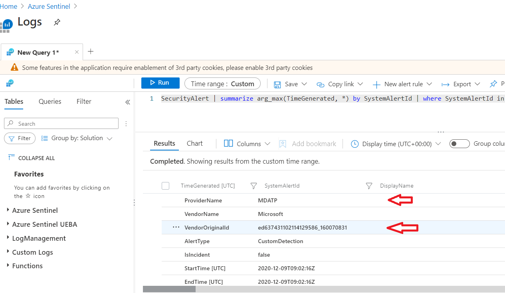
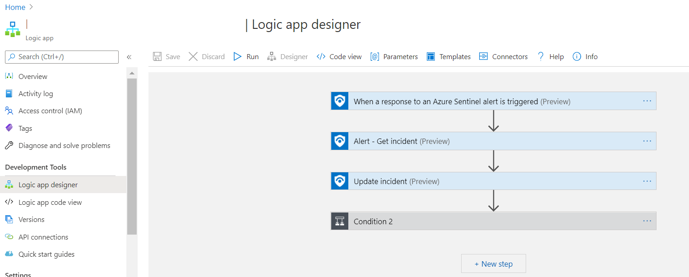
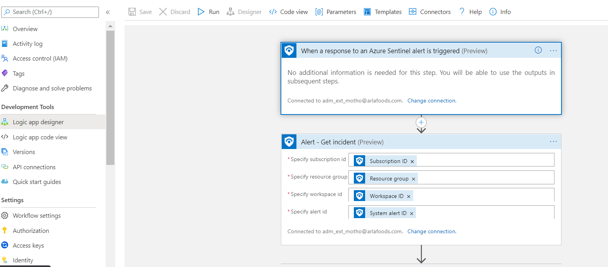
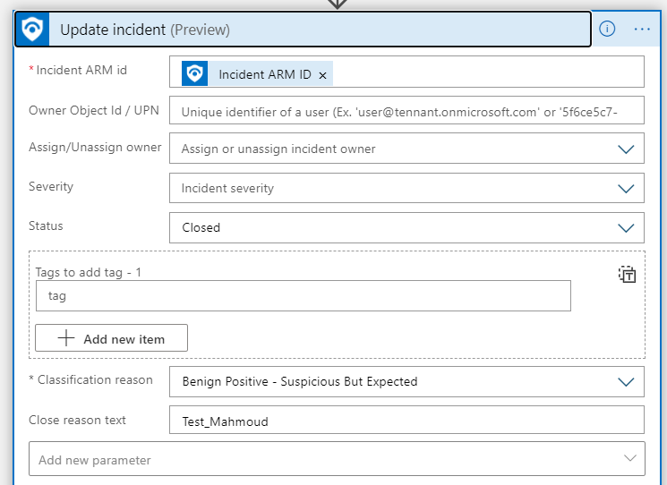
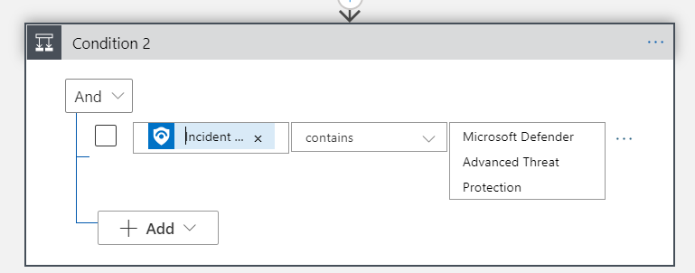
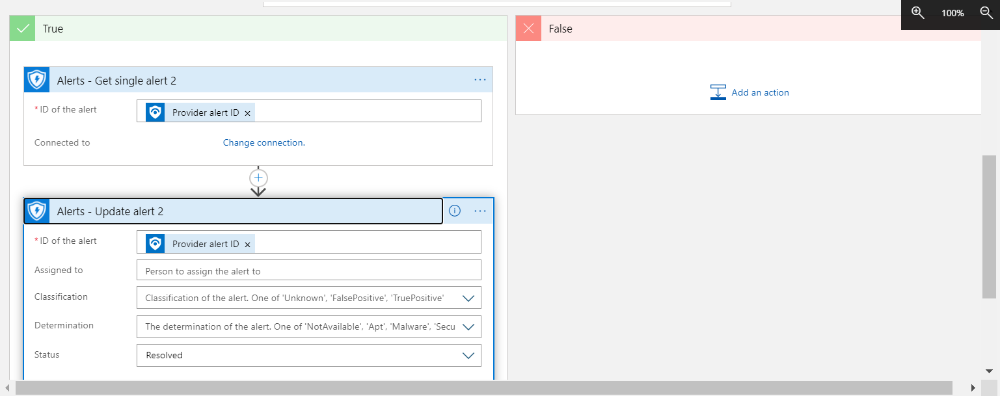
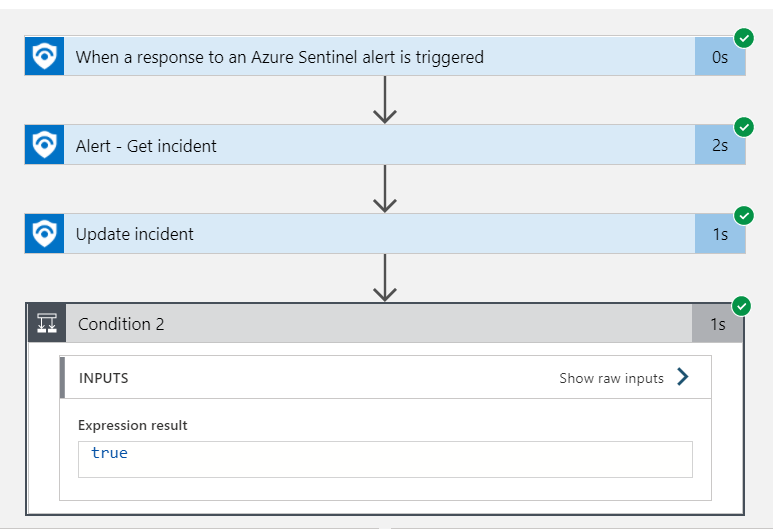
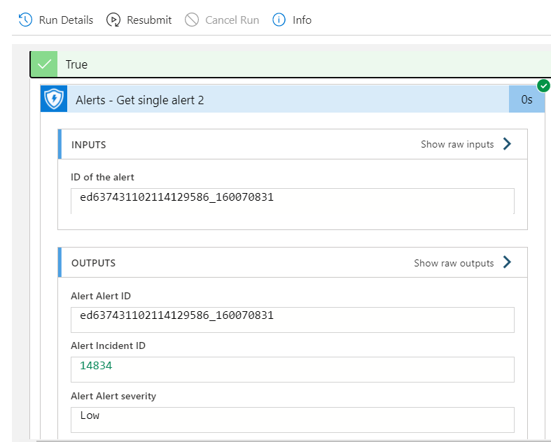

Author: Mahmoud Elsayed

## This playbook could be used to sync incident status in Azure sentinel to the corresponding incident in MDATP

**Description**

This playbook is applicable in following scenario:
- MDATP connector is enabled in Azure sentinel
- An analytic rule is configred to log incidenets in sentinel based on received information from MDATP

In this scenario when an incident status changes for example when an incident gets closed or re-opened, the incident status doesn't get propagated and reflected in MDATP.

This playbook represents an example of how to keep incident status in sync between sentinel and MDATP.

The goal is to find a common matching criteria between the two entities. 

If we look at shown example of one incident in sentinel

 

Clicking on the incident and then from the right pane clicking on "Alerts" it opens the following page with the query result as shown in following screens:

The VendorOriginID is the attribute that represents the Alert ID as it is stored in MDATP originally at the source.

So this is the matching attribute will be used to create the playbook with.

This picture shows how the playbook looks like after being created.

Following is the main steps:

**Step#1**: When a response to an Azure Sentinel alert is triggered:

This step is default trigger that has to be used when the playbook will be triggered

**Step#2:** Alert - Get incident

In this step the fields can be filled up with dynamic attributes as shown in the picture

**Step#3:** Update incident

In this step we set the incident status to "Closed" in Sentinel

**Step#4:** Condition:

Now it's time to set the condition and actions required..

The condition used here is to set dynamic content attribute to: "Incident Alert product names"

If condition is met then next step would be to set the corresponding alert status in MDATP to "Resolved"

The actual matching attribute "provider alert ID" that is exactly same as VendorOriginID mentioned above will be used:

Note: attribute "provider Alert ID" was retreived and the MDATP connector was used in background to pass it to. Same result could be obtained when sending a query to MDATP with the specific alert id ed637431102114129586_160070831 in order to set it to "resovled".

**Step#5:** testing the playbook in action:

As shown above it was able to pull the alert ID ed637431102114129586_160070831 that is equal to the VendorOriginID in order to query for it in MDATP and close the alert.

