# Integrating Microsoft Sentinel with Intezer

This guide outlines the integration between Microsoft Sentinel and [Intezer](https://intezer.com/). 

Intezer automatically monitors, investigates, and triages security alerts 24/7 for your team. Using automated analysis, smart recommendations, and auto-remediation, it saves your team from time wasted on false positives, repetitive analysis tasks, and an excess of escalated alerts. Integrating with Microsoft Sentinel can further enhance your security operations and efficiency.

In this repository, you'll find playbooks to guide you through the integration process.

For assistance, please contact Intezer's support team at [support@intezer.com](mailto:support@intezer.com).

## Playbook Descriptions

### Playbook 1: Update Incident - Intezer Alert Webhook
**Trigger:** HTTP request after Intezer finishes processing an alert.

Assuming you've [connected Microsoft Defender to Intezer](https://support.intezer.com/hc/en-us/articles/7431169050652), this playbook triggers whenever Intezer completes alert processing. It appends a context-specific comment to the corresponding incident in Microsoft Sentinel, linking insights from Intezer.

### Playbook 2: Submit Intezer Alert - Incident Triggered
**Trigger:** Creation of a new incident in Microsoft Sentinel.

This playbook forwards the details of a new Microsoft Sentinel incident, including associated file hashes and network artifacts, to Intezer for analysis and processing.

### Playbook 3: Submit Intezer Scan File Hash - Incident Triggered
**Trigger:** Creation of a new incident in Microsoft Sentinel.

This playbook extracts file hashes from the Microsoft Sentinel incident, then forwards them to Intezer for in-depth analysis. A comment containing Intezer's verdict is appended back to the incident, ensuring that all relevant information is accessible in one place.

### Playbook 4: Submit Intezer Scan URL - Incident Triggered
**Trigger:** Creation of a new incident in Microsoft Sentinel.

This playbook extracts associated URLs from the Microsoft Sentinel incident, then forwards them to Intezer for in-depth analysis. A comment containing Intezer's verdict is appended back to the incident, ensuring that all relevant information is accessible in one place.

## Quick Deployment
> **_Important note:_**  Please note that deploying requires manual setup before and after, including prerequisites and postrequisites. Ensure that the individual performing the deployment in the Azure environment has powerful permissions.

Before deploying, please review the [deployment prerequisites](#deployment-prerequisites).

 
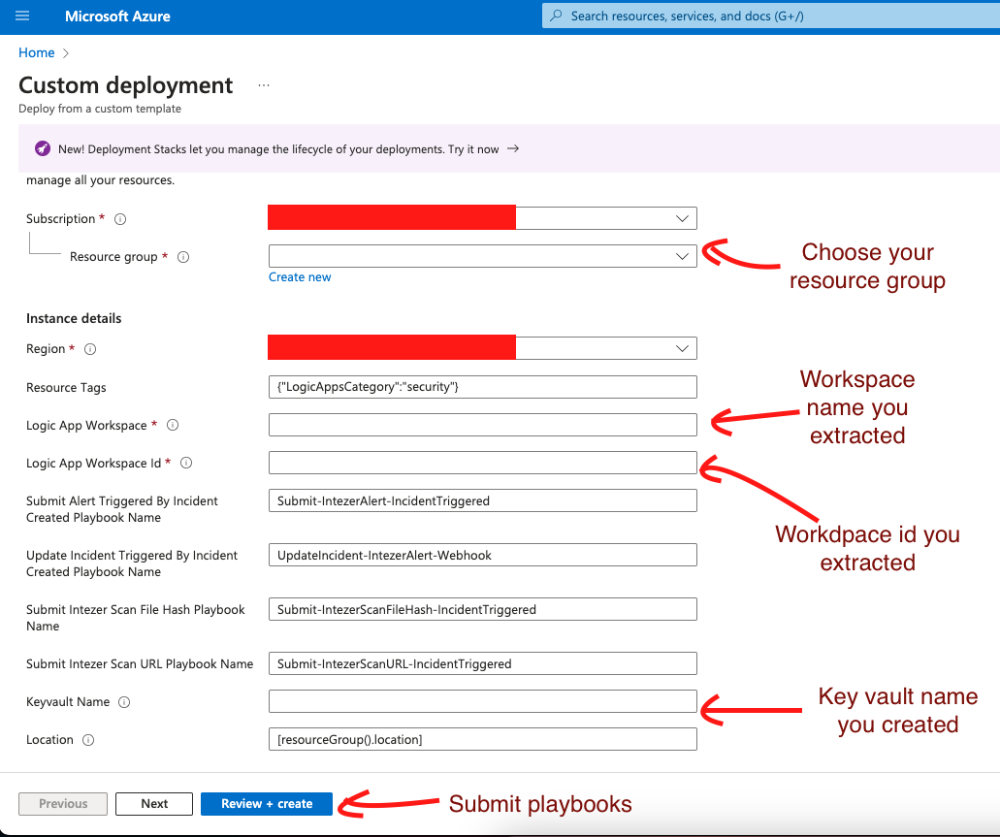

After deployment, please review the [deployment postrequisites](#deployment-postrequisites).

### Deployment Prerequisites
1. Extracting Your Microsoft Sentinel Workspace Name and Workspace ID:
   - Navigate to **Microsoft Sentinel** in the Azure portal:  
     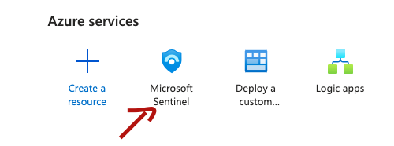
   - Select your Microsoft Sentinel workspace:  
     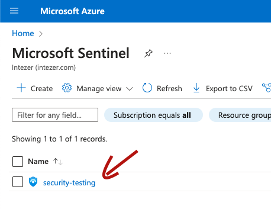
   - Go to **Settings**:  
     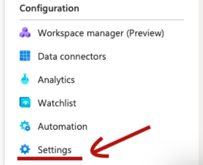
   - Select **Workspace Settings**:  
     
   - Under the **Essentials** section, locate your workspace name and workspace ID. Keep this information for later use:  
     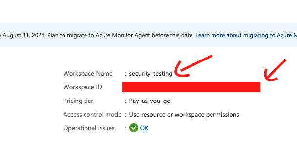

2. Setting Up Azure Vault for Holding Intezer API Key:
   - Go to **Key Vaults** in the Azure portal:  
     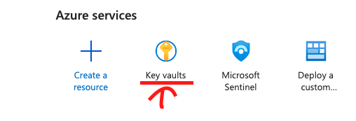
   - Create a new vault, choosing a unique name for the **Key Vault Name** and keeping it for later use:  
     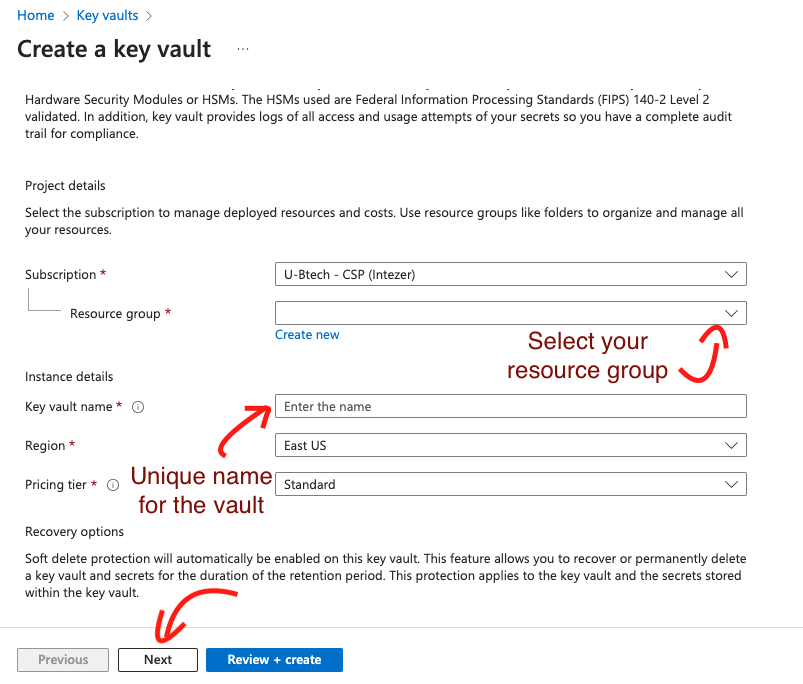
     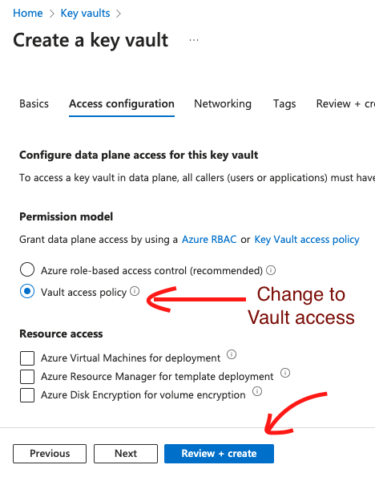
   - Access your created vault and create a new secret named **intezer-sentinel-api-key** to hold your Intezer API key:  
     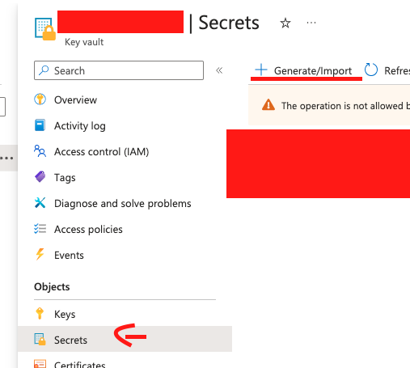
     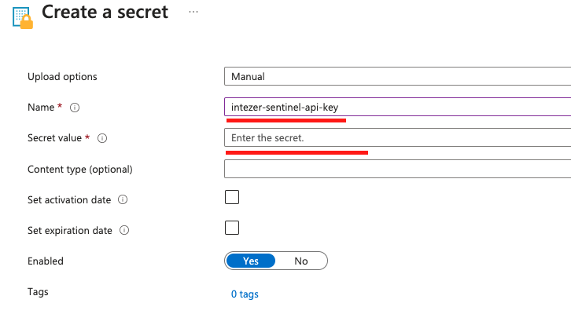

### Deployment Postrequisites
After submitting the custom deployment, you need to perform some actions in your Azure environment.

1. Activate playbooks by setting up Automation rules for logic app playbooks triggered by new incident creation in Microsoft Sentinel (Playbooks 2, 3, and 4)
   - Navigate to **Microsoft Sentinel** in the Azure portal:  
     
   - Select your Microsoft Sentinel workspace:  
     
   - On the left menubar, under Configuration, select **Automation**: 
   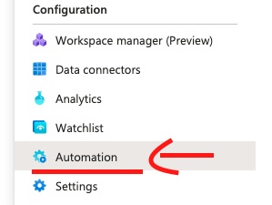

   - Click **Create** and then **Automation rule**: 
   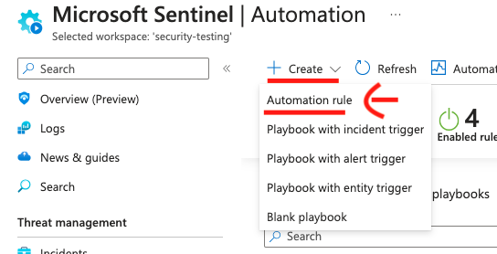

   - Enter an **Automation rule name** and choose the **When incident is created** trigger. In the Actions section, choose **Run playbook** and select the playbook you want to activate, then click Save. Each automation rule is connected to one playbook, so if you want to activate more than one playbook, you will need to create an automation rule for each one of them.
   
      **Note:** You only need to configure the playbooks you want to use; you don't need to activate all three options if you don't need to.
   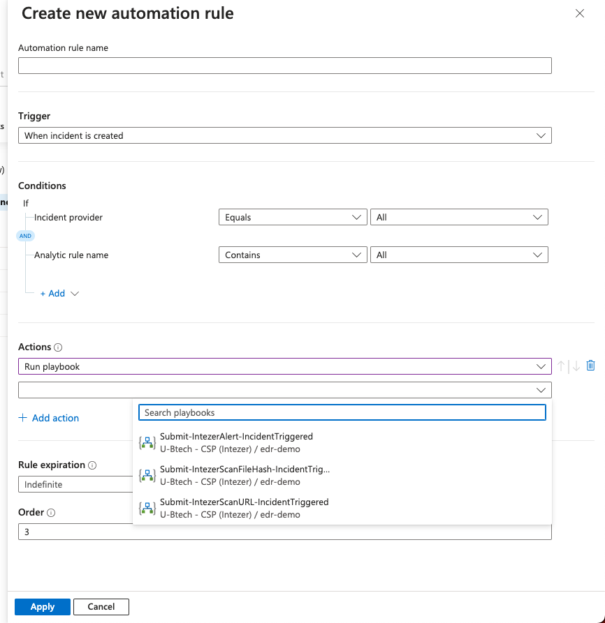

2. Grant Permissions to Microsoft Sentinel Created Playbooks:
   - Navigate to **Microsoft Sentinel** in the Azure portal:  
     
   - Select your Microsoft Sentinel workspace:  
     
   - Go to **Settings**:  
     
   - Select **Workspace Settings**:  
     
   - In the left menu, choose **Access Control (IAM)**:  
     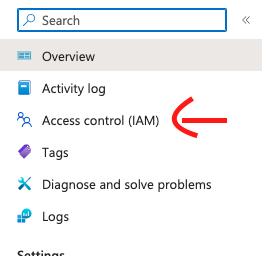
   - Click **Add**, then **Add Role Assignment**:  
     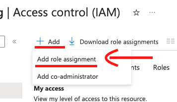
   - Under the Role tab, in the Job Function Rules tab, search and select **Microsoft Sentinel Responder**, then click Next:  
     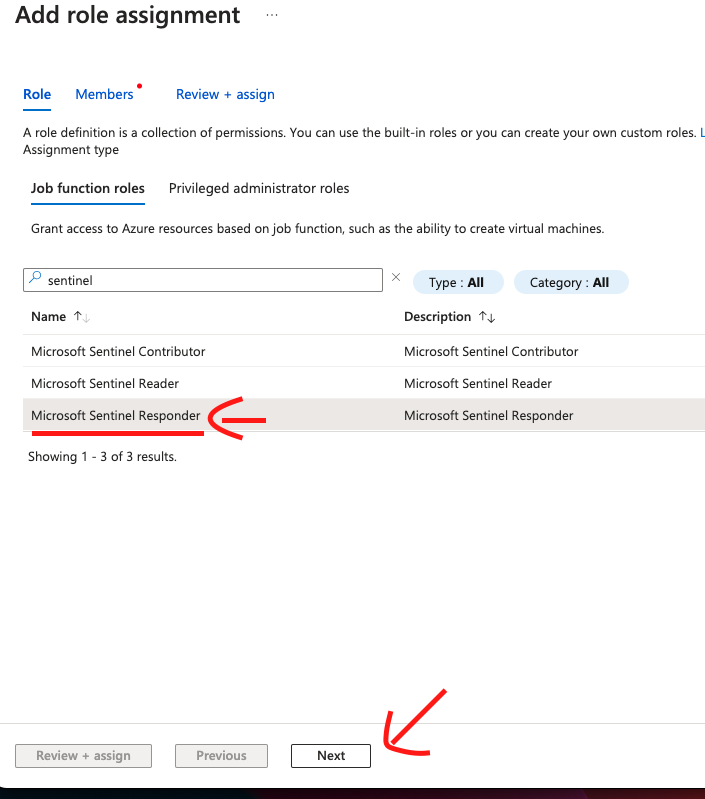
   - Click **+ Select Members** and add the four logic app playbooks created during the deployment process, then click **Review + Assign**:  
     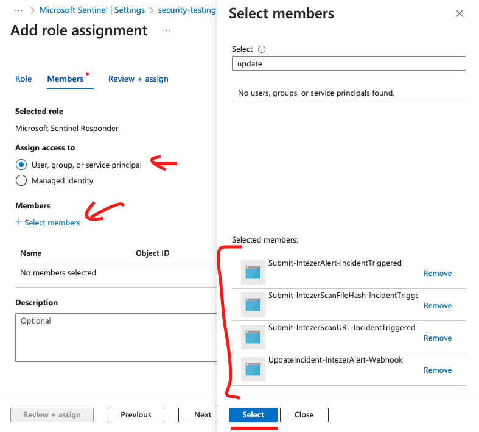
     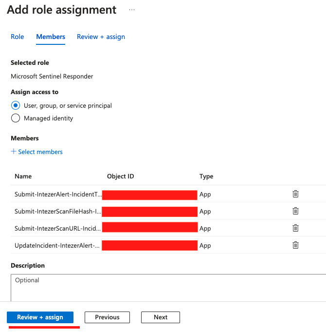

3. Grant Permissions to the Created Azure Vault:
   - During the prerequisites stage, you created an Azure vault that holds the "intezer-sentinel-api-key." After deploying logic app playbooks, ensure that the vault has permissions to read secrets during a run.
   - Go to **Key Vaults** in the Azure portal:  
     
   - Select the vault you created in the prerequisites. Choose **Access policies**:  
     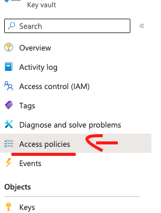
   - Click **Add Access Policy**, then press **Select all** under secret permissions:  
     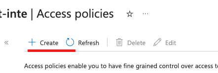
     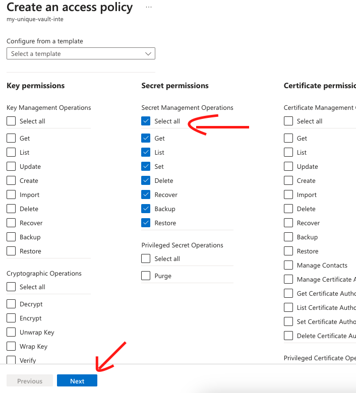
    - Choose each one of the created playbooks. Note that you can't choose all of the playbooks at once, so you need to do that process for each playbook you want to activate.
    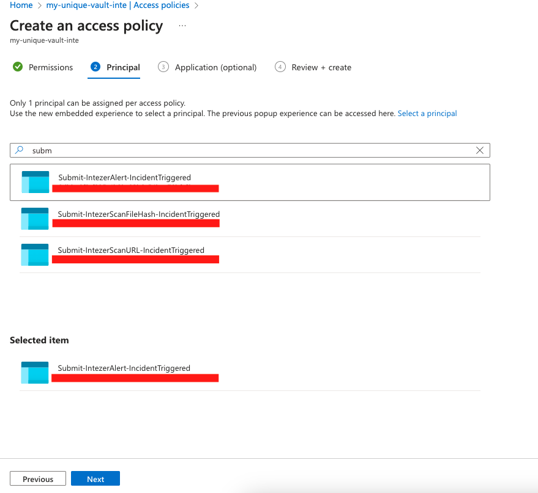

4. (Relevant only for **Update Incident - Intezer Alert Webhook**) Enable the Monitor Logs API Connection:
   - Navigate to **Logic apps** in the Azure portal:  
     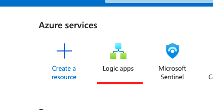

   - Search and select **UpdateIncident-IntezerAlert-Webhook** logic app: 
     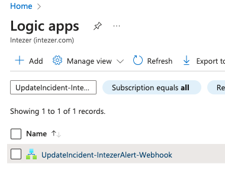

    - On the left menu bar, select **Logic app designer**: 
     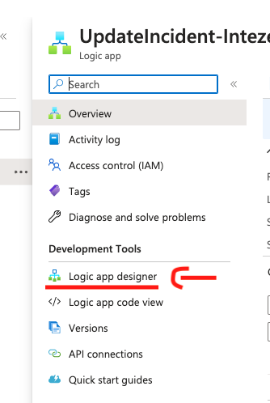

    - Click on the **Connections** step, the one with the warning: 
    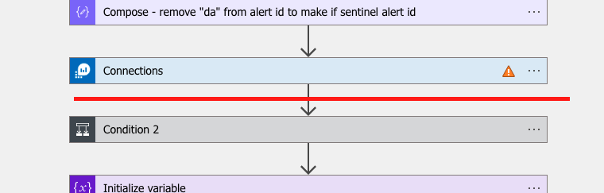

    - Click on **Add new**: 
    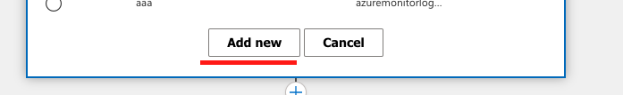

    - Enter a generic connection name and click **Sign in**: 
    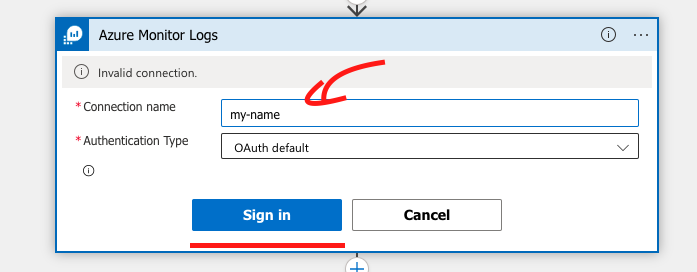

    - After submitting the connection, click **Save** on the left menu: 
    

5. (Relevant only for **Update Incident - Intezer Alert Webhook**) - Register the HTTP trigger.
    - The logic app is fired using an HTTP request every time Intezer alert is done processing Microsoft Defender alert.
    The logic app generates a unique HTTP route for your playbook, which you need to provide to support@intezer.com to register the alerts traffic.

   - Navigate to **Logic apps** in the Azure portal:  
     

   - Search and select **UpdateIncident-IntezerAlert-Webhook** logic app: 
     

    - On the left menu bar, select **Logic app designer**: 
     

    - Open the first stage **When a HTTP request is received** and copy the generated HTTP POST URL. You need to provide it to support@intezer.com: 
     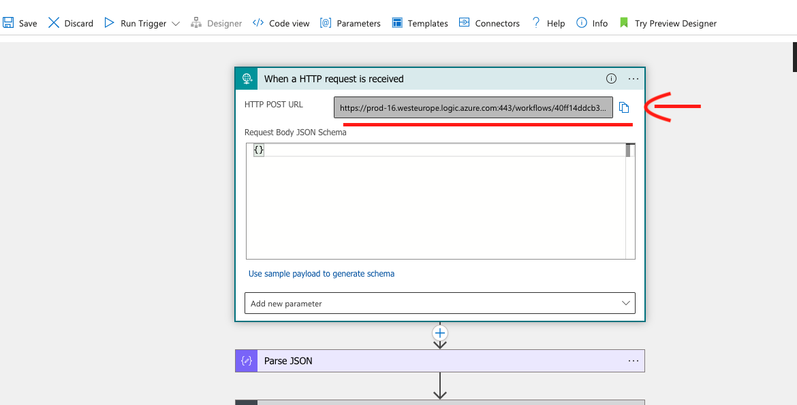
