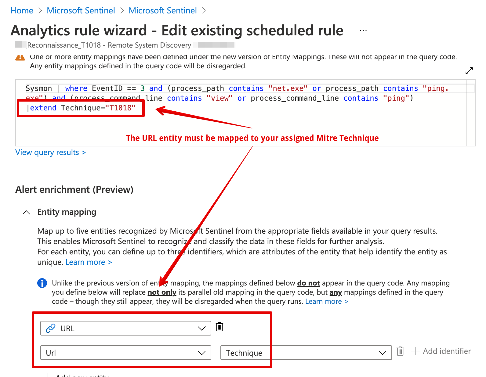

# Mitre Mapping Playbook
Author: David Broggy

This playbook will allow mapping of Mitre Techniques to Mitre SHIELD.
(note: Mitre is moving from Mitre SHIELD to ENGAGE, so expect an update to this playbook sometime after they finish Engage and they provide a good mapping to Techniques)

The following steps are taken to install/configure the Mitre Mapping Playbook
-	Import the playbook
-	Import the attack and mitre_shield watchlist tables
-	Configure automation so that the playbook triggers on every new incident

The Log Analytics operator requires a service principal, so you'll need to create an app registration with Log Analytics read access, or just use any user with the same access.

# test
# test
