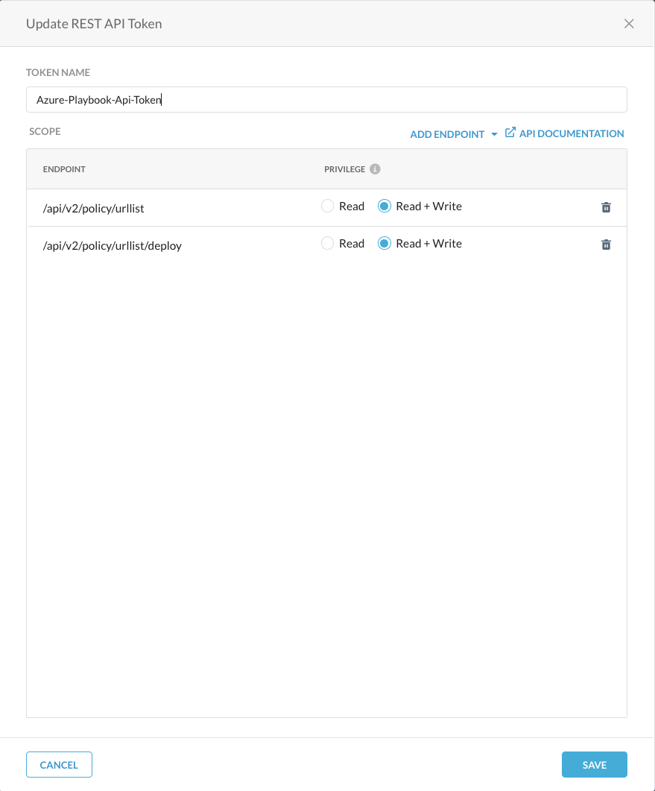

# Introduction

This playbook provides an integrated solution that will allow your SOC to leverage automation to add malicious URL to Netskope as a response to Microsoft Sentinel incidents. You can start automating blocking of these URLs with minimum configurations and effort and this is extremely useful when a Microsoft Sentinel Incident identifies a malicious URL communication, and you want to quickly add it to your Netskope URL block list. 

This playbook template is a pre-built, tested, and ready-to-use workflow that can be customized to meet your needs or as inspiration for new automation scenarios.

## Architecture Diagram

The below diagram shows the high-level architecture and design for this playbook.

*Fig 1. Netskope URL Playbook deployment in Azure*

## Deployment

To deploy this template in Azure:

- Identify the "Base URL" for your Netskope tenant. This is a URL that you use to access your Netskope tenant, for example: `https://example.goskope.com`

- Follow the [REST APIv2 Documentation](https://docs.netskope.com/en/rest-api-v2-overview-312207.html) to create an API token.

    - Required "Read+Write" for `/api/v2/urllist` endpoint.
    - Required "Read+Write" for `/api/v2/urllist/deploy` endpoint.

*Fig 2. Netskope API Token*

- Deploy a playbook by clicking on "Deploy to Azure" button. This will take you to deploying an ARM Template wizard inside Azure Portal.

- Provide values to the template parameters.

|   Parameter                  |          Description                             |
|------------------------------| ------------------------------------------------ |
| Playbook Name                | Name of the Azure Playbook|
| Tenant Name                  | Netskope Tenant Name e.g. if the URL that you use to access your Netskope tenant is https://example.goskope.com then the Tenant Name value will be `example`         | 
| URL List Name                | Netskope URL list name that will be updated to add malicious URL that is included in the Microsoft sentinel incident |
| Netskope API Token           | Netskope REST API v2 Token value |
| keyvault Name                | Azure Keyvault Name to create to store API token value as a keyvault secret. Provide a value that's 11 characters or less, a uniqueString function that returns 13 characters is used to append with your provided vault name value to make it globaly unique. The name must begin with a letter, end with a letter or digit, and not contain consecutive hyphens. |

## Post Deployment

### Set up Access for the Managed System Identity
Before you can use this playbook and the logic app's managed system identity for authentication, you have to set up access for the logic app's managed system identity on the Azure resource used in this playbook. There are connection for Azure KeyVault and Microsoft Sentinel that requires access. You have to set up access by using Azure role-based access control (Azure RBAC) and assign the appropriate roles as follows.

|   Resource                   |        RBAC Role Name              |
|------------------------------| ---------------------------------- |
| Sentinel                     |      Microsoft Sentinel Responder  |
| Keyvault                     |      Key Vault Secrets User        |

Note; On these resources, you'll add the necessary role for the logic app's managed system identity to access these resources on your logic app's or connection's behalf. To add a role to a managed identity, you need Azure AD administrator permissions that can assign roles to identities in the corresponding Azure AD tenant.

### Configurations in Microsoft Sentinel
For Microsoft Sentinel some additional configuration is needed:

- Enable Microsoft Sentinel Analytics rules that create alerts and incidents which includes the relevant entity i.e. URL.
- Configure automation rule(s) to trigger the playbooks.

Refer to Microsoft [Sentinel](https://learn.microsoft.com/en-us/azure/sentinel/) Documentation for further details. 

## Support
Netskope-provided scripts in this and other GitHub projects do not fall under the regular Netskope technical support scope and are not supported by Netskope support services.
