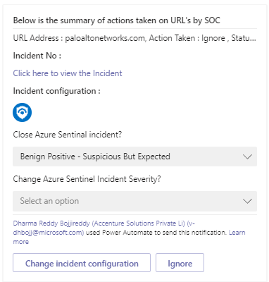

# PaloAlto-PAN-OS-BlockURL

 ## Summary

This playbook allows blocking/unblocking URLs in PaloAlto, using **predefined address group**. This allows to make changes on predefined address group, which is attached to security policy rule. 
When a new Sentinel incident is created, this playbook gets triggered and performs below actions:

1. An adaptive card is sent to the SOC channel providing Incident information, URL address, list of existing security policy rules in which URL is a member of and provides an option to Block/Unblock URL Address by adding/removing it to/from the predefined address group.

2. The SOC can act on risky URL based on the information provided in the adaptive card, or ignore.

 

**This is the adaptive card SOC will receive when playbook is triggered for each risky URL for taking actions like block/unblock/ignore ::**  
 

**This is the consolidate adaptive card about the summary of actions taken on URL and the incident configuration ::**  
 

### Prerequisites 
1. PaloAlto connector needs to be deployed prior to the deployment of this playbook under the same subscription. Relevant instructions can be found in the connector doc page.
2. Generate an API key.[Refer this link on how to generate the API Key](https://paloaltolactest.trafficmanager.net/restapi-doc/#tag/key-generation)
3. Address group should be created for PAN-OS and this should be used while creating playbooks.

### Deployment instructions 
1. Deploy the playbook by clicking on "Deploy to Azure" button. This will take you to deploying an ARM Template wizard.

   

2. Fill in the required parameters:
    * Playbook Name: Enter the playbook name here (e.g. PaloAlto-PAN-OS-BlockURL)
    * Teams GroupId: Enter the Teams channel id to send the adaptive card
    * Teams ChannelId: Enter the Teams Group id to send the adaptive card
     [Refer the below link to get the channel id and group id](https://docs.microsoft.com/powershell/module/teams/get-teamchannel?view=teams-ps)
    * Predefined address group name: Enter the predefined address group name here to Block URL /Unblock URL
    

### Post-Deployment instructions 
#### a. Authorize connections
Once deployment is complete, you will need to authorize each connection.
1.	Click the Azure Sentinel connection resource
2.	Click edit API connection
3.	Click Authorize
4.	Sign in
5.	Click Save
6.	Repeat steps for other connection such as Teams connection and PAN-OS API connection (For authorizing the PAN-OS API connection, API Key needs to be provided)

#### b. Configurations in Sentinel
1. In Azure sentinel analytical rules should be configured to trigger an incident with risky URL
2. Configure the automation rules to trigger this playbook

## Playbook steps explained

### When Azure Sentinel incident creation rule is triggered

Azure Sentinel incident is created. The playbook receives the incident as the input.

### Get Entities as URLs

Get the list of risky/malicious URLs as entities from the Incident

### Initialize variables 

   a. Action Name (type-String) - To determine the action name to be displayed in the adaptive card such as Block or Unblock URL from predefined address group.

   b. Adaptive card body(type-Array) - To determine the dynamic adaptive card body 
   
   c. Address group Members(type-Array) - To determine the body of predefined address group
   
   d: Action taken on URL(type-Array) - Consolidated actions summary on each URL to display in adaptive card

### Select alert product names
Select the first alert product name from the operators list

###Compose product name
Composes product name to be displayed on the adaptive card

### Lists all address objects 
Lists all the address objects present in the firewall

### Lists all security rules
Lists all the security policy rules present in the firewall

### For each-malicious URL received from the incident
Iterates on the URL's found in this incident (probably one) and performs the following:

#### Sets variable for text in the Adaptive card body to send to SOC 
In this step we set the variable with the incident details

#### Filter array of URL address from list of address objects
This filters the list of address objects in which URL is a member

### Lists all address object groups
Lists all the address object groups present in the firewall

#### Sets variable address group members
This assign list of address group members

#### Compose configured address group
This composes predefined address group

### Filter array URL from list of security rules
Filter array list of security rules in which URL is a member

### Select security policy rules
Select security policy rules to display in the adaptive card

### Condition to check if the URL is a member of security policy rules
 

a)If URL is a member of security policy rules

 i) set dynamic policy text based on security policies to display in the adaptive card

 ii) set variable security policy rules to display in the adaptive card

b)If URL is not a member of any security policy rules

 i) set dynamic policy text based on security policies to display in the adaptive card

 ii) set variable security policy rules to empty to display in the adaptive card
    

#### Condition to check if URL address already present in list of address objects

This checks if URL is a member of any of the list of address objects

#### If URL is member of address object

#### Condition to check if URL is a member of predefined address group
  
If URL is a member of predefined address group

 i) Append address group text to adaptive card dynamically

 ii) Set dynamic action name dynamically (UnBlock URL from predefined address group)

 iii) Filter array URL address from the list of address objects to unreference URL address from the existing group members

 iv) unreference URL address from the existing group members

If URL is not a member of predefined address group

i) Append address group text to adaptive card dynamically

ii) Append URL address to the address group members

iii) Set dynamic action name dynamically (Block URL from predefined address group)
  
     
#### If URL is not member of address object

 a. Append to array variable text if URL is not a member of blocked address group

 b. Append URL to array of address group members
 
 c. Set variable to Block URL
 
#### Post an Adaptive Card to a Teams channel and wait for a response 

This posts an adaptive card to SOC about the incident information and gives an option to block/unblock URL from predefined address group 

#### Condition based on user inputs from the adaptive card

a. If Ignore-capture the action taken on URL address to display on consolidated adaptive card

b. If not Ignored

 i) capture the action taken on URL address to display on consolidated adaptive card

 ii) check if SOC choosed Block URL and no address object is present for that URL

if SOC chooses Block URL and no address object is present for that URL

a)PAN-OS action "create an address object"

b)PAN-OS action "Edit an address object group" (add the URL to the predefined address object group) 

if SOC chooses Block URL and address object is already present for that URL

a)PAN-OS action "Edit an address object group" (add the URL to the predefined address object group)     

#### Set variable actions on URL to be displayed on adaptive card

#### Post an Adaptive Card to a Teams channel and wait for a response

This post the adaptive card to SOC with the consolidated URL addresses and action taken on each individual URL and give option to SOC to change the incident configuration details

#### Condition based on the incident configuration from adaptive card

 If SOC changes the Incident configuration and submits the adaptive card

 a) Add comments to incident

 b) Update incident with the consolidated information of each URL
 

