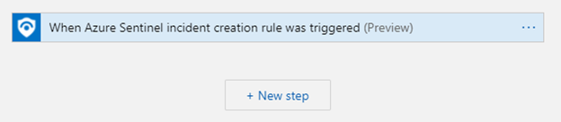
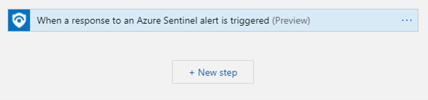

# Quick start - create a playbook from scratch with Sentinel triggers
Use this template to quickly create a new playbook which starts with an **Azure Sentinel incident** or **Azure Sentinel alert**. 

## Prerequisites
* This playbook is configured to work with Managed Identity for the Azure Sentinel Logic Apps connector steps. After playbook is deployed, assign permissions for this playbook to Azure Sentinel workspace. [Learn more](https://docs.microsoft.com/connectors/azuresentinel/#authentication)

## Screenshots

 
 

**Deploy with incident trigger** (recommended)

After deployment, attach this playbook to an **automation rule** so it runs when the incident is created.

[Learn more about automation rules](https://docs.microsoft.com/azure/sentinel/automate-incident-handling-with-automation-rules#creating-and-managing-automation-rules)

**Deploy with alert trigger**

After deployment, you can run this playbook manually on an alert or attach it to an **analytics rule** so it will rune when an alert is created.

