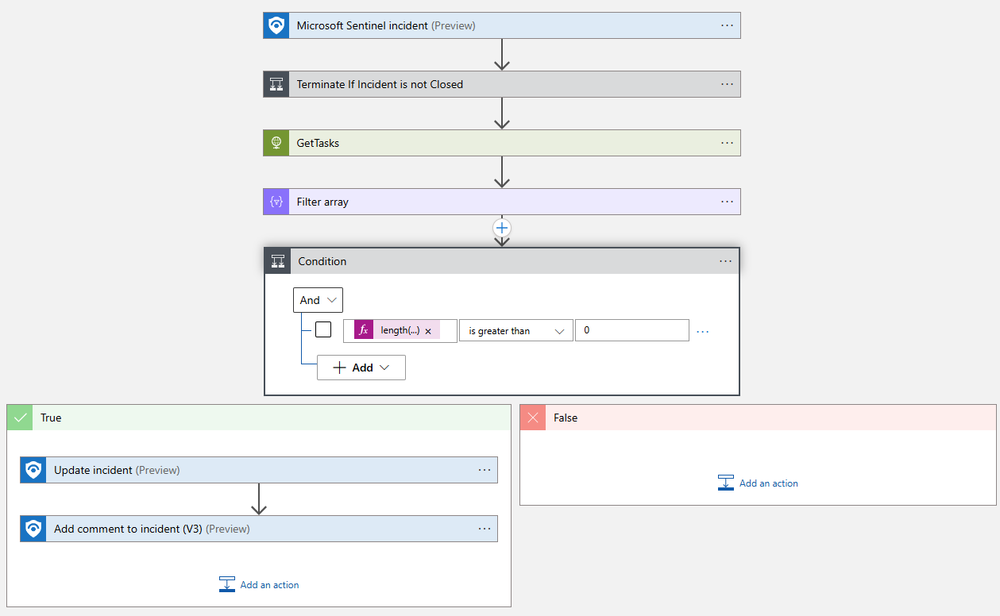
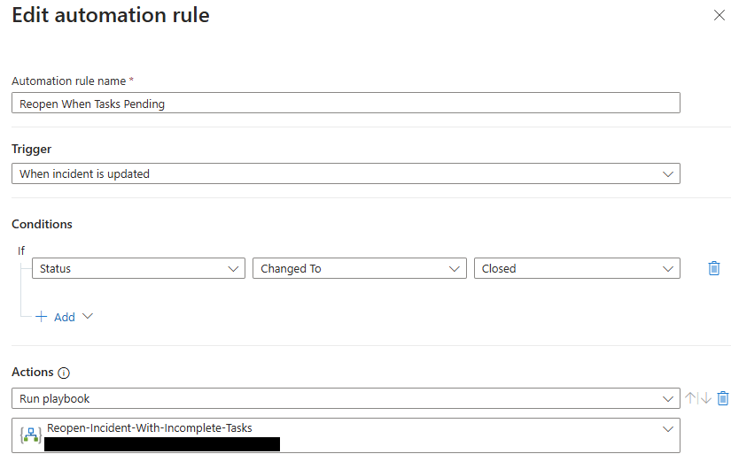

# Reopen Incident with Incomplete Tasks
author: Brian Delaney

Incident tasks are a useful way to convey critical steps that should be taken to a SOC analyst.  However, there is no built in way to ensure these tasks have even been seen or acknowledged by an analyst.  This playbook, in combination with an automation rule can reopen closed incidents if there are any attached tasks that are not in a completed state.  By default it will reopen the incident as Active as well as add a tag and comment to the incident to note the incomplete tasks.

## Quick Deployment
**Deploy with incident trigger**

## Post Deployment

1. Grant the managed identity of the Playbook 'Microsoft Sentinel Responder' on the Microsoft Sentinel resource group.
2. Create an automation rule to invoke the playbook on incident update under the condition that status of the incident was changed to closed

[Learn more about automation rules](https://docs.microsoft.com/azure/sentinel/automate-incident-handling-with-automation-rules#creating-and-managing-automation-rules)

## Screenshots
**Incident Trigger** 

**Automation Rule** 

