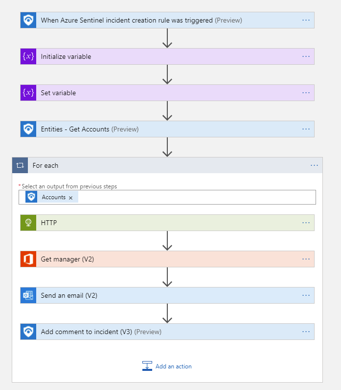
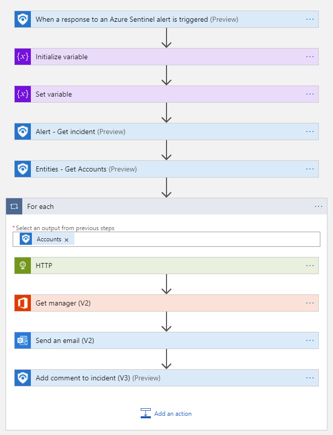

# Reset-AADPassword
author: Nicholas DiCola

This playbook will reset the user password using Graph API.  It will send the password (which is a random guid substring) to the user's manager.  The user will have to reset the password upon login.  

## Quick Deployment
**Deploy with incident trigger** (recommended)

After deployment, attach this playbook to an **automation rule** so it runs when the incident is created.

[Learn more about automation rules](https://docs.microsoft.com/azure/sentinel/automate-incident-handling-with-automation-rules#creating-and-managing-automation-rules)

[](https://portal.azure.com/#create/Microsoft.Template/uri/https%3A%2F%2Fraw.githubusercontent.com%2FAzure%2FAzure-Sentinel%2Fmaster%2FPlaybooks%2FReset-AADUserPassword%2Fincident-trigger%2Fazuredeploy.json)
[](https://portal.azure.us/#create/Microsoft.Template/uri/https%3A%2F%2Fraw.githubusercontent.com%2FAzure%2FAzure-Sentinel%2Fmaster%2FPlaybooks%2FReset-AADUserPassword%2Fincident-trigger%2Fazuredeploy.json)

**Deploy with alert trigger**

After deployment, you can run this playbook manually on an alert or attach it to an **analytics rule** so it will rune when an alert is created.

[](https://portal.azure.com/#create/Microsoft.Template/uri/https%3A%2F%2Fraw.githubusercontent.com%2FAzure%2FAzure-Sentinel%2Fmaster%2FPlaybooks%2FReset-AADUserPassword%2Falert-trigger%2Fazuredeploy.json)
[](https://portal.azure.us/#create/Microsoft.Template/uri/https%3A%2F%2Fraw.githubusercontent.com%2FAzure%2FAzure-Sentinel%2Fmaster%2FPlaybooks%2FReset-AADUserPassword%2Falert-trigger%2Fazuredeploy.json)


## Prerequisites

- You will need to grant User.ReadWrite.All permissions to the managed identity.  Run the following code replacing the managed identity object id.  You find the managed identity object id on the Identity blade under Settings for the Logic App.
```powershell
$MIGuid = "<Enter your managed identity guid here>"
$MI = Get-AzureADServicePrincipal -ObjectId $MIGuid

$GraphAppId = "00000003-0000-0000-c000-000000000000"
$PermissionName = "User.ReadWrite.All" 

$GraphServicePrincipal = Get-AzureADServicePrincipal -Filter "appId eq '$GraphAppId'"
$AppRole = $GraphServicePrincipal.AppRoles | Where-Object {$_.Value -eq $PermissionName -and $_.AllowedMemberTypes -contains "Application"}
New-AzureAdServiceAppRoleAssignment -ObjectId $MI.ObjectId -PrincipalId $MI.ObjectId `
-ResourceId $GraphServicePrincipal.ObjectId -Id $AppRole.Id
```


## Screenshots
**Incident Trigger**<br>
<br>
**Alert Trigger**<br>
<br>