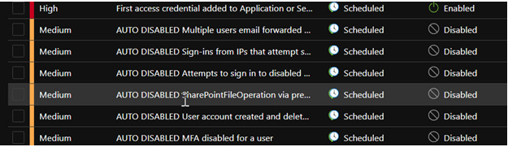
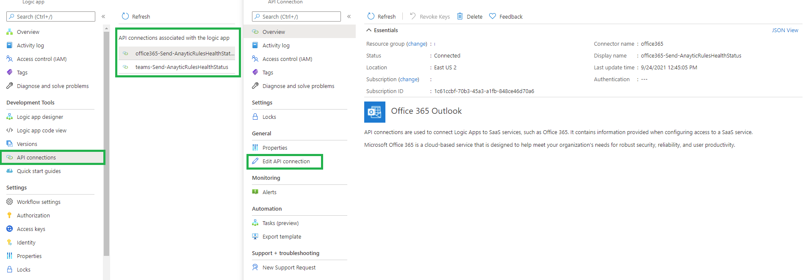
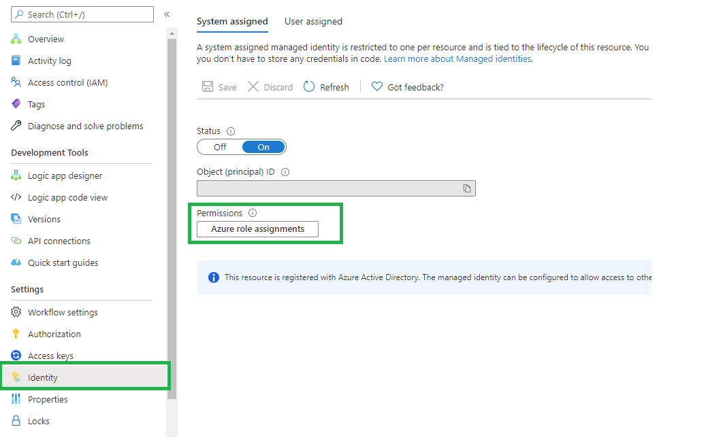
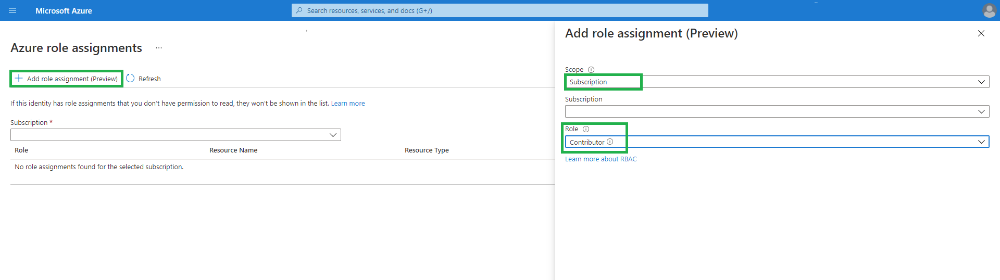
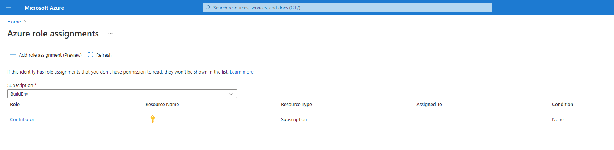
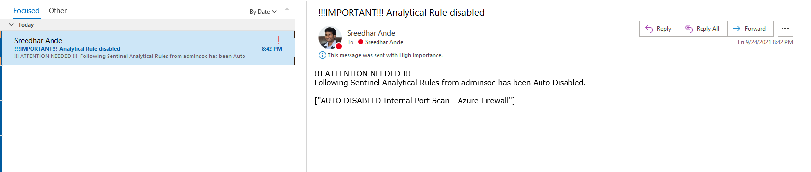
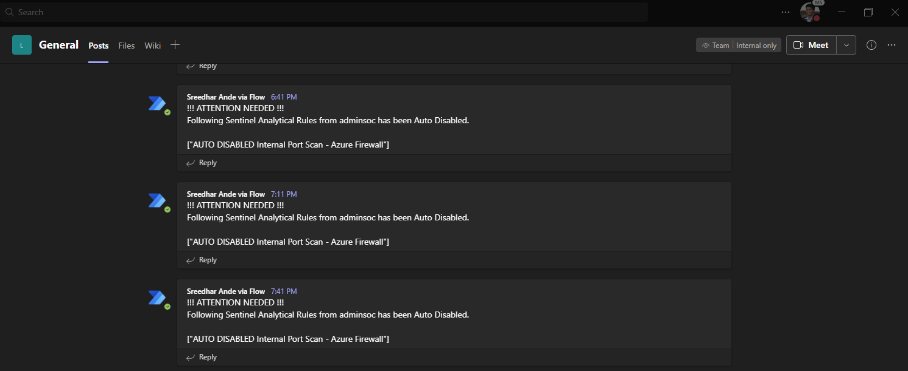

# Send notifications on Azure Sentinel Analytical Rules - auto-disabled rules
**Author: Sreedhar Ande**

It's a rare occurrence that a scheduled query rule fails to run, but it can happen. As shown in the image below, several Scheduled Analytics Rules that had been Auto-disabled  

For more information, click [here](https://docs.microsoft.com/azure/sentinel/detect-threats-custom#issue-a-scheduled-rule-failed-to-execute-or-appears-with-auto-disabled-added-to-the-name)  

Blog https://techcommunity.microsoft.com/t5/microsoft-sentinel-blog/monitoring-microsoft-sentinel-analytical-rules-push-health/ba-p/2793694  

In the event of a predetermined number of consecutive permanent failures, of the same type and on the same rule, Azure Sentinel stops trying to execute the rule, and also takes the following steps:  
    - Disables the rule.  
    - Adds the words "AUTO DISABLED" to the beginning of the rule's name.  
    - Adds the reason for the failure (and the disabling) to the rule's description.  

This Playbook will trigger immediately and inform Security teams by notifying them via mail or post message to Teams Channel

## Deployment

 

## Post Deployment Steps

1.	API connections are used to connect Logic Apps to SaaS services, such as Office 365 & Teams  
    

2. This LogicApp deployed using Managed Identity, grant permissions to the managed identity by using Azure role-based access control (Azure RBAC). The managed identity is authenticated with Azure AD, so you don’t have to store any credentials in code
     
   
   
   
   

## Sample notifications

## Email
  

## Teams  

