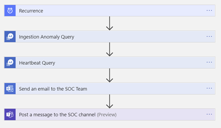
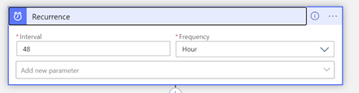
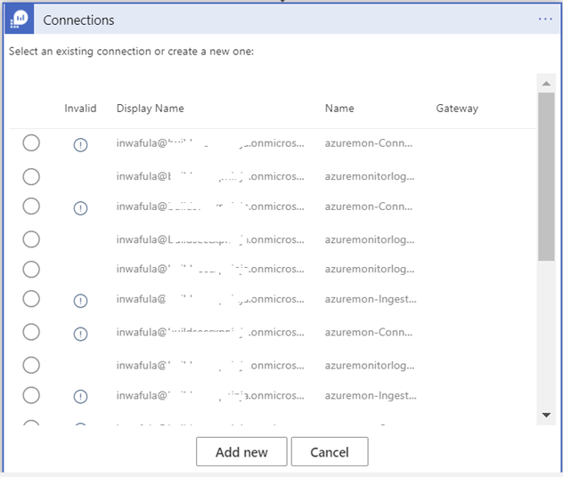
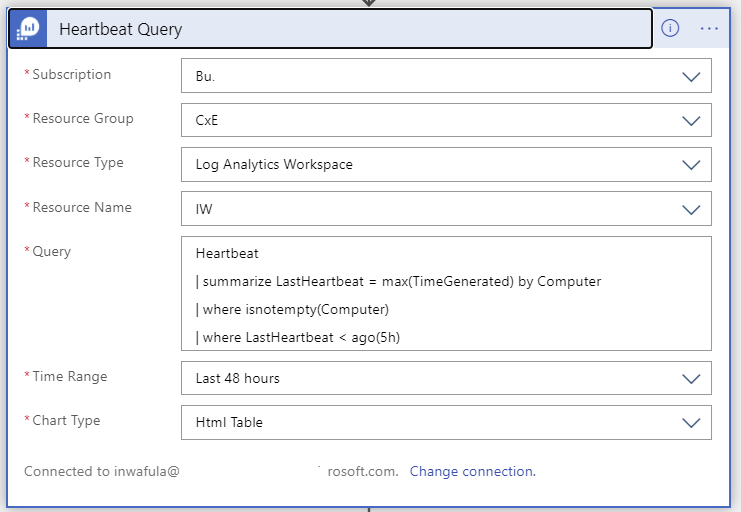
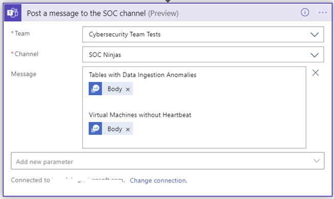

# Connector Health Push Notification Solution
This enhanced solution builds on the existing “Connector Health Workbook” described in this video: [https://www.youtube.com/watch?v=T6Vyo7gZYds] .The Logic App leverages  underlying queries to provide you with an option to configure “Push notifications” to e-mail or a Microsoft Teams channel based on user defined anomaly scores as well as time since the last “Heartbeat” from Virtual Machines connected to the workspace. Below is a detailed description of how the rule and the logic app are put together. 

### Overview of the steps the Logic App works through 




### The Logic App is activated by a Recurrence trigger whose frequency of execution can be adjusted to your requirements:



### In the “Set rule logic” section paste the query below and adjust the “UpperThreshold” & “LowerThreshold” variables as needed:


### Since the Logic App is being deployed from an ARM template you will need to make connections to Azure Monitor, Office 365 and Teams before the Logic App can work in your environment. You can expect to see windows like the one below. Click “Add new” to create a connection for each of the three resources. 

 

### The KQL query below will be added to this step in the Logic App and will execute against your workspace. You can modify the threshold values to suit your needs:

```
let UpperThreshold = 3.0; // Upper Anomaly threshold score
let LowerThreshold = -3.0; // Lower anomaly threshold score
let TableIgnoreList = dynamic(['SecurityAlert', 'BehaviorAnalytics', 'SecurityBaseline', 'ProtectionStatus']); // select tables you want to EXCLUDE from the results
union withsource=TableName1 *
| make-series count() on TimeGenerated from ago(14d) to now() step 1d by TableName1
| extend (anomalies, score, baseline) = series_decompose_anomalies(count_, 1.5, 7, 'linefit', 1, 'ctukey', 0.01)
| where anomalies[-1] == 1 or anomalies[-1] == -1
| extend Score = score[-1]
| where Score >= UpperThreshold or Score <= LowerThreshold
| where TableName1 !in (TableIgnoreList)
| project TableName=TableName1, ExpectedCount=round(todouble(baseline[-1]),1), ActualCount=round(todouble(count_[-1]),1), AnomalyScore = round(todouble(score[-1]),1)
```
  


### Execute query against workspace to detect potential VM connectivity issues

   

### Send out the results of the query to the SOC team as a summarized HTML table
   

<em>Note that while the two queries use two query outputs named “Body” they are different and care should be taken to select the correct output. Naming the Ingestion Anomaly and the Heart Beat query steps differently will help distinguish between the two “Body” variables.</em>

### Send the same message to a Microsoft Teams channel monitored by the SOC team

   

### Below is a sample output of the push notification message
   


[]("https://portal.azure.com/#create/Microsoft.Template/uri/https%3A%2F%2Fraw.githubusercontent.com%2FAzure%2FAzure-Sentinel%2Fmaster%2FPlaybooks%2FSend-ConnectorHealthStatus%2Fazuredeploy.json)
[]("https://portal.azure.us/#create/Microsoft.Template/uri/https%3A%2F%2Fraw.githubusercontent.com%2FAzure%2FAzure-Sentinel%2Fmaster%2FPlaybooks%2Send-ConnectorHealthStatus%2Fazuredeploy.json)

<em>This solution was built in close collaboration with Jeremy Tan, Benjamin Kovacevic & Javier Soriano</em>