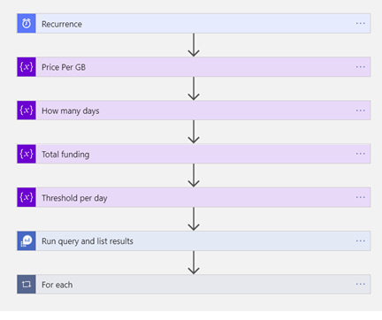
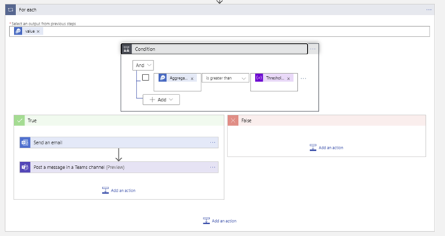
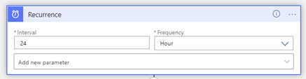
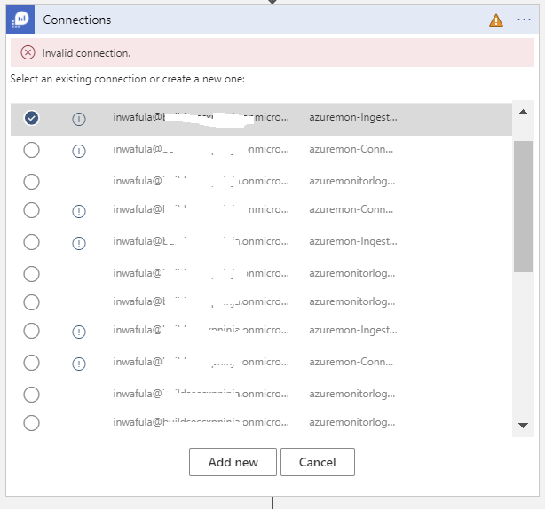
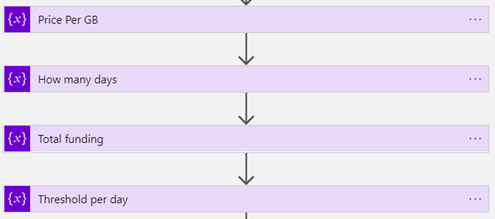
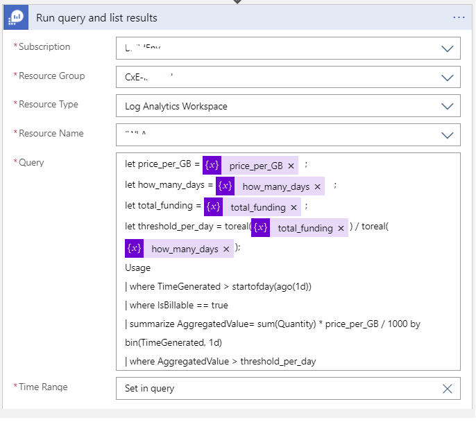
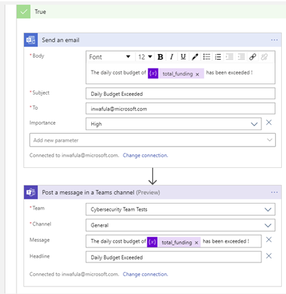

# Ingestion Cost Alert Playbook
Managing cost for cloud services is an essential part of ensuring that you get maximum value for your investment in solutions running on this computing platform. Azure Sentinel is no different. To help you exercise greater control over your budget for Azure Sentinel  this playbook will send you an alert should you exceed a budget that you define for your Azure Sentinel Workspace within a given time-frame. 

### Overview of the Logic App  




### The Logic App is activated by a Recurrence trigger whose frequency of execution can be adjusted to your requirements:




### Since the Logic App is being deployed from an ARM template you will need to make connections to Azure Monitor, Office 365 and Teams before the Logic App can work in your environment. You can expect to see prompts like the one below. Click “Add new” to create a connection to Azure Monitor and subsequently perform a similar operation for the “Send and e-mail” and “Send a Teams message” steps. 




### Since the Logic App is being deployed from an ARM template you will need to make connections to Azure Monitor, Office 365 and Teams before the Logic App can work in your environment. You can expect to see windows like the one below. Click “Add new” to create a connection to Azure Monitor and subsequently perform a similar operation for the “Send and e-mail” and “Send a Teams message” steps. 

 

### The below variables are all declared as integers and can be used to specify values that suit your requirements.



<em>Below is the query being executed in the step above in text format which you can use for validation directly in the Log Analytics query window. Ensure to replace the variables below with actual numbers if running the query within the Log Analytics query window.</em>

```
let price_per_GB = price_per_GB;
let how_many_days = how_many_days;
let total_funding = total_funding;
let threshold_per_day = toreal(total_funding) / toreal(how_many_days);
Usage
| where TimeGenerated > startofday(ago(1d))
| where IsBillable == true
| summarize AggregatedValue= sum(Quantity) * price_per_GB / 1000 by bin(TimeGenerated, 1d)
| where AggregatedValue > threshold_per_day

```
 

### In this step, the aggregated value obtained from the previous step is compared against the budget value you set and should it exceed the amount then the logic branches to the left and sends out an e-mail or posts a Microsoft Teams message. If you are still within budget, then the logic branches to the right and no message is sent.

   

### In the final step below sends out an e-mail to the specified recipient list and a message is posted in a Microsoft Teams channel of your choice

  

  <em>Additional information on cost management can be found in this document: [https://docs.microsoft.com/en-us/azure/azure-monitor/platform/manage-cost-storage]</em>
 


<a href="https://portal.azure.com/#create/Microsoft.Template/uri/https%3A%2F%2Fraw.githubusercontent.com%2FAzure%2FAzure-Sentinel%2Fmaster%2FPlaybooks%2FSend-IngestionCostAlert%2Fazuredeploy.json" target="_blank">
    
</a>
<a href="https://portal.azure.us/#create/Microsoft.Template/uri/https%3A%2F%2Fraw.githubusercontent.com%2FAzure%2FAzure-Sentinel%2Fmaster%2FPlaybooks%2Send-IngestionCostAlert%2Fazuredeploy.json" target="_blank">

</a>


