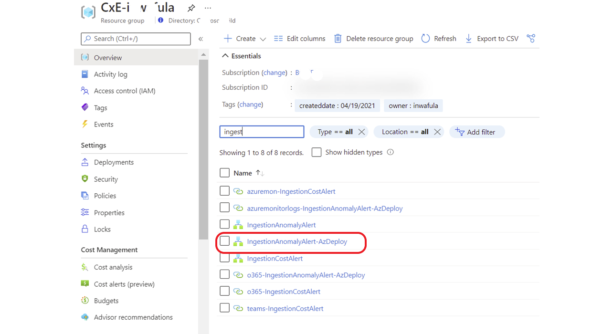
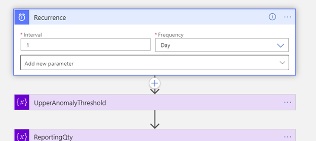
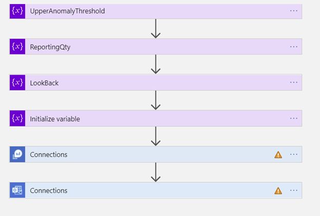
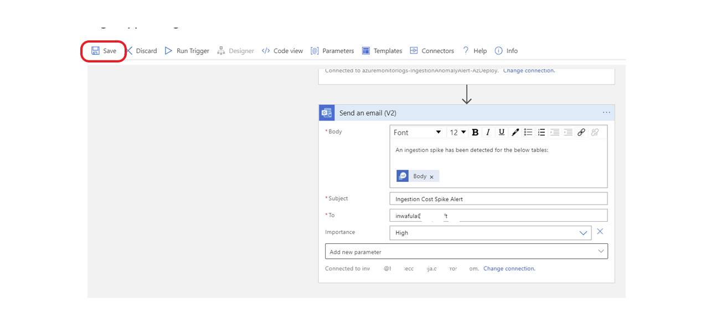
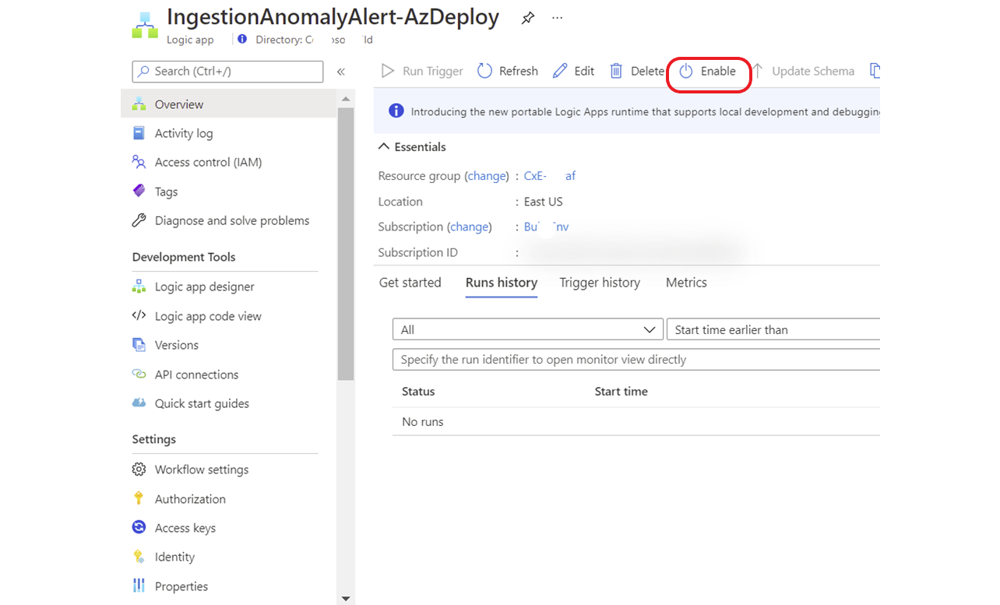

# Ingestion Anomaly Alert Playbook

This playbook sends you an alert should there be an ingestion spike into your workspace. The playbook uses the <em>series_decompose_anomalies</em> KQL function to determine anomalous ingestion.

## Deployment steps

Scroll to the bottom of this document and click the "Deploy to Azure" button

Fill in the parameters, changing the default values as required for your environment

Select your newly deployed app from the resource group

Click on edit to make the connections to Log Analytics and Office 365

Defince the frequency the playbook should execute. Default is daily so you get alerted at the earliest sign of an ingestion anomaly

Make the connections to your Log Analytics workspace using an account with the appropriate permissions. Do the same for Office 365.

Save the app

Enable the app

<em> For more information on the anomaly function read this [this document](https://docs.microsoft.com/azure/data-explorer/kusto/query/series-decompose-anomaliesfunction)</em>

