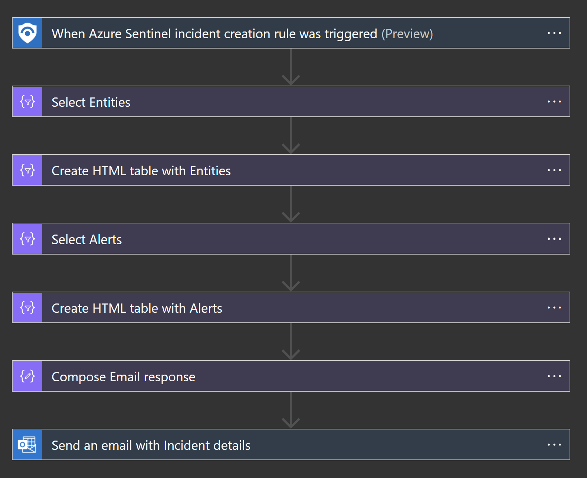

# Send-email-with-formatted-incident-report
author: Benjamin Kovacevic

This playbook will be sending email with formated incidents report (Incident title, severity, tactics, link,…) when incident is created in Azure Sentinel. Email notification is made in HTML.  Please see screenshots for details.
  
## Pre-requisites:
An O365 account to be used to send email notification 
(The user account will be used in O365 connector (Send an email).) 
Link with company logo. No formating since size is defined in the Playbook. Linke example - https://azure.microsoft.com/svghandler/azure-sentinel
  
## Deployment:

## Post-deployment

### Configure connections
Edit the Logic App or go to Logic app designer. 
Expand “Send an email with Incident details” and fix this connector by adding a new connection or signing-in to marked one with user that has mailbox. 
Note:  Email sent with this playbook will be from user that creates connection!  

### Attach the playbook
After deployment, attach this playbook to an automation rule so it runs when the incident is created.
[Learn more about automation rules](https://docs.microsoft.com/azure/sentinel/automate-incident-handling-with-automation-rules#creating-and-managing-automation-rules) 

Note: Playbook is disabled by default. Please enable it before assigning to the Automation rule!
  
## Screenshot
### Playbook screenshoot

### Email screenshot

