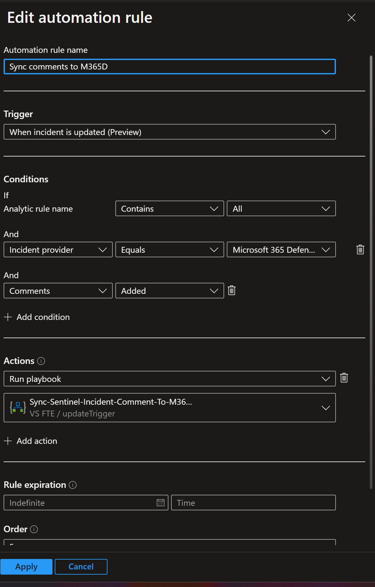
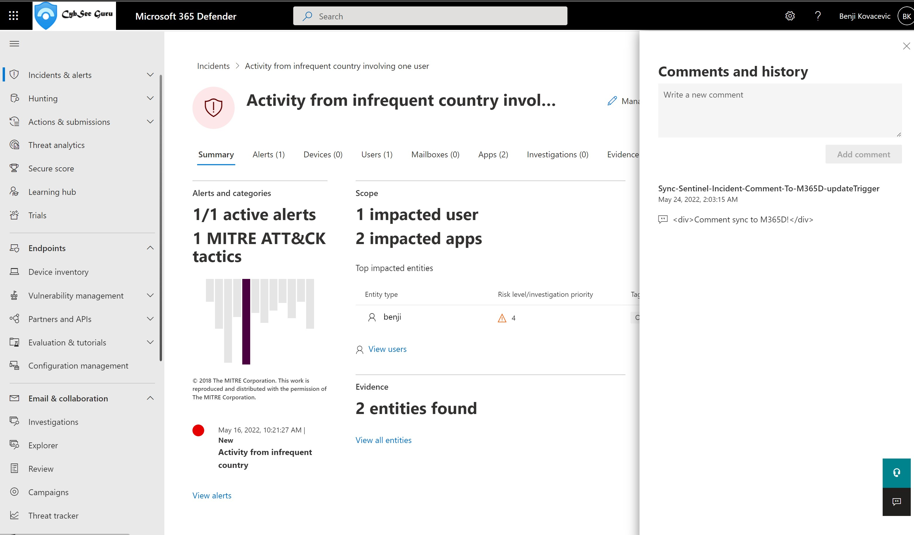

# Sync-IncidentCommentToM365DOnUpdate
author: Benjamin Kovacevic

This playbook will sync incident comments from Microsoft Sentinel to Microsoft 365 Defender when comment is added.

# Prerequisites

None.

# Quick Deployment
[](https://portal.azure.com/#create/Microsoft.Template/uri/https%3A%2F%2Fraw.githubusercontent.com%2FAzure%2FAzure-Sentinel%2Fmaster%2FPlaybooks%2FSync-IncidentCommentToM365DOnUpdate%2Fazuredeploy.json)
[](https://portal.azure.us/#create/Microsoft.Template/uri/https%3A%2F%2Fraw.githubusercontent.com%2FAzure%2FAzure-Sentinel%2Fmaster%2FPlaybooks%2FSync-IncidentCommentToM365DOnUpdate%2Fazuredeploy.json)
<br><br>

# Post-deployment
1. Add Incident.ReadWrite.All API permission to the playbook's managed identity using PowerShell
```powershell
$MIGuid = "<Enter your managed identity guid here>"
$MI = Get-AzureADServicePrincipal -ObjectId $MIGuid

$GraphAppId = "8ee8fdad-f234-4243-8f3b-15c294843740"
$PermissionName1 = "Incident.ReadWrite.All"

$GraphServicePrincipal = Get-AzureADServicePrincipal -Filter "appId eq '$GraphAppId'"
$AppRole1 = $GraphServicePrincipal.AppRoles | Where-Object {$_.Value -eq $PermissionName1 -and $_.AllowedMemberTypes -contains "Application"}
New-AzureAdServiceAppRoleAssignment -ObjectId $MI.ObjectId -PrincipalId $MI.ObjectId `
-ResourceId $GraphServicePrincipal.ObjectId -Id $AppRole1.Id
```
2. Add playbook as an action to the automation rule 
- Trigger = When incident is updated;  
- Condition = Incident provider > Equal > Microsoft 365 Defender, and
- Comments > Added<br>

**Automation rule example**<br>


# Screenshots

**Playbook** <br>
<br>
<br>

**Microsoft 365 Defender** <br>
<br><br>